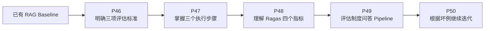

# P45：RAG 评估——本章导学

> 笔记编号 45/89 · 对应原视频 P45 · 时长 00:50 · [打开这一节](https://www.bilibili.com/video/BV1fLoKBREGv?p=45)

[← P44：AI 应用与传统软件开发的区别](../07-baseline-rag/p044-总结和展望-转变思想-AI应用开发和传统软件开发的区别.md) · [返回第 8 章专题](./README.md) · [P46：RAG 评估的三项标准 →](./p046-RAG迭代的关键-评估.md)

## 这节到底讲什么

上一章已经完成制度问答 Baseline，但“能回答两道演示题”不能证明系统足够好。
AI 应用要根据测试结果逐步优化，所以本章回答一个核心问题：

**怎样用可重复的评估，判断一次修改究竟让 RAG 变好还是变差？**

## 本章路线

本章不是把 Ragas 的分数打印出来就结束，而是建立下面的闭环：

1. 先明确要评估问题、检索上下文和生成答案之间的哪些关系；
2. 准备测试问题与标准答案，选择合适指标；
3. 让 RAG 产生上下文和答案，再计算指标；
4. 查看具体低分样本，判断问题发生在检索还是生成；
5. 修改一个环节后，在同一测试集上重新评估。

## 校正版讲解时间线

- **00:00–00:12：承接上一章。** Baseline 建好后，要依据评估结果逐步优化。
- **00:12–00:27：说明评估价值。** 评估既判断项目好坏，也给出优化方向。
- **00:27–00:49：预告本章结构。** 评估标准 → 三个步骤 → Ragas → 制度问答实战。

## 先建立一个正确认识

评估的目的不是追求一个孤立的高分。真正有用的评估必须能回答：

- 检索器有没有找到回答问题所需的证据？
- 生成答案是否忠于检索到的证据？
- 答案是否直接、完整地回应了用户？
- 如果分数不好，应该修改文档、检索、提示词还是模型？

例如，把 Top-k 从 3 改成 8 后，正确证据也许更容易被召回，但无关上下文增多，
生成答案反而可能更差。只有固定测试集并同时观察检索与生成指标，才能看出这个
改动的真实效果。

## 完整原声逐段记录

[查看本节按时间戳保留的本地 ASR 转写](./transcripts/p045-RAG-评估-本章导学-ASR.md)。
原始转写用于核对老师说了什么；其中“IG、IGAS”等识别结果应校正为 RAG、Ragas。

## 读完记住

- Baseline 是评估对象，不是项目终点。
- 评估既要判断质量，也要帮助定位优化方向。
- 本章依次学习三项标准、三个步骤、Ragas 指标和评估实战。
- 改动前后必须使用同一测试集，结果才可比较。
- 分数之后还要分析坏例并重新评估。

## 自测

1. 为什么两道演示题答对，仍不能说明 RAG 可以上线？
2. 本章的四个学习阶段是什么？
3. Top-k 增大后，为什么检索召回和最终答案可能朝相反方向变化？
