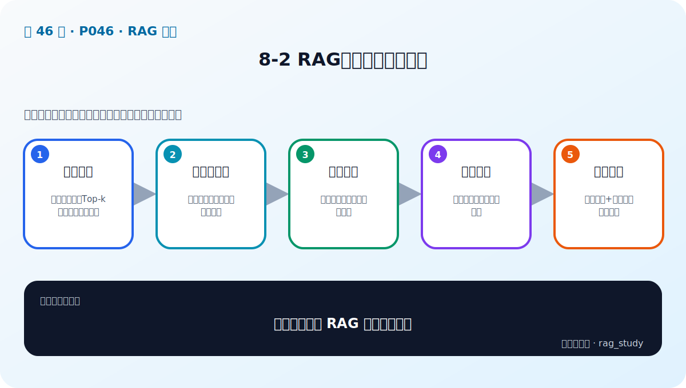

# P46：RAG 评估的三项标准

> 笔记编号 46/89 · 对应原视频 P46 · 时长 03:53 · [打开这一节](https://www.bilibili.com/video/BV1fLoKBREGv?p=46)

[← P45：本章导学](./p045-RAG-评估-本章导学.md) · [返回第 8 章专题](./README.md) · [P47：RAG 评估的三个步骤 →](./p047-RAG评估的三大步骤.md)

## 这节到底讲什么

一个最小 RAG 过程可以压缩成三个对象：

**用户问题（Question）→ 检索上下文（Context）→ 生成答案（Answer）。**

评估就是检查这三个对象两两之间的关系。视频给出三项标准：上下文相关性、
忠实性和答案相关性。三者分别对应“找得对不对”“有没有编造”“有没有答到点上”。

## 1. 上下文相关性：检索结果能否帮助回答问题

它检查问题与检索上下文之间的关系。好的上下文应紧密围绕问题，并包含回答所需
的关键信息；仅仅主题相近还不够。

例如问题是“苹果公司何时成立”。“苹果公司发布了 iPhone”与主题有关，但没有
提供成立时间，因而不是有效上下文。“苹果公司于 1976 年成立”才真正有用。

## 2. 忠实性：答案能否由上下文推出

它检查生成答案与给定上下文之间是否事实一致。答案里的每个事实都应能从上下文
中得到支持，不能把模型自身常识或猜测混进企业制度答案。

如果上下文只写“苹果公司成立于 1976 年”，回答却增加“由三位创始人在车库创办”，
即使补充内容可能是真的，对当前 RAG 上下文而言仍属于没有依据的内容。

## 3. 答案相关性：是否直接、完整且不啰嗦

它检查答案与原问题之间的关系，包含三层含义：

- **直接：** 回答用户真正问的内容；
- **完整：** 不遗漏问题要求的关键部分；
- **精简：** 不塞入与问题无关的冗余信息。

忠实性高不等于答案相关性高。模型可能原封不动复述一段真实制度，但没有回答
“我能报销多少”这个具体问题；它忠于上下文，却没有答到点上。

## 校正版讲解时间线

- **00:00–00:34：** 回顾问题、上下文、答案三个对象，说明评估是衡量它们的关系。
- **00:42–01:04：** 上下文相关性——检索内容是否围绕问题并包含关键信息。
- **01:04–01:28：** 忠实性——答案是否能由上下文推出，而不是胡说。
- **01:30–02:04：** 答案相关性——是否直接、完整且没有无关冗余。
- **02:08–03:24：** 用苹果公司成立时间的例子辨认三项标准。
- **03:24–03:52：** 人工评估更准确但成本高，LLM 可用于自动语义评审。

## 三项标准怎样定位问题

| 现象 | 主要低分项 | 优先检查 |
|---|---|---|
| 正确制度根本没被找回 | 上下文相关性 | 解析、分块、Embedding、Top-k |
| 找到了正确制度，答案却编了金额 | 忠实性 | 提示词、上下文组织、生成模型 |
| 答案都来自制度，但答非所问 | 答案相关性 | 问题理解、提示词、生成结果 |

人工评估能结合业务语境，通常更可信，但耗时和成本高。LLM 具有语义理解能力，
因此可以承担大规模初筛；高风险业务仍应保留人工抽检和争议样本复核。

## 完整原声逐段记录

[查看本节按时间戳保留的本地 ASR 转写](./transcripts/p046-RAG迭代的关键-评估-ASR.md)。
原始转写中的“孕妇”实际是“用户”，“中石性”实际是“忠实性”。

## 自测

1. 用一句话分别解释上下文相关性、忠实性和答案相关性。
2. “上下文正确，但答案添加了一条上下文没有的规定”是哪项失败？
3. 为什么忠实性很高的答案仍可能不可用？

## 学完检查

- [ ] 我能区分上下文相关性、忠实性和答案相关性
- [ ] 我能根据坏例判断问题主要在检索链还是生成链
- [ ] 我理解自动评审适合规模化初筛，但不能取消高风险人工复核
- [ ] 我核对了本节完整 ASR 和老师使用的苹果公司示例
