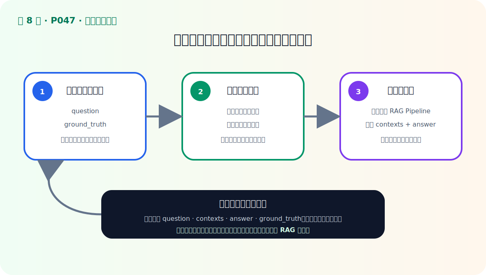
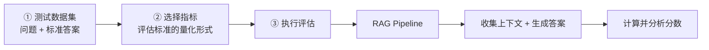

# P47：RAG 评估的三个步骤

> 笔记编号 47/89 · 对应原视频 P47 · 时长 01:06 · [打开这一节](https://www.bilibili.com/video/BV1fLoKBREGv?p=47)

[← P46：三项评估标准](./p046-RAG迭代的关键-评估.md) · [返回第 8 章专题](./README.md) · [P48：Ragas 框架 →](./p048-RAG评价神器-Ragas框架.md)

## 这节到底讲什么

知道“评什么”之后，还要把评估真正执行起来。视频把过程归纳为三个步骤：

**构建测试数据集 → 确定评估指标 → 执行 RAG 并计算指标。**





## 第一步：构建测试数据集

先确定“在哪些问题上评估”。视频给出的最基本数据是：

- `question`：用户问题；
- `ground_truth`：人工确认的标准答案。

测试集要覆盖常见问题、组合条件、边界问题和资料外问题。只有两个容易的演示问题，
无法代表真实用户分布。标准答案应来自有效制度，并保留来源，避免把人的错误答案
当成评估基准。

## 第二步：确定评估指标

指标是上一节评估标准的量化形式。例如：

- 上下文相关性可拆成 Context Recall 与 Context Precision；
- 忠实性可量化答案中有依据事实的比例；
- 答案相关性可衡量回答是否真正对应问题。

不同指标依赖的字段不同。需要标准答案的指标，测试集就必须提供
`ground_truth`；不能先运行再发现输入不够。

## 第三步：执行评估

把每个问题输入 RAG Pipeline。Pipeline 不仅要返回最终答案，还要返回实际检索到
的上下文。评估器随后收集：

```text
问题 + 标准答案 + 检索上下文 + 生成答案
```

再按选定指标逐条计算。保存逐样本结果比只保留平均分重要，因为低分样本才能告诉
你应该改检索还是改生成。

## 校正版讲解时间线

- **00:00–00:11：** 确定标准之后，评估还需要三个执行步骤。
- **00:11–00:26：** 构建测试集，至少包括问题和标准答案。
- **00:26–00:38：** 选择评估指标，可以是一项标准衍生的多个指标。
- **00:38–01:06：** 输入测试集，收集上下文与答案，计算指标。

## 一个完整样本

```python
sample = {
    "question": "员工到上海出差，住宿标准是多少？",
    "ground_truth": "应根据员工职级和上海对应标准确定，不能只给统一金额。",
    "contexts": [
        "上海：P5 级及以下……；P6 级及以上……",
        "差旅报销应在返程后提交……",
    ],
    "answer": "上海住宿标准按职级区分：……",
}
```

前两个字段由评测数据提供，后两个字段由当前 RAG 版本产生。切换分块参数或模型后，
仍用同一组前两个字段，才能公平比较。

## 完整原声逐段记录

[查看本节按时间戳保留的本地 ASR 转写](./transcripts/p047-RAG评估的三大步骤-ASR.md)。

## 自测

1. RAG 评估的三个步骤是什么？
2. 为什么评估 Pipeline 必须返回上下文，而不能只返回答案？
3. 哪些字段来自人工准备，哪些字段来自被评估的 RAG？
