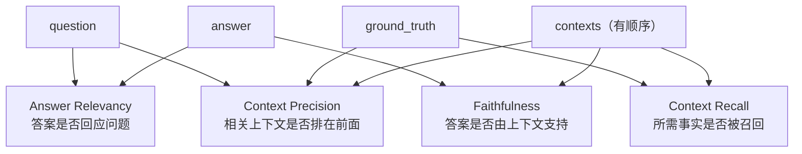

# P48：Ragas 框架与四个核心指标

> 笔记编号 48/89 · 对应原视频 P48 · 时长 20:34 · [打开这一节](https://www.bilibili.com/video/BV1fLoKBREGv?p=48)

[← P47：RAG 评估的三个步骤](./p047-RAG评估的三大步骤.md) · [返回第 8 章专题](./README.md) · [P49：用 Ragas 评估制度问答 →](./p049-实战-用Ragas评估制度问答模块的性能.md)

## 这节到底讲什么

Ragas 是 2023 年提出的自动化 RAG 评估框架。它最初强调无参考评估，以减少人工
标注成本；视频同时说明，后续版本的部分指标仍需要人工标准答案，因为有参考答案
时通常评得更准确。

Ragas 的核心做法是借助 LLM 的语义判断能力，衡量问题、上下文和答案之间的关系。
这节重点不是记 API，而是彻底理解四个指标怎样算、各自在诊断什么。


## 评测样本的四个字段

```python
sample = {
    "question": "用户提出的问题",
    "answer": "当前 RAG 生成的答案",
    "contexts": ["Top-1 上下文", "Top-2 上下文", "Top-3 上下文"],
    "ground_truth": "人工确认的标准答案",
}
```

`answer` 和 `ground_truth` 是两个不同答案：前者可能错误，是被评对象；后者是人工
基准。`contexts` 必须是列表，而且顺序就是检索排名，Context Precision 会用到。



## 1. Faithfulness：答案忠实性

目标：检查生成答案中的事实能否由检索上下文推出。

计算过程：

1. 用 LLM 把生成答案拆成独立、细粒度的事实陈述；
2. 逐条判断每个陈述是否得到上下文支持，并要求给出判断理由；
3. 统计得到支持的陈述占全部陈述的比例。

```text
Faithfulness = 上下文支持的答案陈述数 / 答案陈述总数
```

答案有两个事实，只有一个能由上下文推出，得分就是 `1 / 2 = 0.5`。它不需要
`ground_truth`，因为比较的是生成答案与上下文，而不是与标准答案。

## 2. Answer Relevancy：答案相关性

目标：检查生成答案是否真正回答原问题，并减少遗漏、冗余和含糊表达。

视频讲解的是一种“逆向提问”思路：

1. 让 LLM 根据生成答案反向生成多个潜在问题；
2. 用 Embedding 计算每个潜在问题与原问题的余弦相似度；
3. 对这些相似度求平均，得到答案相关性。

如果一段答案确实围绕原问题，那么从答案反推的问题也应与原问题相似。生成多个
问题是为了覆盖答案里的多个事实。提示词还会要求模型判断答案是否含糊；计算时
只采用由明确答案生成的问题。

## 3. Context Recall：上下文召回率

目标：检查回答标准答案所需的事实，有多少已经出现在检索上下文中。

它与 Faithfulness 的流程相似，但拆分对象不同：

1. 把人工 `ground_truth` 拆成独立事实；
2. 判断每条标准事实能否由所有检索上下文推出；
3. 统计可推出事实的占比。

```text
Context Recall = 上下文支持的标准答案陈述数 / 标准答案陈述总数
```

例如标准答案含“法国位于西欧”和“首都是巴黎”两个事实，上下文只支持第一个，
Context Recall 为 `0.5`。这个指标需要人工标准答案。

## 4. Context Precision：上下文精度

目标：不仅检查相关上下文有没有被召回，还检查它们是否排在前面。

对 Top-k 每个上下文先判断：它能否帮助得出标准答案。记相关为 1，不相关为 0。
随后在每个相关位置计算“截至当前位置的相关比例”，最后对这些值求平均。这就是
一种 Average Precision 思路。

视频示例的相关序列为 `[0, 1, 1]`：

```text
第 2 位：前 2 个中有 1 个相关 → 1/2
第 3 位：前 3 个中有 2 个相关 → 2/3
Context Precision = (1/2 + 2/3) / 2 ≈ 0.58
```

如果两个相关上下文排成 `[1, 1, 0]`，分数会更高。因此 `contexts` 的列表顺序
不能丢失。

## 四指标速查

| 指标 | 比较对象 | 是否需要标准答案 | 主要诊断 |
|---|---|---:|---|
| Faithfulness | answer ↔ contexts | 否 | 答案有没有无依据事实 |
| Answer Relevancy | answer ↔ question | 否 | 答案是否答到点上 |
| Context Recall | ground_truth ↔ contexts | 是 | 所需事实是否召回完整 |
| Context Precision | question/ground_truth ↔ ranked contexts | 是 | 相关上下文是否排在前面 |

## Ragas 怎样使用 LLM

LLM 评审不是简单问一句“这个答案好吗”。Ragas 的提示词通常包含：

- 明确任务，例如拆分陈述或判断是否可由上下文推出；
- 具体输入与输出格式，常要求 JSON；
- 示例，让模型理解判定标准；
- 判断理由，迫使模型给出可检查的依据。

自动评审仍会受到评审模型、提示词和版本影响。应固定配置、保留原始判定，并对
高风险或低分样本做人工复核。

## 从分数到行动

- Context Recall 和 Precision 都低：先改文档处理、Embedding、检索或排序；
- 检索指标好但 Faithfulness 低：检查提示词、上下文组织或更换生成模型；
- Faithfulness 高但 Answer Relevancy 低：答案可能没答全、答非所问或太啰嗦；
- 修改后必须在同一测试集重新评估，确认方案真的有效。

## 校正版讲解时间线

- **00:00–01:29：** Ragas 的由来、参考/无参考特点与 LLM-as-judge。
- **01:30–05:00：** 四项指标与数据集四字段。
- **05:01–09:09：** Faithfulness 的陈述拆分、事实推断和提示词。
- **09:10–11:22：** Answer Relevancy 的逆向提问与 Embedding 相似度。
- **11:24–13:45：** Context Recall 拆标准答案，再判断上下文覆盖。
- **13:45–18:11：** Context Precision 的排序加权与 0.58 示例。
- **18:12–20:34：** `evaluate` 流程，以及根据坏例改进后重新评估。

## 完整原声逐段记录

[查看本节按时间戳保留的本地 ASR 转写](./transcripts/p048-RAG评价神器-Ragas框架-ASR.md)。
原始转写中的“IGAS、关注、善下文、中时性”应分别校正为 Ragas、ground truth、
上下文、忠实性。

## 自测

1. `answer` 与 `ground_truth` 有什么区别？
2. Faithfulness 和 Context Recall 都会“拆陈述”，它们拆的对象为何不同？
3. 为什么 Context Precision 必须保留上下文顺序？
4. 相关序列 `[1, 0, 1]` 为什么优于 `[0, 1, 1]`？
