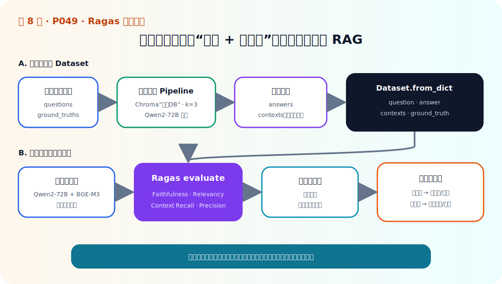
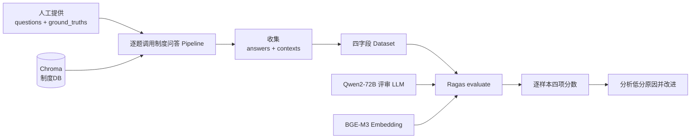

# P49：实战——用 Ragas 评估制度问答模块

> 笔记编号 49/89 · 对应原视频 P49 · 时长 07:35 · [打开这一节](https://www.bilibili.com/video/BV1fLoKBREGv?p=49)

[← P48：Ragas 四个核心指标](./p048-RAG评价神器-Ragas框架.md) · [返回第 8 章专题](./README.md) · [P50：本章总结 →](./p050-RAG-评估-本章总结.md)

## 这节到底讲什么

这一节把上一章的制度问答 Pipeline 改造成“可评估的 Pipeline”，再用 Ragas
计算四个指标。关键变化只有一个：问答函数不能只返回答案，还必须返回实际使用的
上下文列表。





## 第一步：重新加载制度知识库

视频复用上一章组件：

- BGE-M3 作为 Embedding；
- Chroma 连接已经建立的“制度DB”集合；
- Qwen2-72B 通过大模型客户端生成答案；
- 提示词继续要求模型依据上下文作答。

这里是加载已有向量集合，不应每评估一次就重新解析文档、重复建库。

## 第二步：让 Pipeline 返回两个结果

对每个问题：

1. 从 Chroma 检索 `k` 个相关文档；
2. 把它们的 `page_content` 拼成提示词上下文；
3. 调用模型得到答案；
4. 同时返回原始上下文文本列表。

```python
def rag_pipeline(question: str, k: int = 3):
    docs = vector_store.similarity_search(question, k=k)
    contexts = [doc.page_content for doc in docs]
    prompt = build_prompt(question=question, contexts=contexts)
    answer = llm.invoke(prompt)
    return answer, contexts
```

视频实战设定返回三个上下文。Ragas 的 Context Precision 需要列表顺序，因此不能
先拼成一个字符串后把排名信息丢掉。

## 第三步：构建四字段评测数据

课程示例只准备了两个问题及其标准答案。前两个字段由人工提供，后两个字段由
当前 Pipeline 生成：

```python
data = {
    "question": questions,
    "answer": generated_answers,
    "contexts": retrieved_context_lists,
    "ground_truth": ground_truths,
}
dataset = Dataset.from_dict(data)
```

字段长度必须一致；`contexts[i]` 本身仍是字符串列表。真实项目不能只使用两道题，
而应覆盖不同用户表达与业务场景。视频也提到可以借助 LLM 生成候选问题，但这些
问题和标准答案仍要经过人工审核。

## 第四步：配置评审器并执行

视频选择四个指标：

- Faithfulness；
- Answer Relevancy；
- Context Recall；
- Context Precision。

评估器也需要 LLM 与 Embedding。课程继续使用 Qwen2-72B 和 BGE-M3，并因为评估
过程中会多次调用 LLM 而加长超时时间。概念化调用如下：

```python
result = evaluate(
    dataset=dataset,
    metrics=[
        faithfulness,
        answer_relevancy,
        context_recall,
        context_precision,
    ],
    llm=evaluator_llm,
    embeddings=evaluator_embeddings,
    run_config=run_config,
)
table = result.to_pandas()
```

不同 Ragas 版本的类名、字段名和模型适配方式可能变化；复现时应以项目锁定版本
为准。真正稳定的工程资产是四字段数据和指标含义，不是某个版本的 import 路径。

## 第五步：阅读结果，而不是只打印结果

视频结果显示两道题的上下文质量整体较高，第二道题的忠实性和答案相关性略差。
正确动作是点开第二道题，检查它的检索上下文、答案陈述和标准答案，再决定：

- 上下文缺事实：优化检索；
- 相关文档顺序靠后：优化召回或增加重排；
- 上下文充分但答案编造：强化依据约束或换生成模型；
- 答案漏答/冗余：调整提示词和输出结构。

两道题只能证明代码链路跑通，不能证明系统性能达标。

## 校正版讲解时间线

- **00:00–02:06：** 重新加载“制度DB”，构建同时返回答案与上下文的 Pipeline。
- **02:06–04:25：** 人工给问题/标准答案，Pipeline 生成答案/上下文，组成 Dataset。
- **04:25–05:41：** 选择四项指标，配置 Qwen2-72B、BGE-M3 和超时。
- **05:41–06:25：** 调用 `evaluate` 并把结果转成表格。
- **06:25–07:35：** 分析两道题分数，强调真实项目要扩大场景覆盖。

## 完整原声逐段记录

[查看本节按时间戳保留的本地 ASR 转写](./transcripts/p049-实战-用Ragas评估制度问答模块的性能-ASR.md)。

## 自测

1. 为什么评估版 Pipeline 必须返回 `contexts`？
2. 四字段中哪些由人工提供，哪些由 RAG 生成？
3. 为什么 Ragas 评估比普通问答更容易超时？
4. 第二道题分数低时，应该按什么顺序定位问题？
