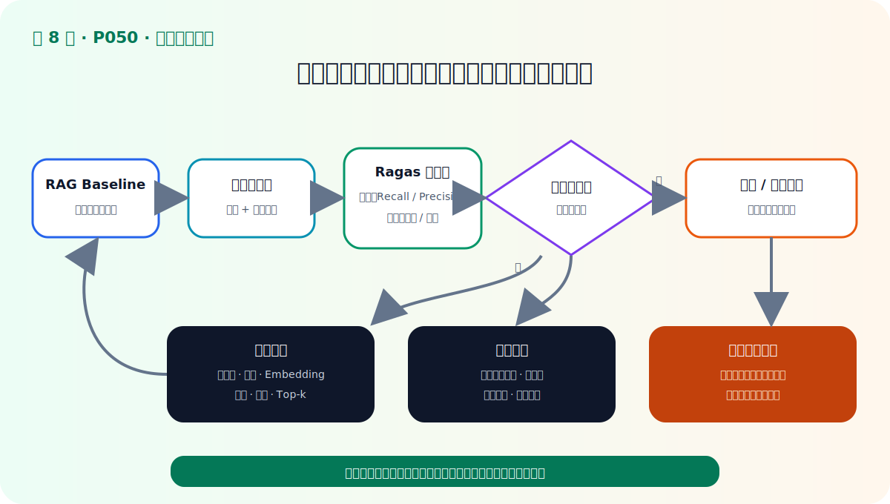
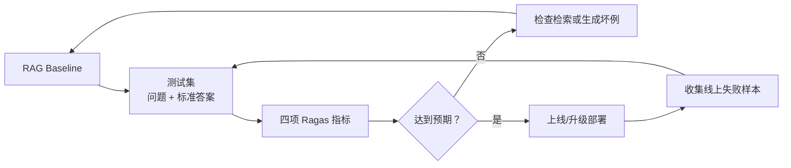

# P50：RAG 评估——本章总结

> 笔记编号 50/89 · 对应原视频 P50 · 时长 02:15 · [打开这一节](https://www.bilibili.com/video/BV1fLoKBREGv?p=50)

[← P49：用 Ragas 评估制度问答](./p049-实战-用Ragas评估制度问答模块的性能.md) · [返回第 8 章专题](./README.md) · [P51：高级检索增强导学 →](../09-advanced-retrieval/p051-高级检索增强-本章导学.md)

## 这节到底讲什么

这一节把本章压缩成一条完整逻辑：

**三项关系标准 → 三个执行步骤 → Ragas 四个指标 → 分析坏例并继续迭代。**

## 一、RAG 评估检查三个关系

- **问题 ↔ 上下文：** 检索内容是否相关、是否包含回答所需事实；
- **上下文 ↔ 答案：** 生成答案是否与证据事实一致；
- **问题 ↔ 答案：** 回答是否直接、完整且没有不相关冗余。

## 二、执行评估需要三个步骤

1. 构建包含问题和标准答案的测试数据集；
2. 选择要计算的指标；
3. 输入 RAG，收集上下文和生成答案，再执行指标计算。

## 三、Ragas 用四个指标落实这些标准

| 指标 | 本章必须记住的计算直觉 |
|---|---|
| Faithfulness | 生成答案的事实，有多少能由上下文推出 |
| Answer Relevancy | 从答案反推的问题，与原问题有多相似 |
| Context Recall | 标准答案所需事实，有多少被上下文覆盖 |
| Context Precision | 能支持标准答案的上下文，是否排在前面 |

前两项可以不依赖人工标准答案；视频讲解的后两项需要 `ground_truth`。

## 四、评估结果必须转化为下一步动作

低检索指标与低生成指标不能用同一种方案解决：

- Context Recall 低：查文档缺失、解析、分块、Embedding 与召回；
- Context Precision 低：查排序、Top-k、过滤与后续 Re-rank；
- Faithfulness 低：查上下文组织、依据约束、提示词和生成模型；
- Answer Relevancy 低：查问题理解、答案完整性和无关冗余。

这正是下一章学习高级检索的原因：当评估已经证明检索质量不足，才有依据引入
查询增强、混合检索、融合与重排。

## 校正版讲解时间线

- **00:00–00:30：** 三项关系标准与三个评估步骤。
- **00:30–01:06：** Ragas 结合无参考与有参考评估，Faithfulness 衡量事实一致性。
- **01:06–01:32：** Answer Relevancy 用逆向提问后的问题相似度。
- **01:32–01:53：** Context Recall 检查标准答案事实是否被召回。
- **01:53–02:15：** Context Precision 检查相关上下文是否排在前面。

## 完整原声逐段记录

[查看本节按时间戳保留的本地 ASR 转写](./transcripts/p050-RAG-评估-本章总结-ASR.md)。

## 不看视频的最终验收

读完本章后，你应能拿到一条制度问答坏例，先查看 `question`、`contexts`、
`answer` 和 `ground_truth`，再说明四个指标各自会检查什么，以及低分后应该改
检索链还是生成链。如果只能说“用 Ragas 跑个分”，还没有真正掌握本章。

## 自测

1. 三项评估标准、三个执行步骤、四个指标分别是什么？
2. 为什么 Context Recall 高而 Context Precision 仍可能低？
3. 哪一种低分最能直接说明答案含有无依据事实？
4. 第 9 章的高级检索方法应由哪类评估坏例驱动？
