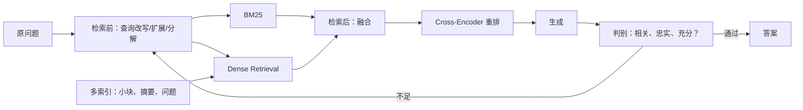

# 第 9 章：检索增强——从 Naive RAG 到可自我修正的系统

> 对应视频 P51–P68：[打开本章第一节](https://www.bilibili.com/video/BV1fLoKBREGv?p=51)


## 优化地图



## 稀疏检索与稠密检索

**TF-IDF/BM25** 根据词频和逆文档频率匹配关键词。词在当前文档越常见、在整个
语料越稀有，区分力通常越强。BM25 进一步对词频增益做饱和，并用文档长度归一化。

**Dense Retrieval** 用 Embedding 把查询和文档放进同一向量空间，能匹配不同
字面表达的相近语义，但可能错过编号、专有名词、缩写和精确数值。

两者的错误互补：BM25 擅长“字面必须一致”，Dense 擅长“意思相近”。企业搜索
通常把混合检索作为稳健 baseline。

## 查询增强：先修问题，再去检索

用户问题可能过短、含糊、缺少上下文、带歧义或包含多个子问题。

- **Query Rewrite**：改写成独立、明确、适合检索的表达；多轮对话要补回指代。
- **Query2doc**：让 LLM 生成一段可能的回答/伪文档，把它与原问题一起用于
  关键词或向量检索。伪文档不要求事实完全正确，价值在于扩充领域词和语义。
- **HyDE**：生成一个或多个 hypothetical documents，对它们做 Embedding，
  将向量平均或分别检索；检索匹配的是“答案形态”而不仅是短问题。
- **Multi-query**：从不同措辞和角度生成多个查询，再合并结果。
- **Sub-question**：把多跳问题拆成可分别检索的小问题，最后汇总证据。

风险是查询增强会漂移意图、增加延迟和 token 成本。必须保留原始 query，限制
扩展数量，并在评测集中加入容易漂移的问题。

## 多索引：匹配粒度与返回粒度可以不同

**父子文档**先切大块，再把大块切成小块。用小块 Embedding 做精确匹配，但命中
后返回带完整上下文的父块：`retrieve small, return large`。

**摘要索引**为大块生成摘要，用摘要向量匹配抽象问题，命中后仍返回原文。还可以
索引标题、关键词、假设问题、表格说明和实体，不同索引从不同维度暴露同一资料。

索引条目必须保存稳定的 `parent_id/source/version`，否则无法回原文、去重和增量
更新。

## 融合检索与 RRF

BM25 分数和余弦分数不在同一尺度，直接相加需要校准。Reciprocal Rank Fusion
只使用名次：

```text
RRF(d) = Σ 1 / (k + rank_r(d))
```

`k` 常取 60，用来减小头部名次差异；同一文档在多路结果中排名越靠前、出现次数
越多，融合分数越高。课程用稀疏 top-k 与稠密 top-k 合并，再选融合后的 top-n。
练习实现见 [fusion.py](../../rag_from_scratch/fusion.py)。

## Rerank：召回求广，重排求准

双塔 Embedding 可预计算文档向量，速度快，但 query 与 document 在编码时没有
直接交互。Cross-Encoder 把 `(query, document)` 一起送入 Transformer，直接输出
相关性分数，通常更准但更慢。

典型漏斗是：

```text
大语料 → BM25/Dense 各召回 20–100 条 → 融合去重 → Reranker → 3–10 条上下文
```

不要对全库用 Cross-Encoder；也不要让它在召回阶段根本没找出的文档上创造奇迹。

## 迭代检索

第一次 RAG 的临时答案可能暴露实体、年份或关系，把“原问题 + 上轮信息”用于下一
轮检索，就能解决需要先找 A、再用 A 找 B 的多跳问题。必须设置最大迭代次数、
去重和停止条件；错误临时答案也可能把后续检索带偏。

## Self-RAG 的核心不是多一次 Prompt

Self-RAG 把评估插入生成过程，而不是只在上线前做离线评估：

1. 判断是否需要检索；
2. 判断候选文档与问题是否相关；
3. 判断生成内容是否被证据支持；
4. 判断答案是否充分回答问题；
5. 不通过时选择改写、再检索、再生成或拒答。

它把固定 pipeline 变成带路由和循环的状态机。准确率可能提高，但延迟、费用、
不确定路径和可观测性也更复杂。

## 实验顺序

1. 固定 baseline、评测集和日志。
2. 先比较 BM25、Dense、Hybrid，确认召回瓶颈。
3. 再加入 Rerank，观察 Context Precision 与生成质量。
4. 只对明确的失败类型加入 Query2doc/HyDE/多查询。
5. 多跳问题再测试迭代或 Self-RAG，不要让所有请求默认走最贵路径。

## 自测

<details>
<summary>为什么小块检索后常返回父块，而不是直接把小块交给模型？</summary>

小块语义更集中，利于准确匹配；但可能缺少定义、条件、例外和相邻表格。返回父块
能补齐生成答案所需上下文，同时保留小块召回的精度。
</details>
