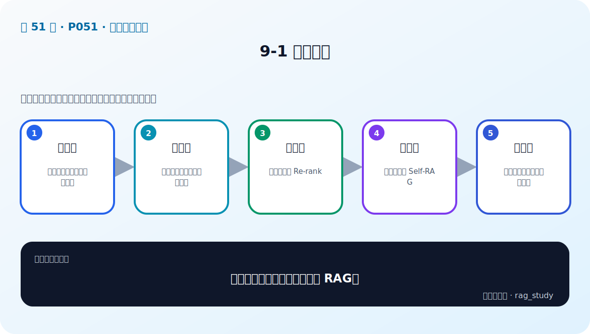

# P51：9-1 本章介绍

> 笔记编号 51/89 · 对应原视频 P51 · 时长 01:24 · [打开这一节](https://www.bilibili.com/video/BV1fLoKBREGv?p=51)

[← P50: 8-6 本章总结](../08-evaluation/p050-RAG-评估-本章总结.md) · [返回第 9 章专题](./README.md) · [P52: 9-2 一图剖析RAG进化之路：探索优化点 →](../09-advanced-retrieval/p052-一图剖析RAG进化之路-探索优化点.md)

## 这节到底讲什么

**核心问题：高级检索章会在哪些位置优化 RAG？**

这节直接回答“高级检索章会在哪些位置优化 RAG？”。老师的结论可以整理成五点：第一，查询前：改写、扩展、拆分用户问题；第二，索引侧：多表示、多粒度、多路索引；第三，检索后：融合候选与 Re-rank；第四，系统级：迭代检索与 Self-RAG；第五，工程化：评测、代码规范和模块组合。下面逐项解释每一点的含义和作用。

## 辅助流程图

## 正文讲解（按视频顺序）

> 下面是依据音轨和画面整理的通顺版本，不是逐字稿。技术术语已经校正，
> 老师的原始讲法保留在后面的 ASR 页面。

### 1. 查询前

改写、扩展、拆分用户问题。

### 2. 索引侧

多表示、多粒度、多路索引。

### 3. 检索后

融合候选与 Re-rank。

### 4. 系统级

迭代检索与 Self-RAG。

### 5. 工程化

评测、代码规范和模块组合。

## 用一个例子串起来

查询“报销 2024-07”适合 BM25 精确匹配编号；查询“出差住宿能报多少”更依赖语义检索。两路候选经 RRF 融合，再由 Reranker 精排，通常比单路更稳。

## 完整原声逐段记录

已用本地语音识别核查；技术词与口误以专题笔记的校正版为准。

[查看本节按时间戳保留的本地 ASR 转写](./transcripts/p051-高级检索增强-本章导学-ASR.md)。原始转写会保留
同音字和断句误差，正文用校正后的术语，方便同时核对“老师说了什么”和“概念是什么”。

## 读完记住这五句话

- **查询前：** 改写、扩展、拆分用户问题
- **索引侧：** 多表示、多粒度、多路索引
- **检索后：** 融合候选与 Re-rank
- **系统级：** 迭代检索与 Self-RAG
- **工程化：** 评测、代码规范和模块组合

## 最小可运行代码

[打开本节最相关的纯 Python 练习](../../rag_from_scratch/fusion.py)。练习包不依赖 LangChain，
目的是先看清输入、输出和算法边界，再替换成课程中的框架/API。

## 最容易踩的坑

不要一次加入所有增强方法。固定 Baseline 后一次只改一个变量，否则无法判断提升来自哪里。

## 自测

1. 不看图回答：高级检索章会在哪些位置优化 RAG？
2. 用上面的例子，指出本节五个知识点分别出现在哪里。
3. 如果没有“系统级”，会出现什么具体问题？

## 学完检查

- [ ] 我能不看视频解释本节核心概念
- [ ] 我能指出它在 RAG 数据流中的位置
- [ ] 我知道它最适合与最不适合的场景
- [ ] 我读过完整 ASR 并核对了技术术语
- [ ] 我完成了专题 README 中对应的自测或实验
