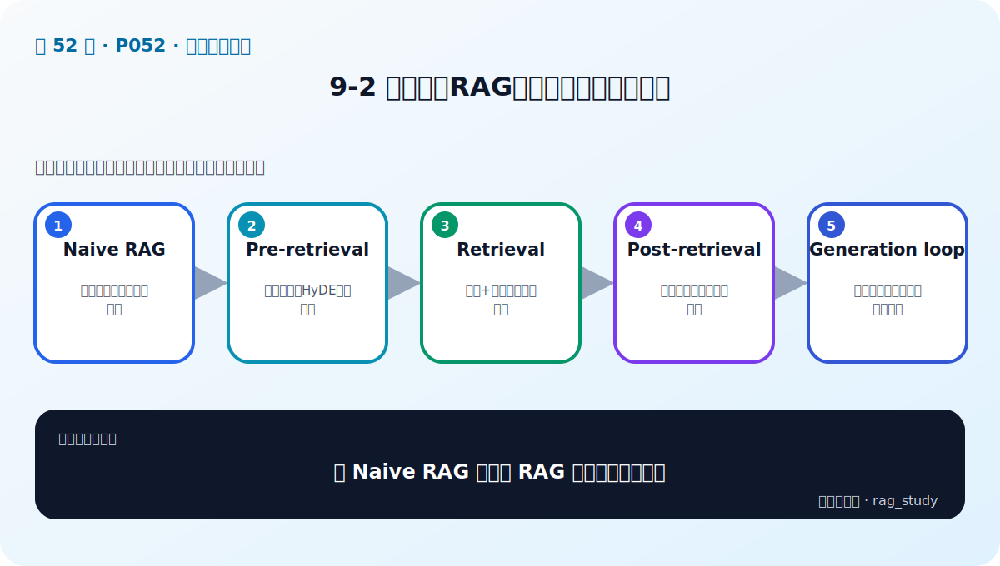

# P52：9-2 一图剖析RAG进化之路：探索优化点

> 笔记编号 52/89 · 对应原视频 P52 · 时长 03:03 · [打开这一节](https://www.bilibili.com/video/BV1fLoKBREGv?p=52)

[← P51: 9-1 本章介绍](../09-advanced-retrieval/p051-高级检索增强-本章导学.md) · [返回第 9 章专题](./README.md) · [P53: 9-3 检索的两大形态：稀疏 vs 稠密 →](../09-advanced-retrieval/p053-检索的两大形态-稀疏-vs-稠密.md)

## 这节到底讲什么

**核心问题：从 Naive RAG 到高级 RAG 的进化点有哪些？**

这节直接回答“从 Naive RAG 到高级 RAG 的进化点有哪些？”。老师的结论可以整理成五点：第一，Naive RAG：单路向量召回后直接生成；第二，Pre-retrieval：查询改写、HyDE、子问题；第三，Retrieval：稀疏+稠密、多索引并行；第四，Post-retrieval：融合、去重、重排与压缩；第五，Generation loop：迭代检索、自评与按需补证据。下面逐项解释每一点的含义和作用。

## 辅助流程图

## 正文讲解（按视频顺序）

> 下面是依据音轨和画面整理的通顺版本，不是逐字稿。技术术语已经校正，
> 老师的原始讲法保留在后面的 ASR 页面。

### 1. Naive RAG

单路向量召回后直接生成。

### 2. Pre-retrieval

查询改写、HyDE、子问题。

### 3. Retrieval

稀疏+稠密、多索引并行。

### 4. Post-retrieval

融合、去重、重排与压缩。

### 5. Generation loop

迭代检索、自评与按需补证据。

## 用一个例子串起来

查询“报销 2024-07”适合 BM25 精确匹配编号；查询“出差住宿能报多少”更依赖语义检索。两路候选经 RRF 融合，再由 Reranker 精排，通常比单路更稳。

## 完整原声逐段记录

已用本地语音识别核查；技术词与口误以专题笔记的校正版为准。

[查看本节按时间戳保留的本地 ASR 转写](./transcripts/p052-一图剖析RAG进化之路-探索优化点-ASR.md)。原始转写会保留
同音字和断句误差，正文用校正后的术语，方便同时核对“老师说了什么”和“概念是什么”。

## 读完记住这五句话

- **Naive RAG：** 单路向量召回后直接生成
- **Pre-retrieval：** 查询改写、HyDE、子问题
- **Retrieval：** 稀疏+稠密、多索引并行
- **Post-retrieval：** 融合、去重、重排与压缩
- **Generation loop：** 迭代检索、自评与按需补证据

## 最小可运行代码

[打开本节最相关的纯 Python 练习](../../rag_from_scratch/fusion.py)。练习包不依赖 LangChain，
目的是先看清输入、输出和算法边界，再替换成课程中的框架/API。

## 最容易踩的坑

不要一次加入所有增强方法。固定 Baseline 后一次只改一个变量，否则无法判断提升来自哪里。

## 自测

1. 不看图回答：从 Naive RAG 到高级 RAG 的进化点有哪些？
2. 用上面的例子，指出本节五个知识点分别出现在哪里。
3. 如果没有“Post-retrieval”，会出现什么具体问题？

## 学完检查

- [ ] 我能不看视频解释本节核心概念
- [ ] 我能指出它在 RAG 数据流中的位置
- [ ] 我知道它最适合与最不适合的场景
- [ ] 我读过完整 ASR 并核对了技术术语
- [ ] 我完成了专题 README 中对应的自测或实验
