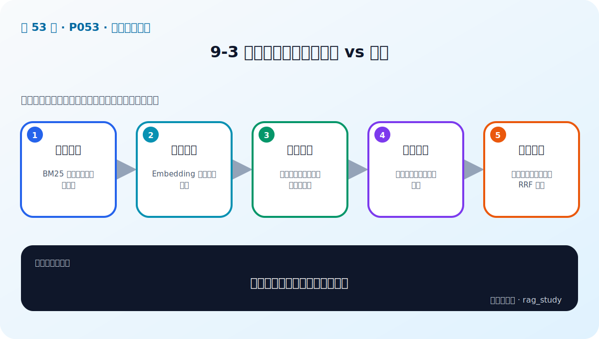

# P53：9-3 检索的两大形态：稀疏 vs 稠密

> 笔记编号 53/89 · 对应原视频 P53 · 时长 09:45 · [打开这一节](https://www.bilibili.com/video/BV1fLoKBREGv?p=53)

[← P52: 9-2 一图剖析RAG进化之路：探索优化点](../09-advanced-retrieval/p052-一图剖析RAG进化之路-探索优化点.md) · [返回第 9 章专题](./README.md) · [P54: 9-4 查询增强：增加相关内容-Query2doc+ HyDE+子问题查询 →](../09-advanced-retrieval/p054-查询增强-增加相关内容-Query2doc-HyDE-子问题查询.md)

## 这节到底讲什么

**核心问题：稀疏检索和稠密检索如何互补？**

这节直接回答“稀疏检索和稠密检索如何互补？”。老师的结论可以整理成五点：第一，稀疏检索：BM25 等依赖词项精确匹配；第二，稠密检索：Embedding 捕捉语义相似；第三，稀疏优势：专名、编号、关键词与可解释性；第四，稠密优势：同义改写和自然语言语义；第五，混合策略：并行召回后归一化或 RRF 融合。下面逐项解释每一点的含义和作用。

## 辅助流程图

## 正文讲解（按视频顺序）

> 下面是依据音轨和画面整理的通顺版本，不是逐字稿。技术术语已经校正，
> 老师的原始讲法保留在后面的 ASR 页面。

### 1. 稀疏检索

BM25 等依赖词项精确匹配。

### 2. 稠密检索

Embedding 捕捉语义相似。

### 3. 稀疏优势

专名、编号、关键词与可解释性。

### 4. 稠密优势

同义改写和自然语言语义。

### 5. 混合策略

并行召回后归一化或 RRF 融合。

## 课后迁移示例（非视频原例）

> 来源说明：这是为了帮助理解而补充的迁移示例，不是老师在本节视频中逐字讲述的原例。

查询“报销 2024-07”适合 BM25 精确匹配编号；查询“出差住宿能报多少”更依赖语义检索。两路候选经 RRF 融合，再由 Reranker 精排，通常比单路更稳。

## 完整原声逐段记录

已用本地语音识别核查；技术词与口误以专题笔记的校正版为准。

[查看本节按时间戳保留的本地 ASR 转写](./transcripts/p053-检索的两大形态-稀疏-vs-稠密-ASR.md)。原始转写会保留
同音字和断句误差，正文用校正后的术语，方便同时核对“老师说了什么”和“概念是什么”。

## 读完记住这五句话

- **稀疏检索：** BM25 等依赖词项精确匹配
- **稠密检索：** Embedding 捕捉语义相似
- **稀疏优势：** 专名、编号、关键词与可解释性
- **稠密优势：** 同义改写和自然语言语义
- **混合策略：** 并行召回后归一化或 RRF 融合

## 最小可运行代码

[打开本节最相关的纯 Python 练习](../../rag_from_scratch/fusion.py)。练习包不依赖 LangChain，
目的是先看清输入、输出和算法边界，再替换成课程中的框架/API。

## 最容易踩的坑

不要一次加入所有增强方法。固定 Baseline 后一次只改一个变量，否则无法判断提升来自哪里。

## 自测

1. 不看图回答：稀疏检索和稠密检索如何互补？
2. 用上面的例子，指出本节五个知识点分别出现在哪里。
3. 如果没有“稠密优势”，会出现什么具体问题？

## 学完检查

- [ ] 我能不看视频解释本节核心概念
- [ ] 我能指出它在 RAG 数据流中的位置
- [ ] 我知道它最适合与最不适合的场景
- [ ] 我读过完整 ASR 并核对了技术术语
- [ ] 我完成了专题 README 中对应的自测或实验
