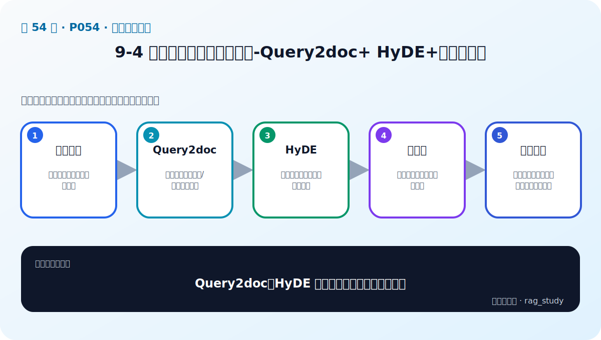

# P54：9-4 查询增强：增加相关内容-Query2doc+ HyDE+子问题查询

> 笔记编号 54/89 · 对应原视频 P54 · 时长 20:37 · [打开这一节](https://www.bilibili.com/video/BV1fLoKBREGv?p=54)

[← P53: 9-3 检索的两大形态：稀疏 vs 稠密](../09-advanced-retrieval/p053-检索的两大形态-稀疏-vs-稠密.md) · [返回第 9 章专题](./README.md) · [P55: 9-5 多索引增强：从不同维度构建索引，强化相关内容 →](../09-advanced-retrieval/p055-多索引增强-从不同维度构建索引-强化相关内容.md)

## 这节到底讲什么

**核心问题：Query2doc、HyDE 与子问题查询如何增强问题？**

这节直接回答“Query2doc、HyDE 与子问题查询如何增强问题？”。老师的结论可以整理成五点：第一，原始查询：可能短、模糊或包含多意图；第二，Query2doc：生成相关扩展文档/关键词再检索；第三，HyDE：先生成假设答案并编码其语义；第四，子问题：拆开复杂问题分别召回证据；第五，风险控制：生成扩展会漂移，需原查询与评测兜底。下面逐项解释每一点的含义和作用。

## 辅助流程图

## 正文讲解（按视频顺序）

> 下面是依据音轨和画面整理的通顺版本，不是逐字稿。技术术语已经校正，
> 老师的原始讲法保留在后面的 ASR 页面。

### 1. 原始查询

用户问题可能太短、表达含糊、缺少上下文，或者一次包含多个意图。直接拿这种问题检索，查询和文档的字面与语义都可能对不上，因此查询增强发生在真正检索之前。

### 2. Query2doc

Query2doc 让 LLM 先根据问题写一段可能相关的文档，再把这段文字与原问题一起用于检索。生成内容不一定事实正确，它的价值是补充领域词、同义表达和可能出现在答案中的关键词。

### 3. HyDE

HyDE 同样先生成一个假设答案，但重点是对假设答案做 Embedding，再用这个向量寻找真实文档。这样，短问题会被转换成更接近“答案文本”的语义表示。

### 4. 子问题

复杂问题应拆成多个可以单独检索的小问题。例如先找出适用制度，再查询金额上限和例外条件，最后汇总各路证据。每个子问题都要保留与原问题的对应关系。

### 5. 风险控制

LLM 生成的扩展内容可能偏离用户原意，所以原始查询必须保留并参与召回。还要限制扩展数量、去重候选，并用固定评测集确认增强确实提高召回，而不只是增加延迟和 Token 消耗。

## 用一个例子串起来

用户只问“出差补贴怎么办”，原问题太宽。Query2doc 可以先生成一段包含“交通、住宿、餐补、报销标准”等词的扩展文本；HyDE 可以先生成一份假设报销说明，再用它的向量检索真实制度；子问题方法则分别查询交通、住宿和餐补。三种结果都应保留原问题共同召回，防止生成内容把意图带偏。

## 完整原声逐段记录

已用本地语音识别核查；技术词与口误以专题笔记的校正版为准。

[查看本节按时间戳保留的本地 ASR 转写](./transcripts/p054-查询增强-增加相关内容-Query2doc-HyDE-子问题查询-ASR.md)。原始转写会保留
同音字和断句误差，正文用校正后的术语，方便同时核对“老师说了什么”和“概念是什么”。

## 读完记住这五句话

- **原始查询：** 可能短、模糊或包含多意图
- **Query2doc：** 生成相关扩展文档/关键词再检索
- **HyDE：** 先生成假设答案并编码其语义
- **子问题：** 拆开复杂问题分别召回证据
- **风险控制：** 生成扩展会漂移，需原查询与评测兜底

## 最小可运行代码

[打开本节最相关的纯 Python 练习](../../rag_from_scratch/fusion.py)。练习包不依赖 LangChain，
目的是先看清输入、输出和算法边界，再替换成课程中的框架/API。

## 最容易踩的坑

不要一次加入所有增强方法。固定 Baseline 后一次只改一个变量，否则无法判断提升来自哪里。

## 自测

1. 不看图回答：Query2doc、HyDE 与子问题查询如何增强问题？
2. 用上面的例子，指出本节五个知识点分别出现在哪里。
3. 如果没有“子问题”，会出现什么具体问题？

## 学完检查

- [ ] 我能不看视频解释本节核心概念
- [ ] 我能指出它在 RAG 数据流中的位置
- [ ] 我知道它最适合与最不适合的场景
- [ ] 我读过完整 ASR 并核对了技术术语
- [ ] 我完成了专题 README 中对应的自测或实验
