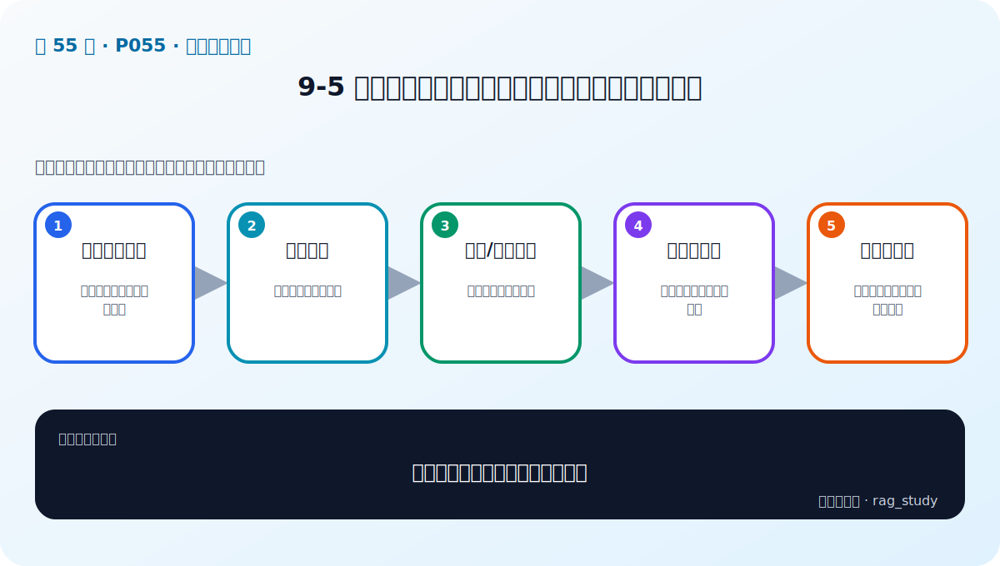

# P55：9-5 多索引增强：从不同维度构建索引，强化相关内容

> 笔记编号 55/89 · 对应原视频 P55 · 时长 09:18 · [打开这一节](https://www.bilibili.com/video/BV1fLoKBREGv?p=55)

[← P54: 9-4 查询增强：增加相关内容-Query2doc+ HyDE+子问题查询](../09-advanced-retrieval/p054-查询增强-增加相关内容-Query2doc-HyDE-子问题查询.md) · [返回第 9 章专题](./README.md) · [P56: 9-6 检索后增强：融合检索，三个臭皮匠顶一个诸葛亮 →](../09-advanced-retrieval/p056-检索后增强-融合检索-三个臭皮匠顶一个诸葛亮.md)

## 这节到底讲什么

**核心问题：多索引怎样从不同维度强化召回？**

这节直接回答“多索引怎样从不同维度强化召回？”。老师的结论可以整理成五点：第一，单一切块局限：一种粒度无法适配所有问题；第二，内容索引：直接对原文块建向量；第三，摘要/问题索引：用替代表述提高命中；第四，多粒度索引：小块定位、大块补上下文；第五，映射回原文：所有索引必须可追溯同一证据。下面逐项解释每一点的含义和作用。

## 辅助流程图

## 正文讲解（按视频顺序）

> 下面是依据音轨和画面整理的通顺版本，不是逐字稿。技术术语已经校正，
> 老师的原始讲法保留在后面的 ASR 页面。

### 1. 单一切块局限

一种粒度无法适配所有问题。

### 2. 内容索引

直接对原文块建向量。

### 3. 摘要/问题索引

用替代表述提高命中。

### 4. 多粒度索引

小块定位、大块补上下文。

### 5. 映射回原文

所有索引必须可追溯同一证据。

## 课后迁移示例（非视频原例）

> 来源说明：这是为了帮助理解而补充的迁移示例，不是老师在本节视频中逐字讲述的原例。

查询“报销 2024-07”适合 BM25 精确匹配编号；查询“出差住宿能报多少”更依赖语义检索。两路候选经 RRF 融合，再由 Reranker 精排，通常比单路更稳。

## 完整原声逐段记录

已用本地语音识别核查；技术词与口误以专题笔记的校正版为准。

[查看本节按时间戳保留的本地 ASR 转写](./transcripts/p055-多索引增强-从不同维度构建索引-强化相关内容-ASR.md)。原始转写会保留
同音字和断句误差，正文用校正后的术语，方便同时核对“老师说了什么”和“概念是什么”。

## 读完记住这五句话

- **单一切块局限：** 一种粒度无法适配所有问题
- **内容索引：** 直接对原文块建向量
- **摘要/问题索引：** 用替代表述提高命中
- **多粒度索引：** 小块定位、大块补上下文
- **映射回原文：** 所有索引必须可追溯同一证据

## 最小可运行代码

[打开本节最相关的纯 Python 练习](../../rag_from_scratch/fusion.py)。练习包不依赖 LangChain，
目的是先看清输入、输出和算法边界，再替换成课程中的框架/API。

## 最容易踩的坑

不要一次加入所有增强方法。固定 Baseline 后一次只改一个变量，否则无法判断提升来自哪里。

## 自测

1. 不看图回答：多索引怎样从不同维度强化召回？
2. 用上面的例子，指出本节五个知识点分别出现在哪里。
3. 如果没有“多粒度索引”，会出现什么具体问题？

## 学完检查

- [ ] 我能不看视频解释本节核心概念
- [ ] 我能指出它在 RAG 数据流中的位置
- [ ] 我知道它最适合与最不适合的场景
- [ ] 我读过完整 ASR 并核对了技术术语
- [ ] 我完成了专题 README 中对应的自测或实验
