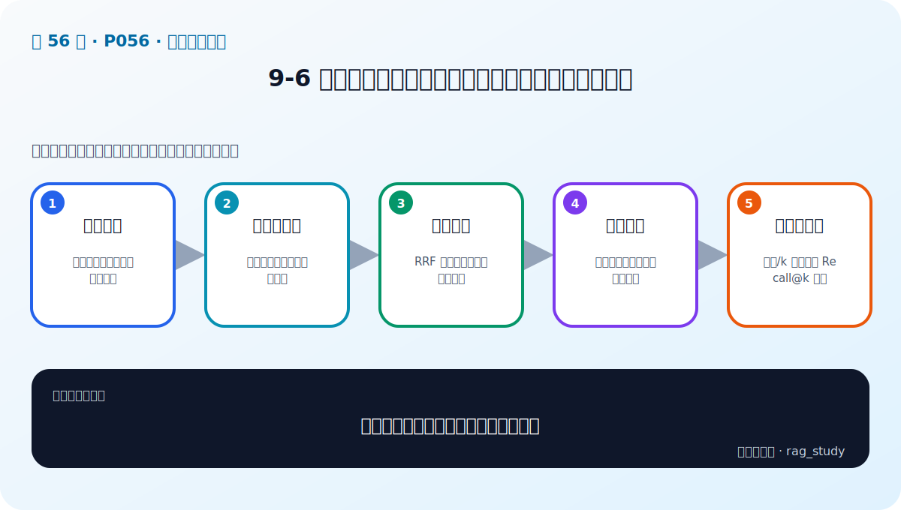

# P56：9-6 检索后增强：融合检索，三个臭皮匠顶一个诸葛亮

> 笔记编号 56/89 · 对应原视频 P56 · 时长 08:55 · [打开这一节](https://www.bilibili.com/video/BV1fLoKBREGv?p=56)

[← P55: 9-5 多索引增强：从不同维度构建索引，强化相关内容](../09-advanced-retrieval/p055-多索引增强-从不同维度构建索引-强化相关内容.md) · [返回第 9 章专题](./README.md) · [P57: 9-7 检索后增强：重排序技术(Re-rank) →](../09-advanced-retrieval/p057-检索后增强-重排序技术-Re-rank.md)

## 这节到底讲什么

**核心问题：融合检索为何能让多路召回彼此补短？**

这节直接回答“融合检索为何能让多路召回彼此补短？”。老师的结论可以整理成五点：第一，并行候选：稀疏、稠密或多索引各自返回；第二，分数不可比：不同检索器量纲与分布不同；第三，排名融合：RRF 用名次而非原始分数合并；第四，去重聚合：同一文档多次命中只保留一份；第五，调参与评测：权重/k 值用固定 Recall@k 验证。下面逐项解释每一点的含义和作用。

## 辅助流程图

## 正文讲解（按视频顺序）

> 下面是依据音轨和画面整理的通顺版本，不是逐字稿。技术术语已经校正，
> 老师的原始讲法保留在后面的 ASR 页面。

### 1. 并行候选

稀疏、稠密或多索引各自返回。

### 2. 分数不可比

不同检索器量纲与分布不同。

### 3. 排名融合

RRF 用名次而非原始分数合并。

### 4. 去重聚合

同一文档多次命中只保留一份。

### 5. 调参与评测

权重/k 值用固定 Recall@k 验证。

## 课后迁移示例（非视频原例）

> 来源说明：这是为了帮助理解而补充的迁移示例，不是老师在本节视频中逐字讲述的原例。

查询“报销 2024-07”适合 BM25 精确匹配编号；查询“出差住宿能报多少”更依赖语义检索。两路候选经 RRF 融合，再由 Reranker 精排，通常比单路更稳。

## 完整原声逐段记录

已用本地语音识别核查；技术词与口误以专题笔记的校正版为准。

[查看本节按时间戳保留的本地 ASR 转写](./transcripts/p056-检索后增强-融合检索-三个臭皮匠顶一个诸葛亮-ASR.md)。原始转写会保留
同音字和断句误差，正文用校正后的术语，方便同时核对“老师说了什么”和“概念是什么”。

## 读完记住这五句话

- **并行候选：** 稀疏、稠密或多索引各自返回
- **分数不可比：** 不同检索器量纲与分布不同
- **排名融合：** RRF 用名次而非原始分数合并
- **去重聚合：** 同一文档多次命中只保留一份
- **调参与评测：** 权重/k 值用固定 Recall@k 验证

## 最小可运行代码

[打开本节最相关的纯 Python 练习](../../rag_from_scratch/fusion.py)。练习包不依赖 LangChain，
目的是先看清输入、输出和算法边界，再替换成课程中的框架/API。

## 最容易踩的坑

不要一次加入所有增强方法。固定 Baseline 后一次只改一个变量，否则无法判断提升来自哪里。

## 自测

1. 不看图回答：融合检索为何能让多路召回彼此补短？
2. 用上面的例子，指出本节五个知识点分别出现在哪里。
3. 如果没有“去重聚合”，会出现什么具体问题？

## 学完检查

- [ ] 我能不看视频解释本节核心概念
- [ ] 我能指出它在 RAG 数据流中的位置
- [ ] 我知道它最适合与最不适合的场景
- [ ] 我读过完整 ASR 并核对了技术术语
- [ ] 我完成了专题 README 中对应的自测或实验
