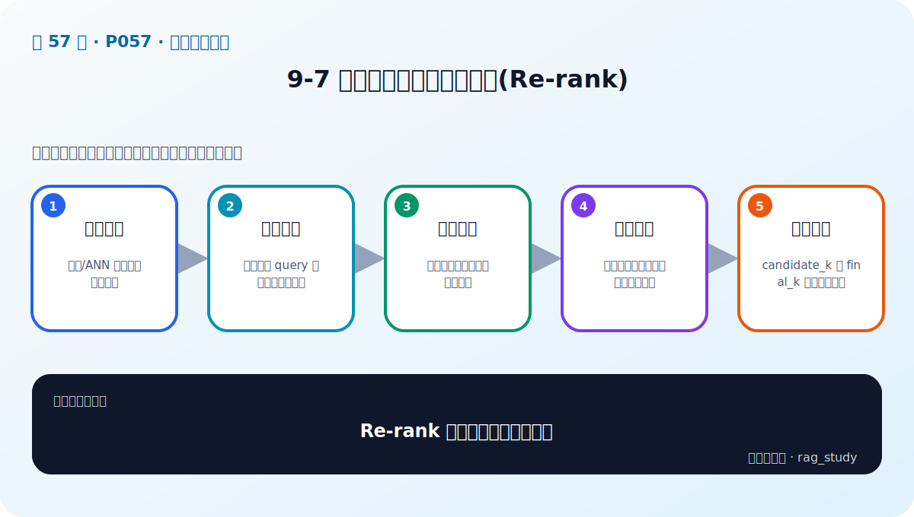
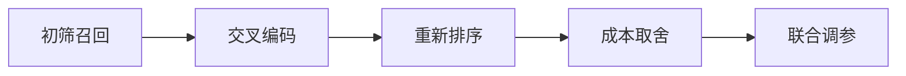

# P57：9-7 检索后增强：重排序技术(Re-rank)

> 笔记编号 57/89 · 对应原视频 P57 · 时长 05:37 · [打开这一节](https://www.bilibili.com/video/BV1fLoKBREGv?p=57)

[← P56: 9-6 检索后增强：融合检索，三个臭皮匠顶一个诸葛亮](../09-advanced-retrieval/p056-检索后增强-融合检索-三个臭皮匠顶一个诸葛亮.md) · [返回第 9 章专题](./README.md) · [P58: 9-8 系统性增强：迭代检索增强生成，从上一迭代收获信息 →](../09-advanced-retrieval/p058-系统性增强-迭代检索增强生成-从上一迭代收获信息.md)

## 这节到底讲什么

**核心问题：Re-rank 为什么放在召回之后？**

这节直接回答“Re-rank 为什么放在召回之后？”。老师的结论可以整理成五点：第一，初筛召回：双塔/ANN 快速取较大候选集；第二，交叉编码：同时阅读 query 与候选判断相关性；第三，重新排序：把最相关证据推到上下文前部；第四，成本取舍：精排准确但计算贵，不能全库运行；第五，联合调参：candidate_k 与 final_k 共同影响效果。下面逐项解释每一点的含义和作用。

## 辅助流程图

## 正文讲解（按视频顺序）

> 下面是依据音轨和画面整理的通顺版本，不是逐字稿。技术术语已经校正，
> 老师的原始讲法保留在后面的 ASR 页面。

### 1. 初筛召回

双塔/ANN 快速取较大候选集。

### 2. 交叉编码

同时阅读 query 与候选判断相关性。

### 3. 重新排序

把最相关证据推到上下文前部。

### 4. 成本取舍

精排准确但计算贵，不能全库运行。

### 5. 联合调参

candidate_k 与 final_k 共同影响效果。

## 课后迁移示例（非视频原例）

> 来源说明：这是为了帮助理解而补充的迁移示例，不是老师在本节视频中逐字讲述的原例。

查询“报销 2024-07”适合 BM25 精确匹配编号；查询“出差住宿能报多少”更依赖语义检索。两路候选经 RRF 融合，再由 Reranker 精排，通常比单路更稳。

## 完整原声逐段记录

已用本地语音识别核查；技术词与口误以专题笔记的校正版为准。

[查看本节按时间戳保留的本地 ASR 转写](./transcripts/p057-检索后增强-重排序技术-Re-rank-ASR.md)。原始转写会保留
同音字和断句误差，正文用校正后的术语，方便同时核对“老师说了什么”和“概念是什么”。

## 读完记住这五句话

- **初筛召回：** 双塔/ANN 快速取较大候选集
- **交叉编码：** 同时阅读 query 与候选判断相关性
- **重新排序：** 把最相关证据推到上下文前部
- **成本取舍：** 精排准确但计算贵，不能全库运行
- **联合调参：** candidate_k 与 final_k 共同影响效果

## 最小可运行代码

[打开本节最相关的纯 Python 练习](../../rag_from_scratch/fusion.py)。练习包不依赖 LangChain，
目的是先看清输入、输出和算法边界，再替换成课程中的框架/API。

## 最容易踩的坑

不要一次加入所有增强方法。固定 Baseline 后一次只改一个变量，否则无法判断提升来自哪里。

## 自测

1. 不看图回答：Re-rank 为什么放在召回之后？
2. 用上面的例子，指出本节五个知识点分别出现在哪里。
3. 如果没有“成本取舍”，会出现什么具体问题？

## 学完检查

- [ ] 我能不看视频解释本节核心概念
- [ ] 我能指出它在 RAG 数据流中的位置
- [ ] 我知道它最适合与最不适合的场景
- [ ] 我读过完整 ASR 并核对了技术术语
- [ ] 我完成了专题 README 中对应的自测或实验
