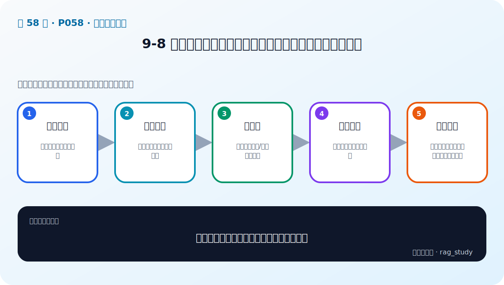
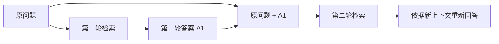

# P58：迭代检索增强生成——把上一轮答案变成下一轮线索

> 笔记编号 58/89 · 对应原视频 P58 · 时长 06:56 · [打开这一节](https://www.bilibili.com/video/BV1fLoKBREGv?p=58)

[← P57：Re-rank](./p057-检索后增强-重排序技术-Re-rank.md) · [返回第 9 章专题](./README.md) · [P59：Self-RAG →](./p059-RAG新范式-自我评估增强Self-RAG.md)

## 这节到底讲什么

普通 RAG 只运行一次“问题 → 检索 → 生成”。这节把完整 RAG 当成一个可重复的
模块：第一轮先得到一个可能不完整、甚至含有错误猜测的答案；第二轮把原问题与
上一轮答案拼成新的检索查询，再寻找新的上下文并重新生成。老师把它称为系统性
或模块化增强，因为它改造的不是检索前、检索中或检索后的单一步骤，而是让整个
RAG 流程迭代。

## 辅助流程图

## 正文讲解（按视频顺序）

### 1. 00:00–00:49：从单步增强转向整条流程迭代

前几节分别增强查询、索引、融合或排序；迭代检索不只替换其中一个组件，而是运行
两次或三次完整的 RAG。每一轮都会产生检索上下文和一个答案，最后一轮的答案才
作为最终输出。

### 2. 00:49–02:07：为什么上一轮答案可能帮助下一轮检索

原问题可能省略实体、属性或关系。即使第一轮答案还不正确，其中也可能出现与问题
有关的新词或描述；把这些内容加入下一轮查询，有机会匹配到原问题没有直接命中的
文档。这就是课程所说的“从上一迭代收获信息”。

注意：这里说的是“可能包含有价值的信息”，不是第一轮答案已经可信。它在第二轮
只是检索线索，最终事实仍必须由新检索到的上下文支持。

### 3. 02:14–04:02：两轮迭代的实际数据流

第一轮用原问题检索得到上下文 C1，再由模型生成答案 A1。第二轮不是直接沿用 C1，
而是把“原问题 + A1”组成新查询，检索得到 C2，然后用原问题和 C2 重新生成 A2。
如果继续第三轮，处理方式与第二轮相同。

课程演示的关键点是：上一轮答案参与下一轮的“检索”，但最后回答仍要回到用户原始
问题，不能把中间猜测当成标准答案。

### 4. 04:02–06:20：视频中的“冠军与身高”示例

老师举了一个多跳问题：询问“赢得 2015 年某冠军的队员身高是多少”。这个问题隐含
两步事实：先确定冠军是谁，再查询这个人的身高。第一轮上下文只提供了冠军身份，
没有身高；模型仍试着给出一个身高描述，但这个数值并没有上下文依据。

第二轮把冠军身份和身高描述等新增词带回检索，知识库若存在该人物的身高资料，就
更容易命中对应文档。随后模型基于新上下文回答人物与身高，才有证据支撑。笔记不
猜测视频画面中未从音轨清楚识别出的赛事名、人物名或最终数值。

### 5. 06:20–06:55：收益来自新证据，也伴随查询污染风险

老师的结论是：中间答案即便不完全准确，也可能提供能帮助召回的新信息。不过从
工程角度看，这同时带来查询污染风险——错误实体也可能把第二轮带偏。因此实现时
应保留原问题、限制迭代次数、记录每轮查询与证据，并检查新一轮是否真的增加了
可用上下文。这些是安全实现边界，不是对课程效果的额外保证。

## 课后迁移示例（非视频原例）

> 来源说明：这是为了帮助理解而补充的迁移示例，不是老师在本节视频中逐字讲述的原例。

用户问“上海出差住宿能报多少”。第一轮只召回“住宿标准按职级和城市确定”，答案
因此暴露了缺失条件“职级”。系统把原问题与已确认的员工职级一起组成第二轮查询，
再检索上海对应标准。若职级不是来自用户资料或可信上下文，就不能擅自猜测后加入。

## 完整原声逐段记录

[查看本节按时间戳保留的本地 ASR 转写](./transcripts/p058-系统性增强-迭代检索增强生成-从上一迭代收获信息-ASR.md)。
原始转写保留同音字与断句误差；本页没有猜写音轨无法确认的专名和数字。

## 读完记住这五句话

- 每一次迭代都是一次完整的 RAG，而不是只重复生成。
- 第二轮查询由原问题和上一轮答案共同组成。
- 上一轮答案是检索线索，不是已证实事实。
- 视频示例展示了先找人物、再找其身高的两步信息需求。
- 工程实现必须限制循环，并保存每轮查询、证据和输出。

## 最容易踩的坑

把上一轮的错误答案不断追加到查询，会让错误实体被反复强化。只有当新一轮确实
召回了更可靠的证据时，迭代才有价值。

## 自测

1. 为什么这项方法属于系统性增强，而不是查询增强的一个普通步骤？
2. 第一轮答案在第二轮中扮演什么角色，为什么不能直接当事实？
3. “冠军与身高”示例为什么需要两步信息？
4. 怎样判断继续一轮检索还有没有收益？

## 学完检查

- [ ] 我能画出两轮迭代的数据流
- [ ] 我能区分中间答案、检索线索和最终证据
- [ ] 我能复述视频中的两步问题示例而不猜测专名
- [ ] 我知道错误中间答案可能污染后续查询
- [ ] 我会为迭代设置次数、证据增益和日志边界
