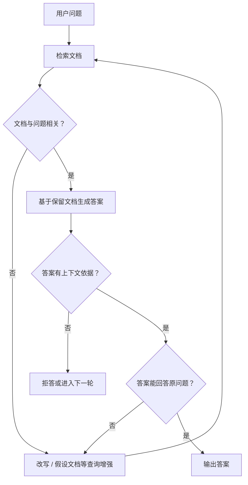

# P59：Self-RAG——把判别与策略选择放进 RAG 流程

> 笔记编号 59/89 · 对应原视频 P59 · 时长 10:50 · [打开这一节](https://www.bilibili.com/video/BV1fLoKBREGv?p=59)

[← P58：迭代检索](./p058-系统性增强-迭代检索增强生成-从上一迭代收获信息.md) · [返回第 9 章专题](./README.md) · [P60：本章总结与代码管理 →](./p060-总结和展望-关于企业里需要良好的代码规范和代码管理.md)

## 这节到底讲什么

传统流程通常在 RAG 输出答案之后才做人工或 Ragas 评估，再由开发者离线调整
策略。课程中的 Self-RAG 思路是把判别节点直接放进运行流程：先判断检索文档是否
相关，再检查生成答案是否得到上下文支持、是否真正回答问题；不同判别结果走向
过滤、查询增强、再次检索、重新生成、拒答或结束。

本节讲的是课程采用的 Self-RAG 工作流解释，不等于 Self-RAG 论文所有实现细节。

## 辅助流程图

## 正文讲解（按视频顺序）

### 1. 00:00–02:41：从“事后评估”转为“流程内判别”

老师先回顾常规项目：构建 RAG，人工或用 Ragas 评估，按结果修改策略，多轮离线
优化后再上线；线上出现坏例时再回到相同闭环。这里评估虽然重要，却没有直接参与
单次答案的生成过程。

Self-RAG 要解决的是：能否在检索和生成的当下就判断当前结果好不好，并立刻选择
下一步。这样固定直线流程会变成带条件分支和循环的工作流。

### 2. 02:41–04:05：第一道判别——检索文档是否相关

检索后逐步判断文档与问题的相关性，只把相关文档交给生成模型，减少噪声干扰。
如果文档都不相关，说明当前检索失效，可以改写查询、生成假设性文档等，再次检索
并重新判别，直到取得足够的相关文档或触发工程上的终止条件。

这里不是笼统地“决定是否检索”；课程画出的流程先执行检索，再评价检索结果。
原笔记把这一点写成“问题是否需要检索”，与本节音轨不完全一致，现已校正。

### 3. 04:05–05:36：生成后还要做两道判别

第一道检查答案是否符合上下文，也就是答案中的事实能否找到证据。若没有依据，
可以放弃答案、再次生成或进入下一轮，而不能因为措辞流畅就直接返回。

第二道检查答案是否真正回应原问题。即使内容有依据，也可能答非所问或漏掉核心
要求；这时可以拒答，或者换一种查询增强和迭代策略。课程借用了前面 Ragas 的思路，
但这里的判别用于控制在线流程，不是只为得到离线分数。

### 4. 05:36–08:35：三道关卡怎样连成一张图

老师把完整流程归纳为三次判断：

1. 文档相关性：问题与检索文档是否相关；
2. 答案支持度：答案是否能由上下文推出；
3. 答案有用性：答案是否能解决原始问题。

文档不相关时可丢弃或增强查询；答案无支持时可拒答或重试；有支持但无用时可进入
新一轮策略。通过三道判断的答案才被视为相对可靠。这里应注意老师说的是“相对来
说比较正确”，不是数学意义上的正确性保证。

### 5. 08:35–10:49：判别器仍是 LLM，流程用 LangGraph 表达

课程中的判别依赖大语言模型和专门提示词，所以判别结果自身也可能不稳定。流程
可以直接用 `if/else` 编写；课程随后引出 LangGraph，把检索、判别、生成表示为
有向图节点，再用条件边依据 `yes/no` 等状态决定后续节点。

LangGraph 是实现工作流的工具，不是 Self-RAG 成立的必要条件。真正的核心是显式
状态、可检查的判别结果、条件路由和受控循环。

## 课后迁移示例（非视频原例）

> 来源说明：这是为了帮助理解而补充的迁移示例，不是老师在本节视频中逐字讲述的原例。

用户问“试用期员工是否有 10 天年假”。检索到的“正式员工年假”文档与问题只部分
相关，相关性节点不能直接把它当完整依据；系统应改写为“试用期 年假 适用范围”再
检索。生成后还要检查“10 天”是否被新文档支持，以及答案是否明确回答试用期条件。

## 完整原声逐段记录

[查看本节按时间戳保留的本地 ASR 转写](./transcripts/p059-RAG新范式-自我评估增强Self-RAG-ASR.md)。
原始转写中的 “IG、IG-AS、Lenshain、Lengrenff” 应按语境校正为 RAG、Ragas、
LangChain、LangGraph。

## 读完记住这五句话

- 课程中的 Self-RAG 把评估从事后分析移到生成流程内部。
- 本节先检索，再判别文档相关性，不是先判断“要不要检索”。
- 生成后分别检查上下文支持度和对原问题的有用性。
- 判别失败后可以过滤、增强、迭代或拒答，但循环必须受控。
- LangGraph 负责表达节点和条件边，核心逻辑并不依赖某个框架。

## 最容易踩的坑

不能把 LLM 判别器当成绝对裁判。生产实现应记录提示词、输入、判别理由、路由结果
和循环次数，并用人工标注样本单独评测每个判别节点。

## 自测

1. Self-RAG 与传统“生成后统一评估”最大的流程差别是什么？
2. 课程中的三道判别分别比较哪些对象？
3. 文档相关但答案不受支持时，为什么不能直接输出？
4. LangGraph 在这里解决的是概念问题还是工作流表达问题？

## 学完检查

- [ ] 我能画出检索、三道判别与条件分支
- [ ] 我能区分文档相关性、答案支持度和答案有用性
- [ ] 我知道课程流程与“先判断是否检索”的说法不同
- [ ] 我知道判别器也需要独立评测
- [ ] 我能为循环设计重试上限、拒答和日志
