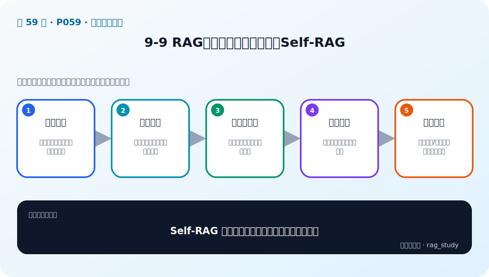
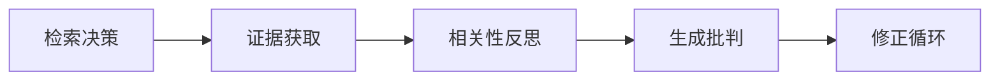

# P59：9-9 RAG新范式：自我评估增强Self-RAG

> 笔记编号 59/89 · 对应原视频 P59 · 时长 10:50 · [打开这一节](https://www.bilibili.com/video/BV1fLoKBREGv?p=59)

[← P58: 9-8 系统性增强：迭代检索增强生成，从上一迭代收获信息](../09-advanced-retrieval/p058-系统性增强-迭代检索增强生成-从上一迭代收获信息.md) · [返回第 9 章专题](./README.md) · [P60: 9-10 总结和展望：关于企业里需要良好的代码规范和代码管理 →](../09-advanced-retrieval/p060-总结和展望-关于企业里需要良好的代码规范和代码管理.md)

## 这节到底讲什么

**核心问题：Self-RAG 如何让模型决定何时检索并自我评价？**

这节直接回答“Self-RAG 如何让模型决定何时检索并自我评价？”。老师的结论可以整理成五点：第一，检索决策：判断当前问题是否需要外部知识；第二，证据获取：按需调用检索器而非固定检索；第三，相关性反思：检查证据是否支持当前任务；第四，生成批判：评价答案忠实性与有用性；第五，修正循环：重新检索/生成，并设置终止上限。下面逐项解释每一点的含义和作用。

## 辅助流程图

## 正文讲解（按视频顺序）

> 下面是依据音轨和画面整理的通顺版本，不是逐字稿。技术术语已经校正，
> 老师的原始讲法保留在后面的 ASR 页面。

### 1. 检索决策

判断当前问题是否需要外部知识。

### 2. 证据获取

按需调用检索器而非固定检索。

### 3. 相关性反思

检查证据是否支持当前任务。

### 4. 生成批判

评价答案忠实性与有用性。

### 5. 修正循环

重新检索/生成，并设置终止上限。

## 用一个例子串起来

查询“报销 2024-07”适合 BM25 精确匹配编号；查询“出差住宿能报多少”更依赖语义检索。两路候选经 RRF 融合，再由 Reranker 精排，通常比单路更稳。

## 完整原声逐段记录

已用本地语音识别核查；技术词与口误以专题笔记的校正版为准。

[查看本节按时间戳保留的本地 ASR 转写](./transcripts/p059-RAG新范式-自我评估增强Self-RAG-ASR.md)。原始转写会保留
同音字和断句误差，正文用校正后的术语，方便同时核对“老师说了什么”和“概念是什么”。

## 读完记住这五句话

- **检索决策：** 判断当前问题是否需要外部知识
- **证据获取：** 按需调用检索器而非固定检索
- **相关性反思：** 检查证据是否支持当前任务
- **生成批判：** 评价答案忠实性与有用性
- **修正循环：** 重新检索/生成，并设置终止上限

## 最小可运行代码

[打开本节最相关的纯 Python 练习](../../rag_from_scratch/fusion.py)。练习包不依赖 LangChain，
目的是先看清输入、输出和算法边界，再替换成课程中的框架/API。

## 最容易踩的坑

不要一次加入所有增强方法。固定 Baseline 后一次只改一个变量，否则无法判断提升来自哪里。

## 自测

1. 不看图回答：Self-RAG 如何让模型决定何时检索并自我评价？
2. 用上面的例子，指出本节五个知识点分别出现在哪里。
3. 如果没有“生成批判”，会出现什么具体问题？

## 学完检查

- [ ] 我能不看视频解释本节核心概念
- [ ] 我能指出它在 RAG 数据流中的位置
- [ ] 我知道它最适合与最不适合的场景
- [ ] 我读过完整 ASR 并核对了技术术语
- [ ] 我完成了专题 README 中对应的自测或实验
