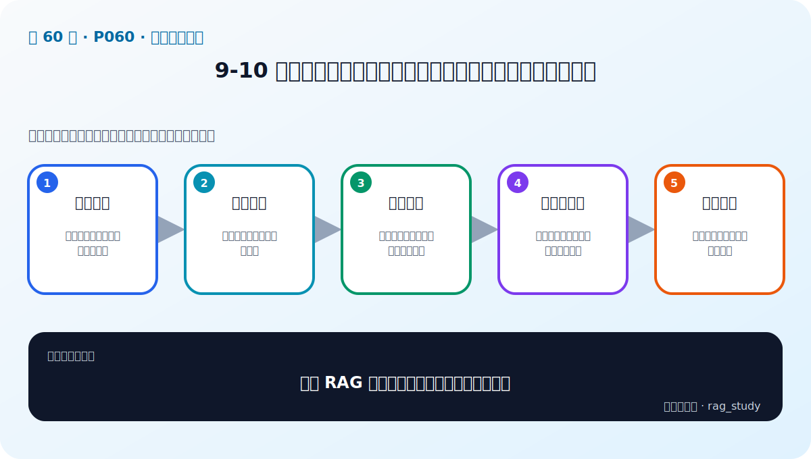
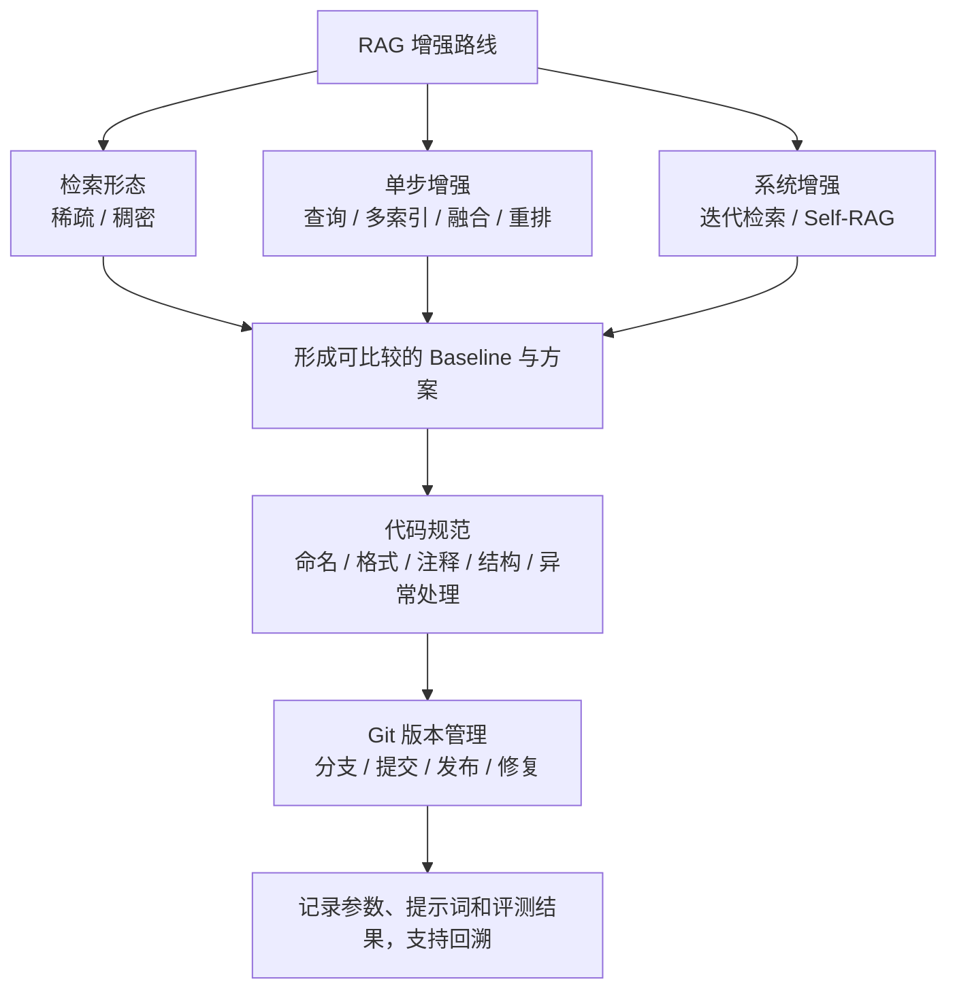

# P60：高级检索增强总结、代码规范与版本管理

> 笔记编号 60/89 · 对应原视频 P60 · 时长 19:42 · [打开这一节](https://www.bilibili.com/video/BV1fLoKBREGv?p=60)

[← P59：Self-RAG](./p059-RAG新范式-自我评估增强Self-RAG.md) · [返回第 9 章专题](./README.md) · [P61：查询增强实战（1） →](./p061-实战-用检索增强技术提升制度问答模块性能-查询增强-1.md)

## 这节到底讲什么

这不是一节只讲“代码规范”的课。老师先用约 7 分钟把整章高级检索增强串成一张
路线图：普通 RAG、Advanced RAG 与模块化 RAG 有什么关系；稀疏检索和稠密检索
各自解决什么问题；查询增强、多索引、融合、重排、迭代检索与 Self-RAG 分别改造
流程的哪一段。后半节才转向企业开发中的代码规范、Git 分支管理，以及为什么 AI
应用的每一次实验都应该留下可回溯的版本。

## 辅助流程图

## 正文讲解（按视频顺序）

> 以下内容依据本节音轨按时间顺序整理。ASR 中的 “IG、减锁、孕妇、Gate”
> 分别按语境校正为 RAG、检索、用户、Git。

### 1. 00:00–01:35：先回到三类 RAG 与两种检索形态

老师先回顾三种设计层次：普通 RAG 是一次固定的检索—生成流程；Advanced RAG
在查询、检索或检索后处理等局部步骤加入增强；模块化或系统性 RAG 则允许多个
模块反复迭代并根据结果改变下一步策略。

检索本身又分为两类。稀疏检索以词项匹配和统计为基础，课程举了 TF-IDF、BM25；
稠密检索用 Embedding 表达语义，再按向量相似度召回，课程提到 BGE、GTE。二者
不是简单的“旧方法和新方法”：用户表达多样，精确词项与语义近义各有适用场景，
所以后面才需要融合和重排。

### 2. 01:35–02:50：查询增强给输入补信息或换表达

第一类增强发生在检索之前。老师把它分成两条思路：一条是让模型根据原问题生成
假设性文本，例如 Query2doc、HyDE，用补充文本增加与知识库文档的匹配机会；另一
条是直接变换问题，例如 Query Rewrite、把复杂问题拆成子问题，以及 Step-Back，
即抽象掉过细条件，先检索更上位的知识。

这里的边界是：增强后的查询只是新的检索入口，不是已经被证实的答案。假设文本
可能带来有用词汇，也可能带来错误实体，因此后续仍要依赖真实文档和评测确认收益。

### 3. 02:51–04:34：多索引改变“拿什么匹配”，不改变最终证据

课程总结了三种多索引表示：用小块检索后返回对应大块；用大文档摘要建索引，命中
后返回原文；根据大文档生成多个假设问题，以“问题对问题”的方式匹配，再返回原文。
三者索引粒度不同，但共同点是检索表示负责提高命中率，最终交给生成模型的仍是可
核查的原始大文档，而不是摘要或假设问题本身。

### 4. 04:35–05:40：融合与重排解决候选排序

融合检索把不同检索器得到的有序候选合并。课程用稀疏检索与稠密检索说明互补性，
并回顾按排名计算融合分数的做法。Re-rank 则在初步召回之后，使用专门的深度学习
模型重新计算“问题—文档”相关性，让更相关的候选排到前面。

两者位置不同：融合先组合多路召回，重排再细看一批候选。课程没有说所有项目都
必须同时使用二者；是否增加这一层，要用同一评测集比较质量提升与额外耗时。

### 5. 05:40–07:24：迭代检索与 Self-RAG 把评估放进流程

迭代检索把一次 RAG 扩展为多轮：上一轮生成内容中的新线索，会与原问题一起进入
下一轮检索。Self-RAG 的重点则是把判别节点放进 RAG 流程，对检索文档或生成答案
进行自我评估，再根据结果动态选择改写、再次检索、重新生成或结束。

老师把“自我评估”称为 Self-RAG 最重要的特点。它不等于模型一定能自我纠错；
判别器也可能出错，而且循环会增加成本，因此工程实现仍需次数限制、日志和离线
评测。后一句是工程边界补充，不是视频对效果的保证。

### 6. 07:25–14:35：为什么团队要先约定代码规范

多人按各自习惯编写代码，会降低协作和维护效率。课程列出的规范范围包括：

- 命名：变量、函数、类和文件要简洁且见名知意，并统一驼峰或下划线等风格；
- 格式：统一缩进、空格或制表符、行宽和空行，并借助语言工具检查；
- 注释：解释复杂逻辑和算法，信息要有用，不能用大段注释掩盖难懂代码；
- 结构：约定目录、模块、类和函数怎样组织；
- 错误处理：捕获和隔离异常，避免一个模块拖垮整个服务；
- 设计原则：课程提到单一职责、开闭、接口隔离、里氏替换、依赖倒置和迪米特法则。

需要校正一个容易混淆的概念：开闭原则通常表述为“对扩展开放、对修改关闭”，
不是禁止别人访问类的内部内容；迪米特法则也不属于 SOLID 五原则，只是课程在同一
段列举的另一条常见设计原则。

### 7. 14:35–18:12：Git 保存变化，也组织多人协作

版本管理保存每次提交，让团队追踪里程碑和回到可用检查点。课程先提到 SVN 与 Git，
再以 Git 的分支流程说明协作：生产主分支、开发分支、功能分支、发布分支和紧急修复
分支各有职责；发布或修复完成后要把变化合回需要保持一致的分支。

视频画面沿用当时常见的 `master`、`develop`、`feature`、`release`、`hotfix` 命名。
这些是示例策略，不是 Git 强制规则；团队可以使用 `main` 或更简单的分支模型，关键
是提前约定，并确保发布、修复和后续开发不会长期分叉。

### 8. 18:12–19:42：AI 实验为什么更需要版本可回溯

AI 应用会从 Baseline 出发反复试验 Embedding、提示词、参数和增强策略。老师建议用
Git 的提交与分支记录这些变化，以便回看哪些方案有效、哪些无效。这里还要补一个
工程边界：Git 适合管理代码和小型文本配置；大模型权重、大型数据集、向量索引和
密钥不应直接塞进普通仓库，应记录其版本标识、存储位置和评测结果，并使用对应的
制品或数据版本工具。

## 课后迁移示例（非视频原例）

> 来源说明：这是为了帮助理解而补充的迁移示例，不是老师在本节视频中逐字讲述的原例。

假设 Baseline 使用 `top_k=3` 和原始查询，方案 A 改成 Query2doc，方案 B 再加入
Reranker。不要在同一个未记录的脚本里反复改参数；分别保存配置、代码提交、测试集、
四项评测分数和耗时。这样方案 B 变差时，才能判断是重排模型、参数还是数据变化，
也能准确回到 Baseline，而不是凭记忆重写。

## 完整原声逐段记录

[查看本节按时间戳保留的本地 ASR 转写](./transcripts/p060-总结和展望-关于企业里需要良好的代码规范和代码管理-ASR.md)。
原始转写保留同音字和断句误差，只用于核对老师的讲解顺序；技术名词与设计原则以
本页校正版为准。

## 读完记住这五句话

- 查询增强、多索引、融合、重排分别作用于 RAG 的不同位置。
- 迭代检索利用上一轮产生的新线索；Self-RAG 把判别与策略选择放进流程。
- 代码规范至少覆盖命名、格式、注释、结构、异常处理和设计原则。
- Git 分支名称只是团队约定，真正目标是版本可追踪、可合并、可回退。
- AI 实验除代码外，还要记录配置、数据、模型和评测结果的版本。

## 最容易踩的坑

不要把“Git 已提交”当成“实验可复现”。如果只保存代码，却没有记录数据版本、模型、
提示词、参数和评测集，同一个提交仍可能得到不同结果。

## 自测

1. 查询增强、多索引、融合检索和 Re-rank 分别改变 RAG 的哪一个环节？
2. 视频为什么先讲完整章总结，再转向代码规范与 Git？
3. 开闭原则的准确含义是什么？迪米特法则为什么不能算作 SOLID 的第六项？
4. 为什么 AI 项目的 Git 提交还不足以单独保证实验可复现？

## 学完检查

- [ ] 我能按视频顺序复述本章高级检索增强路线
- [ ] 我能区分视频原讲解与本页标明的工程边界补充
- [ ] 我能说明代码规范覆盖的六类内容
- [ ] 我能画出开发、发布和紧急修复分支之间的合并关系
- [ ] 我能为一次 RAG 实验记录代码、配置、数据、模型和评测版本
