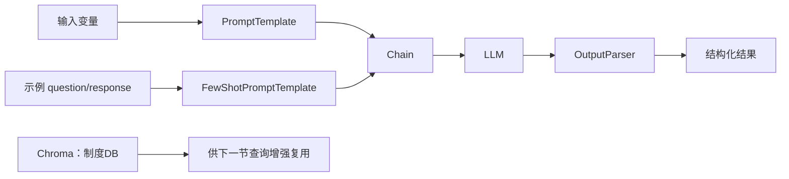

# P61：查询增强实战（1）——先补齐 LangChain 的提示词、Chain 与解析器

> 笔记编号 61/89 · 对应原视频 P61 · 时长 21:26 · [打开这一节](https://www.bilibili.com/video/BV1fLoKBREGv?p=61)

[← P60：本章总结与代码管理](./p060-总结和展望-关于企业里需要良好的代码规范和代码管理.md) · [返回第 9 章专题](./README.md) · [P62：查询增强实战（2） →](./p062-实战-用检索增强技术提升制度问答模块性能-查询增强-2.md)

## 这节到底讲什么

这节还没有正式实现 Query2doc、HyDE 等算法。老师先补齐下一节会反复使用的
LangChain 基础组件：怎样用变量构造提示词模板，怎样插入少样本示例，怎样把提示词、
模型和输出解析器串成 Chain，最后重新连接上一章的制度知识库。原笔记把 Query2doc
和 HyDE 提前写进 P61，已与音轨核对后移回 P62。

## 辅助流程图

## 正文讲解（按视频顺序）

> P61 开头约 3 分钟的本地 ASR 出现大段重复词，无法作为逐字依据；本页只整理
> 后续音轨能够确认的操作主线，不补猜损坏片段中的代码细节。

### 1. 03:00–05:31：PromptTemplate 用变量生成最终提示词

老师先写一个带两个占位变量的提示词文本：一个变量接收内容，另一个控制需要生成
多少项。把变量名和模板文本传入 `PromptTemplate` 后，再给变量赋具体值，模板才
格式化成真正交给模型的提示词。这里要分清“模板对象”和“格式化后的文本”；前者
可复用，后者是一次调用的实际输入。

### 2. 05:31–11:06：FewShotPromptTemplate 由前缀、示例和后缀组成

少样本提示词先为单个示例规定格式，例如一组 `question` 与 `response`；再提供多条
示例数据。最终模板由三部分拼接：说明任务的前缀、按统一格式渲染的示例、带用户
输入变量的后缀。调用时只传当前问题，框架会把示例和当前输入组织成完整提示词。

示例的作用是向模型展示任务与输出形式，不是把示例答案当作当前问题的上下文证据。

### 3. 11:07–15:14：Chain 负责把上一步输出传给下一步

课程先用管道写法把提示词模板和模型连接起来：输入字典进入模板，格式化提示词再
进入模型。随后又展示 `LLMChain` 的封装方式。两种写法的共同点不是语法，而是固定
数据流：每一步的输出必须满足下一步的输入要求。

如果直接打印模型对象的返回值，得到的往往仍是消息或字典结构；后续算法需要的
若是字符串或列表，就还要继续解析。

### 4. 15:15–20:15：OutputParser 同时约束模型并解析结果

老师用逗号分隔列表解析器说明两个作用：一是把格式要求加入提示词，明确告诉模型
应怎样输出；二是把模型返回的文本解析成程序可直接使用的列表。将模板、LLM 和
解析器串进同一条 Chain 后，调用者不必在每处重复手写切分逻辑。

解析器只能检查形式，不能保证每一项内容都正确。模型若漏项、夹带解释或使用错误
分隔符，仍需异常处理和结果校验。

### 5. 20:15–21:26：重新连接制度知识库，为 P62 做准备

课程末尾重新加载 Embedding、LLM 与 Chroma 连接，并取得之前创建的“制度DB”向量
集合。到这里完成的是查询增强实战的公共基础设施；Query2doc、HyDE、子问题、查询
改写与 Step-Back 的具体实现从下一节开始。

## 课后迁移示例（非视频原例）

> 来源说明：这是为了帮助理解而补充的迁移示例，不是老师在本节视频中逐字讲述的原例。

如果查询改写需要返回 3 个不同表达，模板负责说明“保持原意、只输出三项”，解析器
负责把输出变成 `list[str]`。随后应再检查列表长度、去重和空字符串，不能把“解析
成功”误认为“改写质量合格”。

## 完整原声逐段记录

[查看本节按时间戳保留的本地 ASR 转写](./transcripts/p061-实战-用检索增强技术提升制度问答模块性能-查询增强-1-ASR.md)。
开头重复噪声原样保留用于追溯；本页没有把该损坏部分改写成老师未确认的内容。

## 读完记住这五句话

- P61 是查询增强的框架准备，不是 Query2doc/HyDE 的正式实现。
- PromptTemplate 把输入变量填入可复用模板。
- Few-shot 模板由任务前缀、示例和当前输入后缀组成。
- Chain 连接步骤，OutputParser 约束并解析输出格式。
- 课程最后重新连接“制度DB”，供 P62 直接使用。

## 最容易踩的坑

只依赖提示词要求模型输出列表，却不做解析异常、长度和内容校验，会让下游检索在
模型偶尔改变格式时直接失败。

## 自测

1. P61 为什么先讲 PromptTemplate，而不是直接写 Query2doc？
2. Few-shot 模板的示例和 RAG 检索上下文有什么区别？
3. OutputParser 的两个作用分别是什么？
4. 为什么“能解析成列表”还不等于查询增强结果可用？

## 学完检查

- [ ] 我能区分模板对象与格式化后的提示词
- [ ] 我能说明 few-shot 模板的三部分
- [ ] 我能画出模板、LLM、解析器之间的数据流
- [ ] 我知道 P61 开头 ASR 有损坏且没有据此补猜
- [ ] 我知道 P62 才开始实现具体查询增强方法
