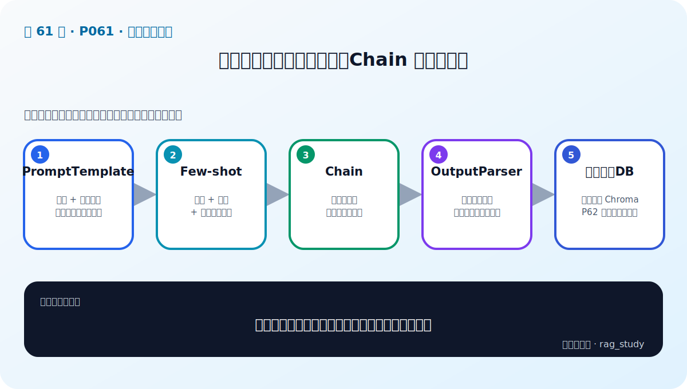

# P61：9-11 实战：用检索增强技术提升制度问答模块性能-查询增强-1

> 笔记编号 61/89 · 对应原视频 P61 · 时长 21:26 · [打开这一节](https://www.bilibili.com/video/BV1fLoKBREGv?p=61)

[← P60: 9-10 总结和展望：关于企业里需要良好的代码规范和代码管理](../09-advanced-retrieval/p060-总结和展望-关于企业里需要良好的代码规范和代码管理.md) · [返回第 9 章专题](./README.md) · [P62: 9-12 实战：用检索增强技术提升制度问答模块性能-查询增强-2 →](../09-advanced-retrieval/p062-实战-用检索增强技术提升制度问答模块性能-查询增强-2.md)

## 这节到底讲什么

**核心问题：查询增强实战第一部分怎样实现可复用接口？**

这节直接回答“查询增强实战第一部分怎样实现可复用接口？”。老师的结论可以整理成五点：第一，定义输入输出：原问题进，增强查询列表出；第二，提示词模板：约束扩展不改变原始意图；第三，实现 Query2doc/HyDE：生成扩展文本或假设答案；第四，保留原查询：与增强结果共同召回防漂移；第五，记录中间结果：便于评测每种增强的真实贡献。下面逐项解释每一点的含义和作用。

## 辅助流程图

## 正文讲解（按视频顺序）

> 下面是依据音轨和画面整理的通顺版本，不是逐字稿。技术术语已经校正，
> 老师的原始讲法保留在后面的 ASR 页面。

### 1. 定义输入输出

原问题进，增强查询列表出。

### 2. 提示词模板

约束扩展不改变原始意图。

### 3. 实现 Query2doc/HyDE

生成扩展文本或假设答案。

### 4. 保留原查询

与增强结果共同召回防漂移。

### 5. 记录中间结果

便于评测每种增强的真实贡献。

## 用一个例子串起来

查询“报销 2024-07”适合 BM25 精确匹配编号；查询“出差住宿能报多少”更依赖语义检索。两路候选经 RRF 融合，再由 Reranker 精排，通常比单路更稳。

## 完整原声逐段记录

已用本地语音识别核查；技术词与口误以专题笔记的校正版为准。

[查看本节按时间戳保留的本地 ASR 转写](./transcripts/p061-实战-用检索增强技术提升制度问答模块性能-查询增强-1-ASR.md)。原始转写会保留
同音字和断句误差，正文用校正后的术语，方便同时核对“老师说了什么”和“概念是什么”。

## 读完记住这五句话

- **定义输入输出：** 原问题进，增强查询列表出
- **提示词模板：** 约束扩展不改变原始意图
- **实现 Query2doc/HyDE：** 生成扩展文本或假设答案
- **保留原查询：** 与增强结果共同召回防漂移
- **记录中间结果：** 便于评测每种增强的真实贡献

## 最小可运行代码

[打开本节最相关的纯 Python 练习](../../rag_from_scratch/fusion.py)。练习包不依赖 LangChain，
目的是先看清输入、输出和算法边界，再替换成课程中的框架/API。

## 最容易踩的坑

不要一次加入所有增强方法。固定 Baseline 后一次只改一个变量，否则无法判断提升来自哪里。

## 自测

1. 不看图回答：查询增强实战第一部分怎样实现可复用接口？
2. 用上面的例子，指出本节五个知识点分别出现在哪里。
3. 如果没有“保留原查询”，会出现什么具体问题？

## 学完检查

- [ ] 我能不看视频解释本节核心概念
- [ ] 我能指出它在 RAG 数据流中的位置
- [ ] 我知道它最适合与最不适合的场景
- [ ] 我读过完整 ASR 并核对了技术术语
- [ ] 我完成了专题 README 中对应的自测或实验
