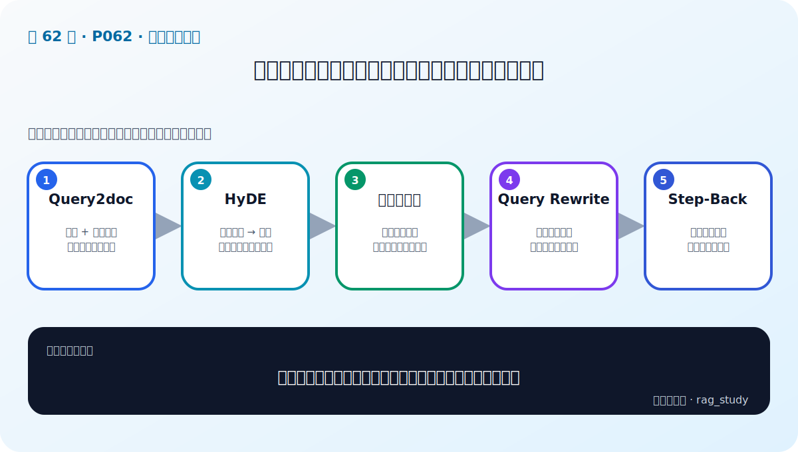
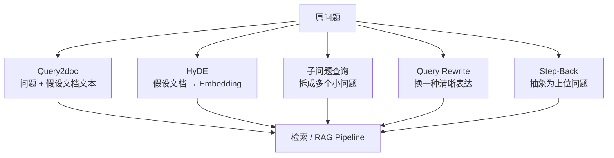

# P62：查询增强实战（2）——Query2doc、HyDE、子问题、改写与 Step-Back

> 笔记编号 62/89 · 对应原视频 P62 · 时长 26:57 · [打开这一节](https://www.bilibili.com/video/BV1fLoKBREGv?p=62)

[← P61：查询增强实战准备](./p061-实战-用检索增强技术提升制度问答模块性能-查询增强-1.md) · [返回第 9 章专题](./README.md) · [P63：多索引增强 →](./p063-实战-用检索增强技术提升制度问答模块性能-多索引增强.md)

## 这节到底讲什么

这节把五类查询增强方法接进制度问答 Pipeline。它们并不是“批量生成查询后统一用
RRF 融合”这一种实现：Query2doc 把假设文本与原问题拼接；HyDE 直接生成用于检索
的向量；子问题查询拆解复杂问题；Query Rewrite 改写表达；Step-Back 把问题抽象到
更上位的概念。原笔记把它们错误归并成一个批量融合流程，现已按视频逐项校正。

## 辅助流程图

## 正文讲解（按视频顺序）

### 1. 00:00–02:16：先让 Pipeline 接受不同类型的检索输入

老师先改造原 RAG Pipeline：提示词模板可作为参数传入；检索入口除了普通字符串，
还可以接收已经计算好的 Embedding，或直接接收已经检索出的文档。字符串走文本
检索，向量走向量检索，文档则跳过检索直接进入上下文拼接。非流式调用还暴露温度
参数，便于不同增强策略控制生成多样性。

这一步很关键，因为后面的 Query2doc 输出文本，而 HyDE 输出向量，两者不能假装成
完全相同的数据类型。

### 2. 02:17–07:42：Query2doc 生成假设文本，再与原问题拼接

Query2doc 的函数接收原问题，通过带“公司规章制度”角色约束的提示词让 LLM 先写
一段可能回答该问题的文本。课程把这段假设文本与原问题拼成新的 `context query`，
再送入知识库检索，并打印中间文本以便比较增强前后的回答。

假设文本用于增加术语和描述，不是权威答案。视频也展示了它对宽泛问题可能补充
有效信息，但如果生成内容偏离意图，也会把检索带偏。

### 3. 07:43–13:36：HyDE 把假设文档转换为检索向量

HyDE 与 Query2doc 都先生成假设文档，区别在输出：HyDE 使用
`HypotheticalDocumentEmbedder` 一类封装，把假设文档编码为向量。课程还演示了把
原问题向量与假设文档向量取平均，再把结果作为 `vector` 类型的检索输入。

因此 HyDE 不是“把假设答案直接塞进最终上下文”，而是在向量空间里改变查询表示；
真正提供给生成模型的仍应是知识库召回文档。

### 4. 13:37–17:30：子问题查询先拆复杂问题，再分别处理

课程用提示词要求模型找出复杂问题的核心，并拆成多个较容易检索的小问题；输出经
解析后成为子问题列表。随后逐个把子问题送进 RAG Pipeline 得到回答。这个方法适合
原问题同时包含多个条件或关系的情况。

拆分必须保留原问题约束。若子问题漏掉时间、地点或对象，分别回答得再流畅，也无法
重新组成正确的总答案。

### 5. 17:31–21:08：Query Rewrite 改写表达，但不应改掉意图

查询改写通过提示词让模型换一种更清晰、更适合知识库匹配的表达。课程调整生成
设置以增加表达多样性，再用改写后的查询检索和生成答案。它与子问题查询不同：
Rewrite 仍然代表同一个问题，子问题法则把一个复杂任务拆成多个局部问题。

### 6. 21:09–26:57：Step-Back 去掉过细条件，先问上位知识

Step-Back 使用少样本示例告诉模型怎样把具体问题抽象成更一般的问题。课程构造了
示例模板、系统任务说明和当前用户问题，再生成抽象后的查询并接入检索。它的目标
不是随意删词，而是先找到能覆盖原问题的上位概念或规则。

抽象过度会丢掉决定答案的具体条件，所以 Step-Back 的结果通常要与原问题共同使用，
而不是完全替换原问题后直接作答。

## 五种方法不要混成一张表

| 方法 | 增强结果 | 主要用途 | 主要风险 |
|---|---|---|---|
| Query2doc | 原问题 + 假设文本 | 补充可能出现的术语和描述 | 假设内容污染查询 |
| HyDE | 假设文档的向量表示 | 让查询靠近答案型文档的向量区域 | 生成偏差进入向量 |
| 子问题查询 | 多个小问题 | 处理多条件、多跳或组合问题 | 拆分后漏约束 |
| Query Rewrite | 同意图的新表达 | 修复口语、歧义或不利于匹配的表达 | 改写改变意图 |
| Step-Back | 更抽象的上位问题 | 先找通用原理或规则 | 抽象过度丢细节 |

## 课后迁移示例（非视频原例）

> 来源说明：这是为了帮助理解而补充的迁移示例，不是老师在本节视频中逐字讲述的原例。

“我去上海住店能报几多”适合先 Rewrite 为“员工赴上海出差的住宿报销标准是多少”；
如果问题还同时要求交通和餐补，则可拆成三个子问题。不能让 HyDE 生成的假设金额
直接进入最终答案，金额必须来自检索到的制度原文。

## 完整原声逐段记录

[查看本节按时间戳保留的本地 ASR 转写](./transcripts/p062-实战-用检索增强技术提升制度问答模块性能-查询增强-2-ASR.md)。
ASR 中反复出现的“维吾党”按上下文校正为“假设文档”，“Inventing/imbelling”校正
为 Embedding。

## 读完记住这五句话

- P62 的 Pipeline 明确区分文本、向量和已检索文档三类输入。
- Query2doc 输出拼接文本，HyDE 输出用于检索的向量。
- 子问题查询是拆任务，Query Rewrite 是换表达。
- Step-Back 生成更上位的问题，但不能丢掉原问题的关键条件。
- 所有生成式增强都可能漂移，必须与原查询做对照评测。

## 最容易踩的坑

不要把假设文档里的事实当作最终证据。它只服务于召回；最终答案中的制度条款、
金额和适用条件都必须能回到真实文档。

## 自测

1. Query2doc 与 HyDE 的输出类型有什么关键差别？
2. 子问题查询与 Query Rewrite 为什么不能合并理解？
3. Step-Back 在什么情况下会因为抽象过度而变差？
4. 为什么 Pipeline 要支持 `str`、Embedding 和文档三类输入？

## 学完检查

- [ ] 我能按视频顺序说出五种查询增强方法
- [ ] 我能区分每种方法产生的中间数据
- [ ] 我知道假设文档不是事实来源
- [ ] 我能为每种方法指出至少一种漂移风险
- [ ] 我会用固定测试集分别比较原查询与增强查询
