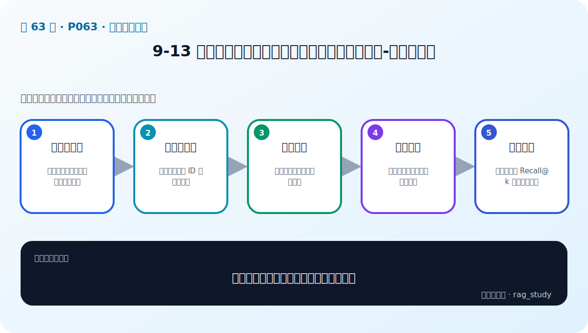
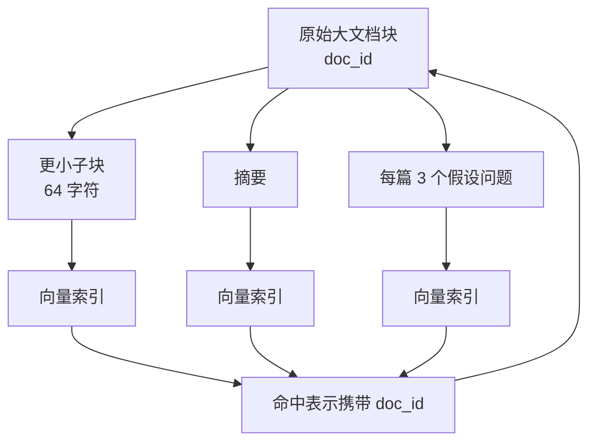

# P63：多索引增强实战——小块、摘要和假设问题都要映射回原文

> 笔记编号 63/89 · 对应原视频 P63 · 时长 23:55 · [打开这一节](https://www.bilibili.com/video/BV1fLoKBREGv?p=63)

[← P62：查询增强实战](./p062-实战-用检索增强技术提升制度问答模块性能-查询增强-2.md) · [返回第 9 章专题](./README.md) · [P64：融合检索实战 →](./p064-实战-用检索增强技术提升制度问答模块性能-融合检索.md)

## 这节到底讲什么

老师从已经切好的制度文档出发，分别建立三种新的检索表示：更小的子块、原文摘要、
以及根据原文生成的假设问题。检索命中的是这些“索引表示”，真正返回给 RAG 的却
是它们对应的原始大块。实现的关键不是并行搜索多少索引，而是用稳定的文档 ID
保存“索引表示 → 权威原文”的父子映射。

## 辅助流程图

## 正文讲解（按视频顺序）

### 1. 00:00–01:47：读取原始分块并确认数据结构

课程先读取上一章保存的分块结果。数据是以文档 ID 为键、文档对象为值的映射；
老师打印内容，确认其中既有正文也有表格等类型。后续无论生成小块、摘要还是问题，
都必须保存这个原始 ID，才能在命中后找回原文。

### 2. 01:48–11:33：父子检索——小块负责命中，大块负责回答

第一种方法按文档长短建立新的粒度。课程把普通文本继续切成约 64 字符的小块，
并在小块元数据里保存父文档 ID 与类型；表格等内容按课程代码的类型分支处理，不能
不加区分地再次切碎。小块被写入新的 Embedding 集合，原始大块则保存到内存存储。

`MultiVectorRetriever` 一类检索器先在小块向量集合中命中，再读取命中项的 ID，
最后从父文档存储中返回对应大块。这样既用小粒度提高匹配机会，又避免只把残缺的
一句话交给生成模型。

### 3. 11:34–17:00：摘要检索——摘要建索引，原文作上下文

第二种方法先为每个原始大块生成摘要。老师构造摘要提示词和 Chain，要求概括主要
信息并保留关键词，再把摘要与父文档 ID 组成新的文档对象写入向量集合。检索器仍
通过 ID 回到原始大块。

摘要不是事实源的替代品。摘要若漏掉细节，可能影响召回；即使命中摘要，最终上下文
仍返回原文，便于回答时核对具体条件。

### 4. 17:01–23:54：假设问题检索——问题匹配问题，命中后仍返回原文

第三种方法让 LLM 针对每个原始块生成三个可能由该文档回答的问题。提示词要求中文、
不附解释、按列表输出；课程用结构化模型/解析器约束结果，再把每个问题分别包装成
带父文档 ID 的文档并建立向量索引。

查询时，用户问题更容易与这些假设问题在“问题—问题”层面相似；命中后通过 ID
取回原文。老师最后测试返回两个父文档，展示三种方法虽然索引表示不同，但检索器
输出都统一为原始文档。

## 三种索引的共同结构

| 索引表示 | 建索引的内容 | 命中后返回 | 主要风险 |
|---|---|---|---|
| 父子检索 | 更小的子块 | 对应原始大块 | 子块切断语义或 ID 错配 |
| 摘要检索 | LLM 生成摘要 | 对应原始大块 | 摘要遗漏关键词或事实 |
| 假设问题检索 | 每篇文档的候选问题 | 对应原始大块 | 生成的问题覆盖不全或偏题 |

## 课后迁移示例（非视频原例）

> 来源说明：这是为了帮助理解而补充的迁移示例，不是老师在本节视频中逐字讲述的原例。

一条长制度包含“适用对象、城市等级、住宿上限、审批例外”。可以用“小块：住宿上限”、
“摘要：差旅制度主要规则”和“问题：上海 P6 员工住宿能报多少”三种表示建索引；
无论命中哪一种，都应返回同一个带版本和页码的制度原文块。

## 完整原声逐段记录

[查看本节按时间戳保留的本地 ASR 转写](./transcripts/p063-实战-用检索增强技术提升制度问答模块性能-多索引增强-ASR.md)。
ASR 中的“复制检索/复制索引”按画面和上下文理解为父子/小块检索，不据此创造新的
算法名称。

## 读完记住这五句话

- 多索引先从已有原始分块生成新的检索表示。
- 小块、摘要和假设问题都必须携带父文档 ID。
- 检索命中索引表示，最终返回原始大块。
- 课程的小块示例使用约 64 字符，并区分文档类型。
- 生成式索引可能遗漏或偏移，需要离线评测和重建版本记录。

## 最容易踩的坑

如果只把摘要或假设问题返回给 LLM，系统就把“用于匹配的辅助表示”误当成“可引用
的事实原文”；一旦生成内容有误，答案会失去可靠证据。

## 自测

1. 为什么小块命中后要返回大块？
2. 三种索引方法变化的是哪一层，不变的又是哪一层？
3. `doc_id` 丢失会造成什么后果？
4. 假设问题检索为何仍不能把生成的问题当答案依据？

## 学完检查

- [ ] 我能画出索引表示到父文档的映射
- [ ] 我能区分三种表示的建库方式
- [ ] 我知道表格等结构不能无条件按普通文本再切分
- [ ] 我能说明 MultiVectorRetriever 的两级读取逻辑
- [ ] 我会为生成式索引记录模型、提示词和数据版本
