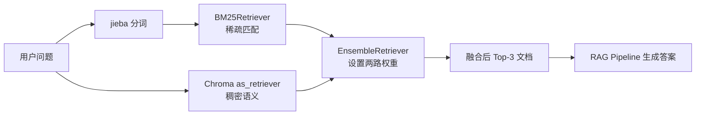

# P64：融合检索实战——BM25、中文分词与稠密检索加权组合

> 笔记编号 64/89 · 对应原视频 P64 · 时长 07:11 · [打开这一节](https://www.bilibili.com/video/BV1fLoKBREGv?p=64)

[← P63：多索引增强](./p063-实战-用检索增强技术提升制度问答模块性能-多索引增强.md) · [返回第 9 章专题](./README.md) · [P65：Re-rank 实战 →](./p065-实战-用检索增强技术提升制度问答模块性能-rerank重排.md)

## 这节到底讲什么

老师没有在本节手写一套 RRF 公式实现，而是先为中文制度文档建立 BM25 检索器，
再把已有 Chroma 向量集合转成稠密检索器，最后交给 LangChain 的
`EnsembleRetriever` 并设置两路权重。融合后的有序文档直接传入 RAG Pipeline。
原笔记把课堂操作写成“按 ID 手写 RRF、处理空列表和稳定排序”，现已校正。

## 辅助流程图

## 正文讲解（按视频顺序）

### 1. 00:00–00:52：准备 BM25 与融合检索组件

课程先说明这是检索后增强，并安装/导入 BM25、中文分词以及 LangChain 的 BM25
检索器和融合检索器。稀疏检索依赖词项统计，因此中文不能直接把整句当一个词项；
需要先确定分词预处理。

### 2. 00:53–03:22：用 jieba 为中文 BM25 建立预处理

老师编写分词函数，把输入文本切成词语或单字，并用一句请假相关文本观察切分结果。
随后以原始大文档列表创建 `BM25Retriever`，把 jieba 函数传给预处理参数，并把返回
数量设为 3。两个问题的测试展示了关键词命中：相关文档不一定总排第一，这正是
后续融合要改善的地方。

分词器、用户词典和停用词都会影响 BM25 结果；课程示例只说明基本链路，不能把一次
切分效果当成中文检索已调优完成。

### 3. 03:23–05:05：把 Chroma 向量集合转成稠密检索器

已有 Embedding 向量集合通过 `as_retriever` 转成统一检索接口，并同样设置返回数量。
这一路按语义相似度召回，不要求问题与文档出现完全相同的关键词。

两路检索器的原始分数含义不同，课程没有直接把 BM25 分数与向量相似度相加，而是
交给融合检索器处理排序。

### 4. 05:06–06:23：用 EnsembleRetriever 设置权重并融合

老师把 BM25 与稠密检索器传入 `EnsembleRetriever`，同时设置两路权重。调用融合
检索器后返回重新排序的前三个文档。课堂代码使用框架内部的融合逻辑；如果在不同
LangChain 版本复现，具体构造参数与内部算法应以该版本文档/源码为准。

权重不是“准确率百分比”，而是两路排序在融合时的相对影响。应通过固定评测集调整，
不能因为两路看起来同等重要就默认各一半且永不变化。

### 5. 06:23–07:10：把已融合文档直接交给 Pipeline

融合检索已经得到文档对象，因此课程把这些文档直接作为 Pipeline 的上下文输入，
同时传入原问题生成答案，不再让 Pipeline 重复检索。这里沿用了 P62 改造后的“可接收
已检索文档”接口。

## 课后迁移示例（非视频原例）

> 来源说明：这是为了帮助理解而补充的迁移示例，不是老师在本节视频中逐字讲述的原例。

“制度编号 BX-2024-07”通常更依赖 BM25 的精确词项；“外地住酒店最高能报多少”更
依赖语义召回。融合可以让两路候选互补，但最终是否提升，要比较同一批问题的召回、
答案质量和延迟，不能只看一条示例。

## 完整原声逐段记录

[查看本节按时间戳保留的本地 ASR 转写](./transcripts/p064-实战-用检索增强技术提升制度问答模块性能-融合检索-ASR.md)。
ASR 中的“解巴、Innsable retriever、Inventing”分别按语境校正为 jieba、
EnsembleRetriever、Embedding。

## 读完记住这五句话

- 中文 BM25 先做分词，再统计词项匹配。
- 课程把 Chroma 向量集合转成统一的稠密检索器接口。
- 本节通过 EnsembleRetriever 和两路权重实现融合，没有手写 RRF 循环。
- 融合结果已经是文档对象，可直接交给改造后的 RAG Pipeline。
- 权重与 Top-k 都需要评测，不能凭直觉固定。

## 最容易踩的坑

把 BM25 原始分数和余弦相似度直接相加，会混合量纲不同的分数；课程使用排序融合
组件，避免了这种未经校准的直接相加。

## 自测

1. 为什么中文 BM25 需要先分词？
2. 本节是手写 RRF，还是调用框架的融合检索器？
3. 为什么两路原始分数不适合直接相加？
4. 融合后的文档为什么不应再被 Pipeline 重复检索？

## 学完检查

- [ ] 我能画出稀疏与稠密两路检索
- [ ] 我能说明 jieba 在 BM25 前的作用
- [ ] 我知道课程的融合由 EnsembleRetriever 完成
- [ ] 我能解释权重不是准确率
- [ ] 我会用同一评测集选择权重与 Top-k
