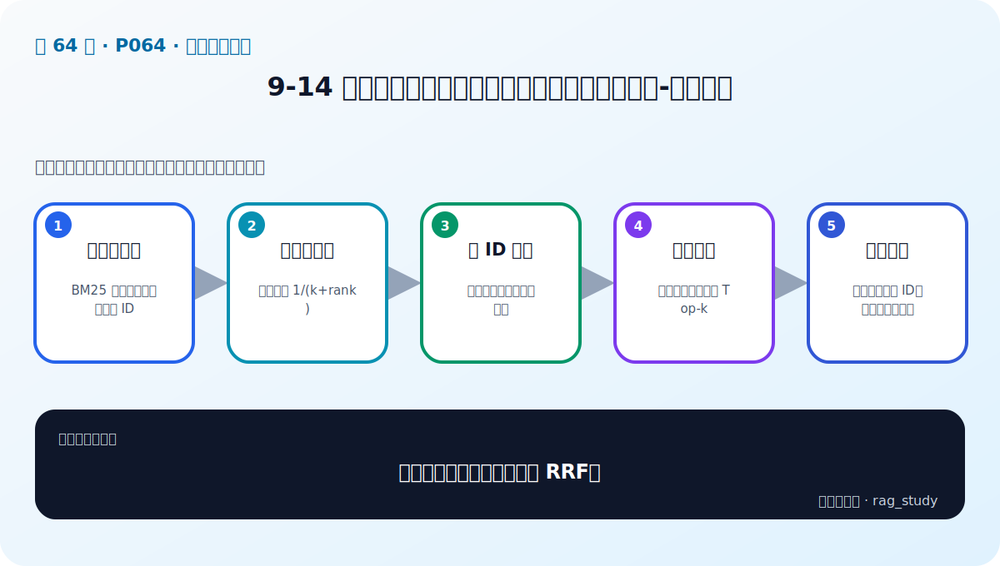

# P64：9-14 实战：用检索增强技术提升制度问答模块性能-融合检索

> 笔记编号 64/89 · 对应原视频 P64 · 时长 07:11 · [打开这一节](https://www.bilibili.com/video/BV1fLoKBREGv?p=64)

[← P63: 9-13 实战：用检索增强技术提升制度问答模块性能-多索引增强](../09-advanced-retrieval/p063-实战-用检索增强技术提升制度问答模块性能-多索引增强.md) · [返回第 9 章专题](./README.md) · [P65: 9-16 实战：用检索增强技术提升制度问答模块性能-rerank重排 →](../09-advanced-retrieval/p065-实战-用检索增强技术提升制度问答模块性能-rerank重排.md)

## 这节到底讲什么

**核心问题：融合检索实战如何正确实现 RRF？**

这节直接回答“融合检索实战如何正确实现 RRF？”。老师的结论可以整理成五点：第一，取得排名表：BM25 与向量检索返回有序 ID；第二，按名次计分：每路贡献 1/(k+rank)；第三，同 ID 累加：多路高排名候选自然上升；第四，排序截断：按融合分数选最终 Top-k；第五，检查边界：空列表、重复 ID、权重和稳定排序。下面逐项解释每一点的含义和作用。

## 辅助流程图

## 正文讲解（按视频顺序）

> 下面是依据音轨和画面整理的通顺版本，不是逐字稿。技术术语已经校正，
> 老师的原始讲法保留在后面的 ASR 页面。

### 1. 取得排名表

BM25 与向量检索返回有序 ID。

### 2. 按名次计分

每路贡献 1/(k+rank)。

### 3. 同 ID 累加

多路高排名候选自然上升。

### 4. 排序截断

按融合分数选最终 Top-k。

### 5. 检查边界

空列表、重复 ID、权重和稳定排序。

## 用一个例子串起来

查询“报销 2024-07”适合 BM25 精确匹配编号；查询“出差住宿能报多少”更依赖语义检索。两路候选经 RRF 融合，再由 Reranker 精排，通常比单路更稳。

## 完整原声逐段记录

已用本地语音识别核查；技术词与口误以专题笔记的校正版为准。

[查看本节按时间戳保留的本地 ASR 转写](./transcripts/p064-实战-用检索增强技术提升制度问答模块性能-融合检索-ASR.md)。原始转写会保留
同音字和断句误差，正文用校正后的术语，方便同时核对“老师说了什么”和“概念是什么”。

## 读完记住这五句话

- **取得排名表：** BM25 与向量检索返回有序 ID
- **按名次计分：** 每路贡献 1/(k+rank)
- **同 ID 累加：** 多路高排名候选自然上升
- **排序截断：** 按融合分数选最终 Top-k
- **检查边界：** 空列表、重复 ID、权重和稳定排序

## 最小可运行代码

[打开本节最相关的纯 Python 练习](../../rag_from_scratch/fusion.py)。练习包不依赖 LangChain，
目的是先看清输入、输出和算法边界，再替换成课程中的框架/API。

## 最容易踩的坑

不要一次加入所有增强方法。固定 Baseline 后一次只改一个变量，否则无法判断提升来自哪里。

## 自测

1. 不看图回答：融合检索实战如何正确实现 RRF？
2. 用上面的例子，指出本节五个知识点分别出现在哪里。
3. 如果没有“排序截断”，会出现什么具体问题？

## 学完检查

- [ ] 我能不看视频解释本节核心概念
- [ ] 我能指出它在 RAG 数据流中的位置
- [ ] 我知道它最适合与最不适合的场景
- [ ] 我读过完整 ASR 并核对了技术术语
- [ ] 我完成了专题 README 中对应的自测或实验
