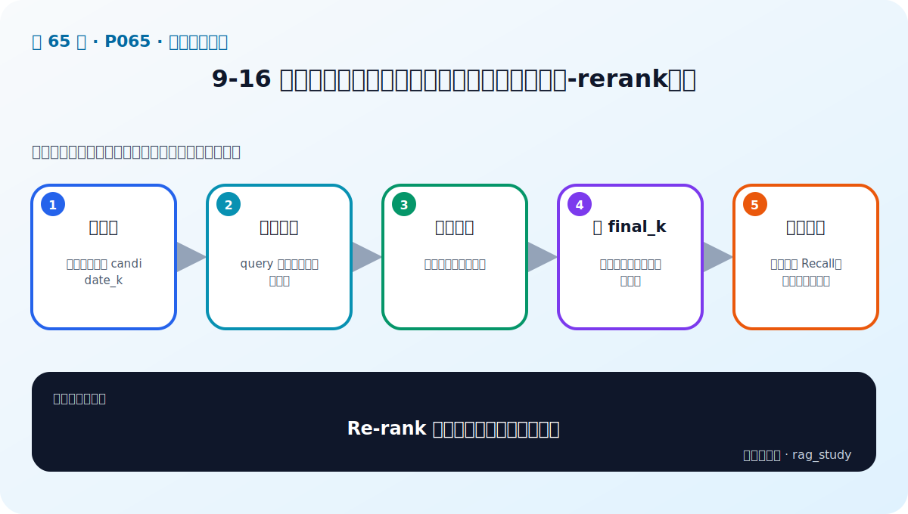
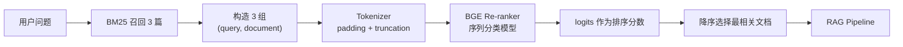

# P65：Re-rank 实战——用 BGE 重排器重新给“问题—文档”配对打分

> 笔记编号 65/89 · 对应原视频 P65 · 时长 06:31 · [打开这一节](https://www.bilibili.com/video/BV1fLoKBREGv?p=65)

[← P64：融合检索](./p064-实战-用检索增强技术提升制度问答模块性能-融合检索.md) · [返回第 9 章专题](./README.md) · [P66：迭代检索实战 →](./p066-实战-用检索增强技术提升制度问答模块性能-迭代检索增强生成.md)

## 这节到底讲什么

老师用一个 BGE Re-ranker 对 BM25 已召回的三个文档重新排序。每条输入不是单独的
问题向量或文档向量，而是 `(query, document)` 文本对；分词后送入序列分类模型，
取模型输出的 logit 作为相关性排序分数，再按降序选择最相关文档并交给 RAG。
原笔记中的 `candidate_k / final_k / Recall` 是合理的工程概念，但不是本节实际展示的
代码与指标，已从“老师结论”中移除。

## 辅助流程图

## 正文讲解（按视频顺序）

### 1. 00:00–01:30：加载重排模型与 Tokenizer

课程说明 Re-rank 是初次召回后的第二次相关性排序，并选用 BGE 的开源重排模型。
代码设置 GPU 设备，从 Transformers 加载 Tokenizer 和序列分类模型，再把模型移动
到 GPU。这里是课程环境的演示；没有兼容 GPU 的环境需要选择 CPU 或相应推理后端，
不能照抄设备编号。

### 2. 01:30–02:16：先观察 BM25 原始排序的问题

老师复用上一节 BM25 检索器查询，返回三个文档。打印结果可以看到前两个不够相关，
真正较相关的文档排在第三。这提供了重排前的具体对照：Re-ranker 的任务不是重新
扫描整个知识库，而是在小候选集里纠正顺序。

### 3. 02:16–03:59：把问题与每篇候选文档配成一对

遍历候选文档，把同一个问题分别与每篇 `page_content` 组成文本对。Tokenizer 对这
批配对做截断与补齐，生成模型所需张量；张量再移动到与模型一致的设备。

重排器能联合查看问题和文档，比“分别编码后只算向量距离”更细致，但代价是每个
候选都要经过模型前向计算，因此只适合对已缩小的候选集使用。

### 4. 03:59–05:23：取 logits、降序排序并选择文档

课程取模型输出的 logits 作为三篇文档的重排分数。演示中前两篇得分较低、第三篇
相对较高；随后把分数转成可排序数组，按降序取得索引，再据此重排原文档列表。

这些 raw logits 可用于同一次候选集内排序，但不应直接解释为概率，也不应把“负数”
简单等同于绝对不相关。若需要阈值，必须针对所用模型和数据做校准。

### 5. 05:23–06:30：取最相关文档并直接进入生成

视频从重排后的列表取最相关的一篇，作为已经检索完成的文档直接传入 RAG Pipeline，
再让大语言模型生成答案。课堂重点是打通重排链路，并没有在本节展示 Recall、延迟
或不同候选数量的系统对照实验。

## 课后工程补充（非视频原讲解）

真实项目通常会区分初召回数量与最终上下文数量，并测量质量和延迟；候选过少可能
让正确文档根本进不了重排，候选过多又会增加推理成本。这是落地时必须评测的边界，
但不要误认为视频已经给出了某个通用的 `candidate_k` 或 `final_k` 最佳值。

## 完整原声逐段记录

[查看本节按时间戳保留的本地 ASR 转写](./transcripts/p065-实战-用检索增强技术提升制度问答模块性能-rerank重排-ASR.md)。
ASR 中的“金牌/价序”按上下文校正为“重排/降序”，“逻辑分数”对应模型 logits。

## 读完记住这五句话

- Re-rank 处理的是初次召回后的候选集。
- 模型输入是问题与候选文档的配对。
- 课程使用序列分类模型输出的 logits 做降序排序。
- raw logit 是排序分数，不等于概率。
- 本节只打通三篇候选到一篇上下文的链路，没有给出通用最优 Top-k。

## 最容易踩的坑

把 logits 当成已校准概率，或跨问题直接比较这些分数，都会得出没有依据的阈值判断。

## 自测

1. Re-ranker 为什么不直接遍历整个知识库？
2. 它与双塔 Embedding 相似度在输入结构上有何不同？
3. 为什么负 logit 不一定表示绝对不相关？
4. 本节视频实际选择了多少篇重排后的文档进入 RAG？

## 学完检查

- [ ] 我能画出 BM25 → 配对 → Tokenizer → logits → 排序流程
- [ ] 我知道模型和输入张量必须位于兼容设备
- [ ] 我能区分排序分数与概率
- [ ] 我不会把课后 candidate_k 建议冒充视频参数
- [ ] 我会在真实项目中测量候选数量带来的质量/延迟权衡
