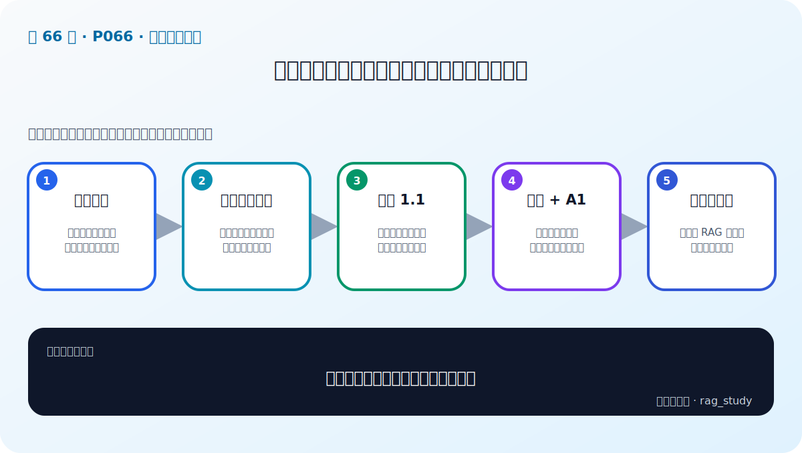

# P66：迭代检索实战——两轮查询、两套提示词与不同温度

> 笔记编号 66/89 · 对应原视频 P66 · 时长 06:03 · [打开这一节](https://www.bilibili.com/video/BV1fLoKBREGv?p=66)

[← P65：Re-rank 实战](./p065-实战-用检索增强技术提升制度问答模块性能-rerank重排.md) · [返回第 9 章专题](./README.md) · [P67：Self-RAG 实战（1） →](./p067-实战-用检索增强技术提升制度问答模块性能-self-RAG-1.md)

## 这节到底讲什么

这节把 P58 的概念写成一个固定两轮的函数。非最后一轮允许模型在证据不足时尝试
产生更丰富的中间答案，并把温度设为 1.1；下一轮把“原问题 + 上一轮答案”作为新
检索查询。最后一轮换回严格的原 RAG 提示词、降低温度并流式输出最终答案。
原笔记写了“置信度、无增益等停止条件”，但视频代码只使用预先设定的迭代次数，
现已校正。

## 辅助流程图

## 正文讲解（按视频顺序）

### 1. 00:00–01:12：为什么准备两套提示词

最后一轮使用前面制度问答 Baseline 的严格提示词，要求依据上下文回答。非最后一轮
的提示词较宽松：上下文缺少信息时允许尝试回答，因为课程希望中间答案产生更多
可能帮助下一轮检索的词语。

这种宽松只适用于中间检索线索，不能把无依据的中间答案直接返回用户。

### 2. 01:13–02:36：循环状态只保存问题、上一轮答案和轮次

函数接收问题并把迭代次数设为 2，初始化上一轮答案。每次循环先构造检索查询：
第一轮没有历史答案，所以直接使用原问题；第二轮把原问题和 A1 拼接。课程还打印
轮次和中间查询，便于观察每轮实际搜索什么。

### 3. 02:36–04:09：非最后一轮提高温度，生成探索性内容

循环调用前面改造后的 RAG Pipeline。若当前不是最后一轮，就传入探索型提示词，
并把温度设置为 1.1。老师解释温度较低时多次生成较一致，提高温度是为了得到更有
多样性的中间信息。生成结果保存下来，供下一轮拼接。

`1.1` 是视频演示参数，不是所有模型或业务的安全默认值；某些 API 的温度范围也
不同，复现时要看所用模型接口。

### 4. 04:09–05:00：最后一轮回到严格回答

若已到最后一轮，Pipeline 改用原来的严格提示词，降低温度，并以流式方式展示结果。
所以两轮的职责不同：第一轮偏向探索检索线索，第二轮偏向基于证据形成最终回答。

### 5. 05:00–06:02：视频测试展示第二轮得到更多信息

老师用一个表述较宽泛的问题测试。第一轮检索并生成中间结果；将该结果与问题合并
后，第二轮召回的文档提供了更多信息，最终回答也更全面。本节没有给出固定评测集
或统计显著性，因此这个运行结果只说明代码链路与示例效果，不能证明两轮必然优于
一轮。

## 课后工程补充（非视频原讲解）

生产实现可以再加入“最大轮数、没有新增文档、成本超限或答案已充分”等停止条件，
也应防止错误中间答案污染查询。但这些是对视频固定两轮示例的工程补强，不是本节
代码已经实现的功能。

## 完整原声逐段记录

[查看本节按时间戳保留的本地 ASR 转写](./transcripts/p066-实战-用检索增强技术提升制度问答模块性能-迭代检索增强生成-ASR.md)。

## 读完记住这五句话

- 视频代码固定执行两轮，不是按置信度自动停止。
- 第一轮直接使用原问题，第二轮使用“原问题 + A1”。
- 非最后一轮用探索型提示词和 1.1 温度。
- 最后一轮换回严格提示词、降低温度并流式输出。
- 示例更好不等于普遍更好，仍需固定评测集验证。

## 最容易踩的坑

如果最后一轮仍沿用允许猜测的探索提示词，系统会把原本只为检索服务的无依据内容
当成最终答案返回。

## 自测

1. 两套提示词分别服务于什么目标？
2. 第二轮的检索查询具体由什么组成？
3. 视频中的 `1.1` 应怎样理解，为什么不能当通用默认值？
4. 本节实际实现了哪些停止条件？

## 学完检查

- [ ] 我能画出固定两轮循环
- [ ] 我能区分探索型中间答案与最终回答
- [ ] 我知道视频使用 1.1 温度的位置
- [ ] 我不会声称视频已实现无增益或置信度停止
- [ ] 我会用评测验证第二轮是否真的增加可靠证据
