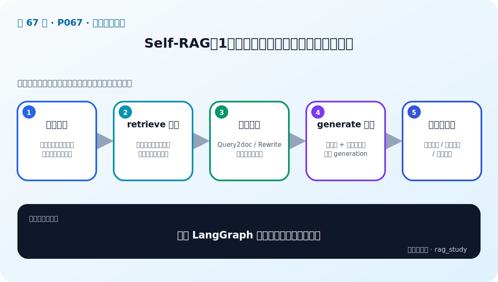
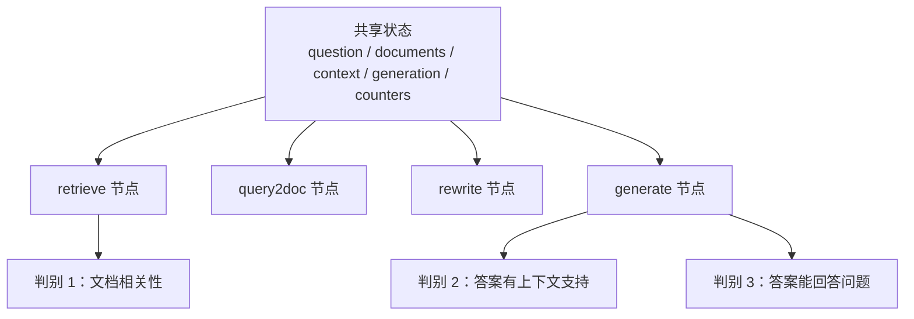

# P67：Self-RAG 实战（1）——先定义 LangGraph 节点、状态与三个判别器

> 笔记编号 67/89 · 对应原视频 P67 · 时长 17:35 · [打开这一节](https://www.bilibili.com/video/BV1fLoKBREGv?p=67)

[← P66：迭代检索实战](./p066-实战-用检索增强技术提升制度问答模块性能-迭代检索增强生成.md) · [返回第 9 章专题](./README.md) · [P68：Self-RAG 实战（2） →](./p068-实战-用检索增强技术提升制度问答模块性能-self-RAG-2.md)

## 这节到底讲什么

课程用 LangGraph 实现 P59 的 Self-RAG。P67 先画出整体路由，再定义检索、
Query2doc、查询改写和生成节点；每个节点都从共享状态读取输入、执行任务、把结果
写回状态。最后构造三条 LLM 判别 Chain：文档相关性、答案的上下文支持度、答案
对问题的有用性。图的条件边和完整运行留到 P68。

## 辅助流程图

## 正文讲解（按视频顺序）

### 1. 00:00–02:38：先明确图上的节点和可能分支

LangGraph 用节点表示具体任务，用边表示状态怎样流动。课程流程先检索，再评价文档
相关性：不相关时执行 Query2doc 后重新检索；相关时进入生成。生成后同时考虑答案
是否有上下文支持、是否对问题有用；无用时改写查询再检索。课程示例对“无支持”
结果直接结束，也说明可以设计成重新生成，但本次代码采用前一种路径。

### 2. 02:38–07:44：检索节点由输入、任务和输出三部分组成

老师先把原 Pipeline 的检索逻辑抽成函数：输入问题，查询向量集合，返回文档列表
和拼接后的上下文。LangGraph 节点从共享状态读取 `question` 等字段，执行检索，
再把问题、文档、上下文以及计数器写回输出。

节点输出会成为后续节点输入，因此凡是后面需要的数据都要显式保留。课程状态还
记录 Query2doc 与 Rewrite 的执行次数，用于 P68 限制循环，避免增强无限重复。

### 3. 07:44–10:49：把已有增强函数包装成图节点

Query2doc 节点直接调用 P62 的函数，得到增强后的 `context query`，并把对应计数加一；
查询改写节点同样调用已有 Rewrite 方法，输出改写后的问题并增加计数。这里没有
重新发明增强算法，重点是把普通函数适配为“读取状态—返回状态更新”的节点。

原问题与增强后的检索输入要分开保存，否则多轮以后无法知道最终答案究竟回应哪个
问题，也无法追踪某次检索为何发生。

### 4. 10:50–13:02：生成节点复用原 RAG 提示词

生成节点读取原问题和检索文档，先拼成上下文，再把 `question/context` 填入提示词，
通过 LLM Chain 和文本解析器得到 `generation`。输出继续透传文档、上下文和两个
计数器，为后面的判别和条件路由提供完整状态。

### 5. 13:03–17:35：三条判别 Chain 才是 Self-RAG 的控制信号

课程分别为三种判断编写提示词和 Chain：

1. 文档相关性：输入问题和单篇检索文档，输出是否相关；
2. 答案支持度：输入上下文和生成答案，判断答案能否从上下文得到事实支持；
3. 答案有用性：输入原问题和生成答案，判断答案能否解决用户问题。

提示词给评审器设定角色、说明领域与判断标准，并要求输出 `yes/no` 一类结构。它们
在 P67 只被定义，真正逐文档调用、解释结果并连接条件边在 P68 完成。

## 课后工程补充（非视频原讲解）

共享状态最好使用明确的 TypedDict/Pydantic 类型，并为“原问题、当前检索查询、
生成答案”使用不同字段；否则把 `question` 反复覆盖后，答案有用性判别可能比较到
改写问题，而不是用户最初的问题。

## 完整原声逐段记录

[查看本节按时间戳保留的本地 ASR 转写](./transcripts/p067-实战-用检索增强技术提升制度问答模块性能-self-RAG-1-ASR.md)。
ASR 中的 “Langramp、快速图DLC”分别按上下文校正为 LangGraph、Query2doc。

## 读完记住这五句话

- P67 定义节点和判别器，P68 才连接图并运行。
- 每个节点都遵循“读状态—执行任务—写状态”。
- Query2doc 与 Rewrite 计数器用于限制循环。
- 生成节点复用原问题、检索文档和 RAG 提示词。
- 三个判别分别检查文档相关、答案受支持、答案有用。

## 最容易踩的坑

如果用同一个 `question` 字段同时表示原问题和改写后的检索查询，后续“答案是否回答
原问题”的判别对象会被悄悄替换。

## 自测

1. LangGraph 节点的输入和输出为什么都来自共享状态？
2. 为什么要分别记录 Query2doc 与 Rewrite 次数？
3. 三个判别器各自比较哪两个对象？
4. P67 与 P68 的实现边界是什么？

## 学完检查

- [ ] 我能列出 P67 定义的四类任务节点
- [ ] 我能说明状态中每个核心字段的用途
- [ ] 我能区分原问题与当前检索查询
- [ ] 我能说出三个判别 Chain 的输入
- [ ] 我知道无支持分支在课程示例中如何处理
