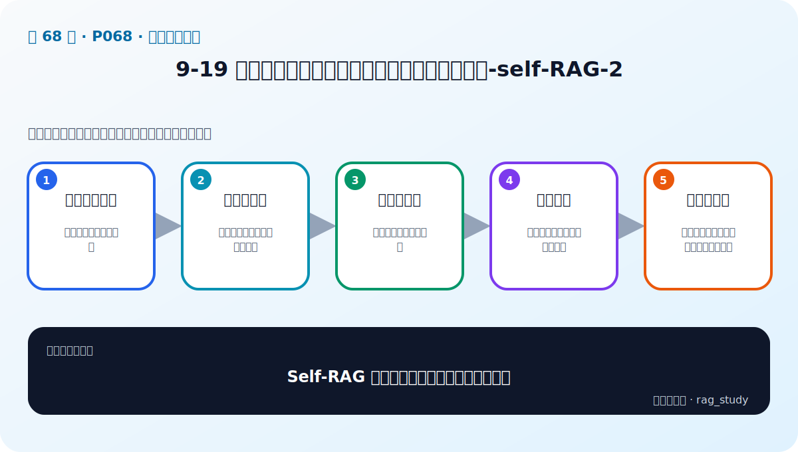
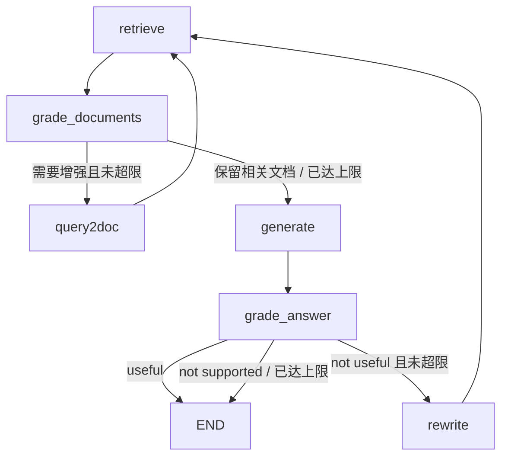

# P68：Self-RAG 实战（2）——实现判别节点、条件边并运行完整图

> 笔记编号 68/89 · 对应原视频 P68 · 时长 17:50 · [打开这一节](https://www.bilibili.com/video/BV1fLoKBREGv?p=68)

[← P67：Self-RAG 实战（1）](./p067-实战-用检索增强技术提升制度问答模块性能-self-RAG-1.md) · [返回第 9 章专题](./README.md) · [P69：Graph RAG →](../10-graph-rag/p069-Graph-RAG-本章导学.md)

## 这节到底讲什么

P68 把上一节定义的函数连成真正可执行的 LangGraph。课程先逐篇过滤不相关文档，
再组合答案支持度和有用性判断，随后编写两个路由函数并添加普通边、条件边和结束
节点。最后用两个问题观察节点轨迹，确认 Query2doc 只重试一次、Rewrite 也受次数
限制。原笔记把这节概括成通用“逐陈述核查”，但代码实际是 LLM 的 yes/no 节点判别。

## 辅助流程图

## 正文讲解（按视频顺序）

### 1. 00:00–02:41：逐文档判断相关性并过滤

文档判别节点读取问题和检索文档，遍历每篇文档，调用上一节的相关性 Chain，得到
`yes/no`。相关文档加入新列表；发现不相关文档时设置“需要增强”的路由信号。节点
把过滤后的文档重新拼成上下文，并把判别结果及其他状态字段传给下游。

课程还检查 Query2doc 的执行次数：若已经达到示例上限，即使判别仍建议增强，也
强制进入下一阶段，避免无限循环。音轨中的条件写法较口语化，可靠结论是“只允许
有限次 Query2doc”，而不是把某个比较符号当通用规则。

### 2. 02:41–05:31：先判支持度，再判有用性

答案判别节点先检查 `generation` 是否能从 `context` 得到支持。如果不支持，直接
返回 `not supported`；只有得到支持时才继续判断答案能否解决原问题。后一判断通过
返回 `useful`，不通过返回 `not useful`。

对 `not useful` 分支，课程再看 Rewrite 次数：未达到上限时进入查询改写，超过上限
则结束，避免“改写—检索—仍无用”的无穷循环。这里是对整段答案的 LLM 判别，并
没有在代码中逐陈述计算 Ragas Faithfulness 分数。

### 3. 05:31–07:27：路由函数把判别结果翻译成下一步节点

节点负责产生状态，路由函数负责读取状态并返回路径标签。文档路由要综合“是否需要
增强”和 Query2doc 次数，决定走 `generate` 还是 `query2doc`；答案路由读取
`useful / not useful / not supported` 及 Rewrite 次数，决定结束或改写。

把“评估”和“选路”拆开后，每个函数职责更清楚，也能单独测试路由边界。

### 4. 07:28–13:32：注册节点并连接普通边、条件边

课程创建状态图，添加 retrieve、grade documents、Query2doc、generate、grade answer
和 rewrite 等节点。入口连接检索；检索连接文档判别；文档判别通过条件边选择生成或
Query2doc；Query2doc 和 Rewrite 都回到检索；生成连接答案判别；答案判别再根据
结果选择结束或改写。完成后编译为可调用工作流。

### 5. 13:33–17:49：用两个问题观察真实节点轨迹

执行时输入被包装成图状态，流式查看每一步输出。第一个问题经历检索、Query2doc、
再次检索、生成和答案判别，最后判为有用；第二个问题也展示了增强后的节点轨迹和
最终 `generation`。老师强调可以打印每个节点输出排查路径，而不是只看最后答案。

这两个例子证明工作流能运行，不足以证明判别器或路由在真实业务上准确。还要分别
建立文档相关、答案支持、答案有用与循环次数的测试集。

## 课后工程补充（非视频原讲解）

解析 `yes/no` 时不要只用“字符串是否包含 yes”，否则解释文本里出现反例也可能误判。
更安全的是结构化枚举、严格解析、非法值回退，并把原始判别理由保存到日志。

## 完整原声逐段记录

[查看本节按时间戳保留的本地 ASR 转写](./transcripts/p068-实战-用检索增强技术提升制度问答模块性能-self-RAG-2-ASR.md)。
ASR 中 `Useful / NoUseful / NoSupport` 等口述标签按代码语义整理为 useful、not useful、
not supported；具体常量名应以课程源码画面为准。

## 读完记住这五句话

- 文档节点逐篇判断并只保留相关文档。
- 答案节点先判上下文支持，再判能否回答问题。
- 路由函数与判别节点分离，各自只做一件事。
- Query2doc 和 Rewrite 都有次数限制并回到检索。
- 调试应查看完整节点轨迹，而不只看最终答案。

## 最容易踩的坑

把包含 `yes` 的任意自由文本都当真，会让判别解析不可靠；循环图里一次误判还可能
触发多次昂贵调用，因此输出格式与失败回退必须严格。

## 自测

1. 文档判别与答案判别为什么不能合成一个函数？
2. `not supported` 与 `not useful` 分别表示什么？
3. 两个计数器各自限制哪条循环？
4. 本节是否实现了逐陈述的 Ragas 分数计算？

## 学完检查

- [ ] 我能画出完整条件图和两条回环
- [ ] 我能区分节点输出与路由标签
- [ ] 我能解释三种答案判别结果
- [ ] 我知道视频测试只验证链路，不代表线上准确率
- [ ] 我会严格解析判别输出并保存完整轨迹
