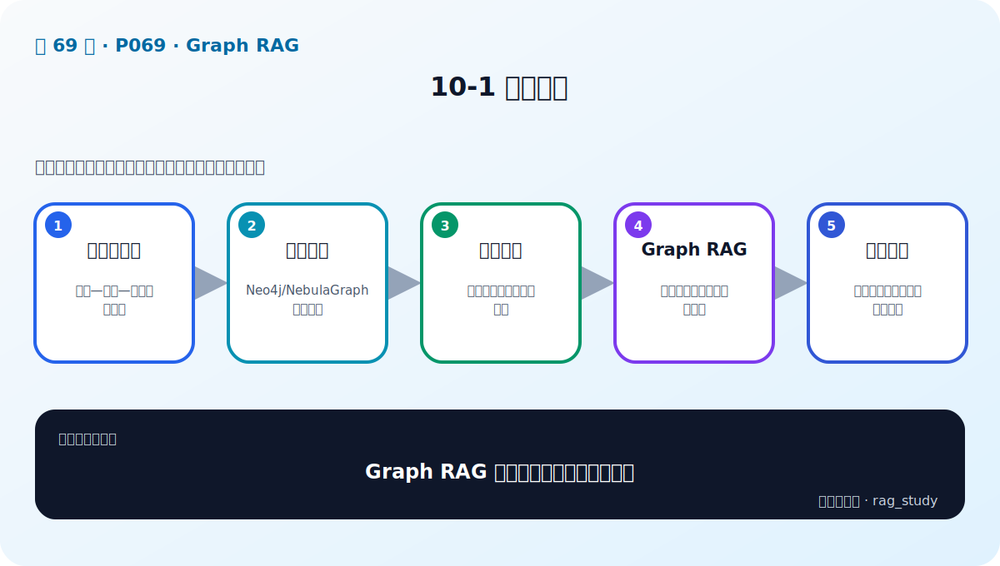

# 第 10 章：知识图谱与 Graph RAG

> 对应视频 P69–P76：[打开本章第一节](https://www.bilibili.com/video/BV1fLoKBREGv?p=69)



## 知识三元组

知识图谱把事实表示为 `(subject, predicate, object)`：

```text
(华为Mate, 采用, 海思芯片)
(华为Mate, 属于, 智能手机)
(智能手机, 包含, 超感光摄像头)
```

实体成为节点，关系成为有方向、带类型的边，节点和边还可有时间、来源、置信度等
属性。与普通文本块不同，图结构显式保存“谁与谁有什么关系”。

## 图数据库

- **Neo4j** 使用 Property Graph 与 Cypher，生态成熟，适合本地学习和业务图谱。
- **NebulaGraph** 面向分布式大规模图，使用 nGQL，部署和 schema 管理更复杂。

选择时评估图规模、遍历深度、并发、分布式需求、查询语言、运维和许可证。不要
因为叫“Graph RAG”就默认必须换数据库；小图可先用内存结构验证价值。

练习包中的 [graph.py](../../rag_from_scratch/graph.py) 用邻接表实现三元组和
多跳路径，帮助看清图数据库替你做的工作。

## 从原始数据构建金融智库


最难的通常不是 `CREATE` 语句，而是实体对齐：`华为`、`华为公司`、
`Huawei Technologies` 是否同一节点？关系还要有方向、类型、时间和来源，否则
多跳查询会把错误持续放大。

## Vector RAG 与 Graph RAG 的差别

Vector RAG 适合“哪段文字与问题语义相近”；Graph RAG 适合：

- 明确实体间关系；
- 路径、多跳和聚合问题；
- 需要结构化过滤与可解释路径；
- 单个文本块不能同时包含全部证据的问题。

例如“华为还有哪些采用超感光摄影的手机？”需要从产品到品牌、类别和摄像能力
沿关系查找。若只做文本相似度，相关事实可能散在多个文档且缺少显式连接。

## Graph RAG 查询流水线

1. 从问题中抽取实体、关系意图和约束。
2. 实体链接到图中的规范 ID，必要时用别名与向量搜索辅助。
3. 生成受约束的 Cypher/nGQL 或调用预定义图查询工具。
4. 限制跳数、节点/边类型和返回数量，得到小型子图。
5. 把路径连同来源序列化成易读上下文。
6. 让模型基于路径生成答案与引用。

不要让模型在没有 schema、权限和只读限制的情况下自由执行任意图查询。

## 混合更常见

图谱擅长结构，原文擅长细节。可先用实体找到子图，再取节点关联文档；也可先用
向量检索定位实体，再做图遍历。最终上下文同时含路径和原文证据。

## 自测

<details>
<summary>为什么“把实体和关系抽出来”还不等于图谱可用？</summary>

还需要实体规范化与消歧、关系方向和类型校验、来源与时间、重复合并、schema 和
质量评测。否则图查询会稳定地返回错误路径。
</details>
