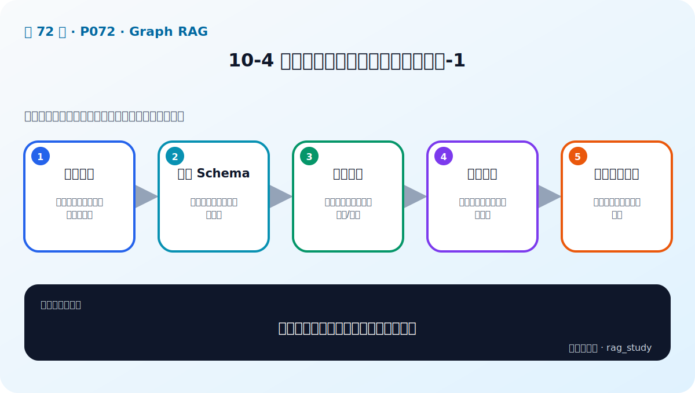
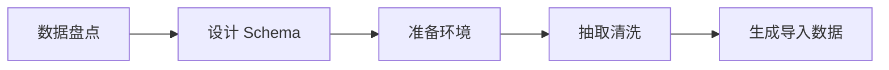

# P72：10-4 实战：动手构建金融智库知识图谱-1

> 笔记编号 72/89 · 对应原视频 P72 · 时长 17:27 · [打开这一节](https://www.bilibili.com/video/BV1fLoKBREGv?p=72)

[← P71: 10-3 如何存储和操作知识图谱：neo4j和nebulagraph](../10-graph-rag/p071-如何存储和操作知识图谱-neo4j和nebulagraph.md) · [返回第 10 章专题](./README.md) · [P73: 10-5 实战：动手构建金融智库知识图谱-2 →](../10-graph-rag/p073-实战-动手构建金融智库知识图谱-2.md)

## 这节到底讲什么

**核心问题：构建金融智库知识图谱第一步做什么？**

这节直接回答“构建金融智库知识图谱第一步做什么？”。老师的结论可以整理成五点：第一，数据盘点：明确实体类型、关系和权威来源；第二，设计 Schema：节点标签、边类型与唯一键；第三，准备环境：启动图数据库并创建空间/约束；第四，抽取清洗：规范名称、类型和缺失字段；第五，生成导入数据：把原始记录转换成点与边。下面逐项解释每一点的含义和作用。

## 辅助流程图

## 正文讲解（按视频顺序）

> 下面是依据音轨和画面整理的通顺版本，不是逐字稿。技术术语已经校正，
> 老师的原始讲法保留在后面的 ASR 页面。

### 1. 数据盘点

明确实体类型、关系和权威来源。

### 2. 设计 Schema

节点标签、边类型与唯一键。

### 3. 准备环境

启动图数据库并创建空间/约束。

### 4. 抽取清洗

规范名称、类型和缺失字段。

### 5. 生成导入数据

把原始记录转换成点与边。

## 课后迁移示例（非视频原例）

> 来源说明：这是为了帮助理解而补充的迁移示例，不是老师在本节视频中逐字讲述的原例。

问题“某公司投资了哪些新能源企业”需要沿着公司—投资—企业—所属行业的关系查询。向量检索擅长找相似文本，图检索则能明确走过哪些实体和关系。

## 完整原声逐段记录

已用本地语音识别核查；技术词与口误以专题笔记的校正版为准。

[查看本节按时间戳保留的本地 ASR 转写](./transcripts/p072-实战-动手构建金融智库知识图谱-1-ASR.md)。原始转写会保留
同音字和断句误差，正文用校正后的术语，方便同时核对“老师说了什么”和“概念是什么”。

## 读完记住这五句话

- **数据盘点：** 明确实体类型、关系和权威来源
- **设计 Schema：** 节点标签、边类型与唯一键
- **准备环境：** 启动图数据库并创建空间/约束
- **抽取清洗：** 规范名称、类型和缺失字段
- **生成导入数据：** 把原始记录转换成点与边

## 最小可运行代码

[打开本节最相关的纯 Python 练习](../../rag_from_scratch/graph.py)。练习包不依赖 LangChain，
目的是先看清输入、输出和算法边界，再替换成课程中的框架/API。

## 最容易踩的坑

知识图谱中的错误关系会在多跳查询中被放大。每条事实都应保留来源、时间和可核验的实体 ID。

## 自测

1. 不看图回答：构建金融智库知识图谱第一步做什么？
2. 用上面的例子，指出本节五个知识点分别出现在哪里。
3. 如果没有“抽取清洗”，会出现什么具体问题？

## 学完检查

- [ ] 我能不看视频解释本节核心概念
- [ ] 我能指出它在 RAG 数据流中的位置
- [ ] 我知道它最适合与最不适合的场景
- [ ] 我读过完整 ASR 并核对了技术术语
- [ ] 我完成了专题 README 中对应的自测或实验
