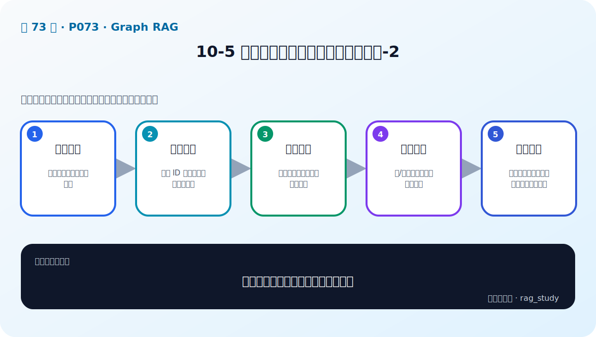
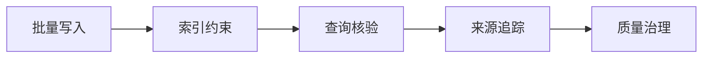

# P73：10-5 实战：动手构建金融智库知识图谱-2

> 笔记编号 73/89 · 对应原视频 P73 · 时长 20:23 · [打开这一节](https://www.bilibili.com/video/BV1fLoKBREGv?p=73)

[← P72: 10-4 实战：动手构建金融智库知识图谱-1](../10-graph-rag/p072-实战-动手构建金融智库知识图谱-1.md) · [返回第 10 章专题](./README.md) · [P74: 10-6 RAG和Graph RAG有什么区别：如何构建Graph RAG →](../10-graph-rag/p074-RAG和Graph-RAG有什么区别-如何构建Graph-RAG.md)

## 这节到底讲什么

**核心问题：构建知识图谱第二步如何保证可用？**

这节直接回答“构建知识图谱第二步如何保证可用？”。老师的结论可以整理成五点：第一，批量写入：先节点后关系并处理重复；第二，索引约束：唯一 ID 与常用查询字段建索引；第三，查询核验：按实体、邻居和路径抽样检查；第四，来源追踪：边/事实保留文档与时间依据；第五，质量治理：孤立点、冲突关系、错误类型持续修正。下面逐项解释每一点的含义和作用。

## 辅助流程图

## 正文讲解（按视频顺序）

> 下面是依据音轨和画面整理的通顺版本，不是逐字稿。技术术语已经校正，
> 老师的原始讲法保留在后面的 ASR 页面。

### 1. 批量写入

先节点后关系并处理重复。

### 2. 索引约束

唯一 ID 与常用查询字段建索引。

### 3. 查询核验

按实体、邻居和路径抽样检查。

### 4. 来源追踪

边/事实保留文档与时间依据。

### 5. 质量治理

孤立点、冲突关系、错误类型持续修正。

## 用一个例子串起来

问题“某公司投资了哪些新能源企业”需要沿着公司—投资—企业—所属行业的关系查询。向量检索擅长找相似文本，图检索则能明确走过哪些实体和关系。

## 完整原声逐段记录

已用本地语音识别核查；技术词与口误以专题笔记的校正版为准。

[查看本节按时间戳保留的本地 ASR 转写](./transcripts/p073-实战-动手构建金融智库知识图谱-2-ASR.md)。原始转写会保留
同音字和断句误差，正文用校正后的术语，方便同时核对“老师说了什么”和“概念是什么”。

## 读完记住这五句话

- **批量写入：** 先节点后关系并处理重复
- **索引约束：** 唯一 ID 与常用查询字段建索引
- **查询核验：** 按实体、邻居和路径抽样检查
- **来源追踪：** 边/事实保留文档与时间依据
- **质量治理：** 孤立点、冲突关系、错误类型持续修正

## 最小可运行代码

[打开本节最相关的纯 Python 练习](../../rag_from_scratch/graph.py)。练习包不依赖 LangChain，
目的是先看清输入、输出和算法边界，再替换成课程中的框架/API。

## 最容易踩的坑

知识图谱中的错误关系会在多跳查询中被放大。每条事实都应保留来源、时间和可核验的实体 ID。

## 自测

1. 不看图回答：构建知识图谱第二步如何保证可用？
2. 用上面的例子，指出本节五个知识点分别出现在哪里。
3. 如果没有“来源追踪”，会出现什么具体问题？

## 学完检查

- [ ] 我能不看视频解释本节核心概念
- [ ] 我能指出它在 RAG 数据流中的位置
- [ ] 我知道它最适合与最不适合的场景
- [ ] 我读过完整 ASR 并核对了技术术语
- [ ] 我完成了专题 README 中对应的自测或实验
