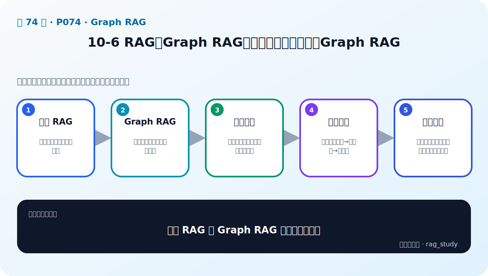

# P74：10-6 RAG和Graph RAG有什么区别：如何构建Graph RAG

> 笔记编号 74/89 · 对应原视频 P74 · 时长 18:04 · [打开这一节](https://www.bilibili.com/video/BV1fLoKBREGv?p=74)

[← P73: 10-5 实战：动手构建金融智库知识图谱-2](../10-graph-rag/p073-实战-动手构建金融智库知识图谱-2.md) · [返回第 10 章专题](./README.md) · [P75: 10-7 实战：利用Graph RAG构建金融智库知识库应用 →](../10-graph-rag/p075-实战-利用Graph-RAG构建金融智库知识库应用.md)

## 这节到底讲什么

**核心问题：普通 RAG 与 Graph RAG 的边界在哪里？**

这节直接回答“普通 RAG 与 Graph RAG 的边界在哪里？”。老师的结论可以整理成五点：第一，普通 RAG：按语义相似找到文本片段；第二，Graph RAG：按实体关系和路径组织证据；第三，优势问题：关系查询、全局结构与多跳推理；第四，构建流程：实体关系抽取→图存储→图检索；第五，混合落地：图给结构、向量给语义，结果共同生成。下面逐项解释每一点的含义和作用。

## 辅助流程图

## 正文讲解（按视频顺序）

> 下面是依据音轨和画面整理的通顺版本，不是逐字稿。技术术语已经校正，
> 老师的原始讲法保留在后面的 ASR 页面。

### 1. 普通 RAG

按语义相似找到文本片段。

### 2. Graph RAG

按实体关系和路径组织证据。

### 3. 优势问题

关系查询、全局结构与多跳推理。

### 4. 构建流程

实体关系抽取→图存储→图检索。

### 5. 混合落地

图给结构、向量给语义，结果共同生成。

## 用一个例子串起来

问题“某公司投资了哪些新能源企业”需要沿着公司—投资—企业—所属行业的关系查询。向量检索擅长找相似文本，图检索则能明确走过哪些实体和关系。

## 完整原声逐段记录

已用本地语音识别核查；技术词与口误以专题笔记的校正版为准。

[查看本节按时间戳保留的本地 ASR 转写](./transcripts/p074-RAG和Graph-RAG有什么区别-如何构建Graph-RAG-ASR.md)。原始转写会保留
同音字和断句误差，正文用校正后的术语，方便同时核对“老师说了什么”和“概念是什么”。

## 读完记住这五句话

- **普通 RAG：** 按语义相似找到文本片段
- **Graph RAG：** 按实体关系和路径组织证据
- **优势问题：** 关系查询、全局结构与多跳推理
- **构建流程：** 实体关系抽取→图存储→图检索
- **混合落地：** 图给结构、向量给语义，结果共同生成

## 最小可运行代码

[打开本节最相关的纯 Python 练习](../../rag_from_scratch/graph.py)。练习包不依赖 LangChain，
目的是先看清输入、输出和算法边界，再替换成课程中的框架/API。

## 最容易踩的坑

知识图谱中的错误关系会在多跳查询中被放大。每条事实都应保留来源、时间和可核验的实体 ID。

## 自测

1. 不看图回答：普通 RAG 与 Graph RAG 的边界在哪里？
2. 用上面的例子，指出本节五个知识点分别出现在哪里。
3. 如果没有“构建流程”，会出现什么具体问题？

## 学完检查

- [ ] 我能不看视频解释本节核心概念
- [ ] 我能指出它在 RAG 数据流中的位置
- [ ] 我知道它最适合与最不适合的场景
- [ ] 我读过完整 ASR 并核对了技术术语
- [ ] 我完成了专题 README 中对应的自测或实验
