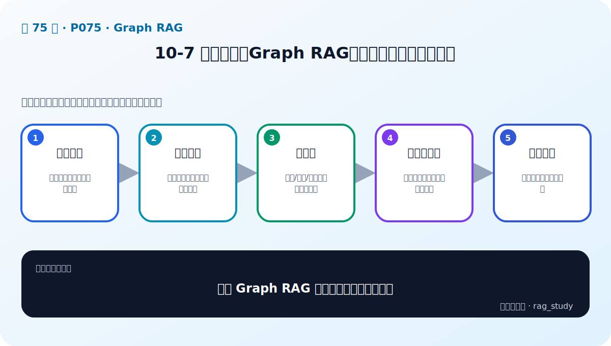
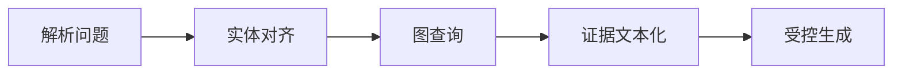

# P75：10-7 实战：利用Graph RAG构建金融智库知识库应用

> 笔记编号 75/89 · 对应原视频 P75 · 时长 26:14 · [打开这一节](https://www.bilibili.com/video/BV1fLoKBREGv?p=75)

[← P74: 10-6 RAG和Graph RAG有什么区别：如何构建Graph RAG](../10-graph-rag/p074-RAG和Graph-RAG有什么区别-如何构建Graph-RAG.md) · [返回第 10 章专题](./README.md) · [P76: 10-8 总结和展望：如何自我学习，跟进前沿技术 →](../10-graph-rag/p076-总结和展望-如何自我学习-跟进前沿技术.md)

## 这节到底讲什么

**核心问题：金融 Graph RAG 实战的在线链路是什么？**

这节直接回答“金融 Graph RAG 实战的在线链路是什么？”。老师的结论可以整理成五点：第一，解析问题：识别实体、关系和查询意图；第二，实体对齐：把提及映射到图中的唯一节点；第三，图查询：邻居/路径/子图取得结构化事实；第四，证据文本化：将三元组和来源组织成上下文；第五，受控生成：回答并展示路径或出处。下面逐项解释每一点的含义和作用。

## 辅助流程图

## 校正版讲解时间线

> 下面按老师实际编写 Pipeline 的顺序整理，不是把五个名词重新列一遍。原始音轨开头约两分钟存在明显重复和损坏，因此正文从能够可靠核对的关键词提取步骤开始；后续函数、反例和三组测试均保留。

### 02:00–04:18：先让大模型把自然语言问题收敛成少量关键词

Graph RAG 的在线链路并不是拿整句话直接拼一条固定 Cypher。老师先设计提示词，让大语言模型从查询里最多提取三个关键词，并把结果格式化成列表，后续函数只需要逐个处理列表元素。例如“总结下哪些公司进行了转型”会得到“公司、转型、总结”一类候选，其中真正有区分度的是“转型”。

这里有两个工程目的。第一，用户表达可以很长，图查询需要先找到可对齐的实体或事件类型；第二，结构化列表比自由文本更容易遍历、过滤和记录。老师把这段逻辑封装成 `parse_query` 一类函数：输入原始 query 和关键词数量，生成提示词、调用模型，再从返回文本中提取关键词列表。这个步骤依赖大模型，因此输出格式必须做校验；“公司”“总结”这类泛词也不应无条件进入图查询，否则会取回大量无关节点。

### 04:19–07:53：关键词不等于实体，必须先做节点类型对齐

关键词提取后，老师马上提出一个关键问题：这些词是不是图数据库里的实体？只有知道它对应哪个节点类型，才能构造后续 `MATCH` 条件。实战库里主要有投资者、公司和事件类型三类节点，于是程序通过 `py2neo.Graph` 连接 Neo4j，再用 `get_node` 分别检查某个关键词是否出现在各类节点的 `name` 属性中。

“比亚迪”这个测试展示了为什么不能跳过对齐：它在“事件类型”节点里匹配不到，却能在“公司”节点里命中“比亚迪股份有限公司”，在“投资者”节点里也没有结果。函数因此返回命中的标准节点名，没有命中则返回空值。这个反例说明，模型提取出的词只是语言层面的提及，图里的标签和唯一节点才是结构化查询的入口；如果把提及直接当节点 ID，多跳关系会从第一步就走错。

### 07:53–16:28：按命中的节点拼查询，并为缺失关系准备降级路径

确定节点后，`get_detail` 会分别检查它属于投资者、公司还是事件类型，再把命中的名称变成查询条件。真正执行查询的 `get_context` 先匹配“投资者—投资—公司—发生—事件类型”这条较完整的关系链，返回投资者名、公司名、事件类型，以及关系本身的属性。老师没有只返回节点名称，而是把关系改写成可读证据，例如“某投资者投资了某公司”“某公司发生了某类事件”，再把时间、数值等关系属性拼到句子后面。

新闻标题和正文内容可能很长，所以函数保留 `include_content` 开关。关闭时跳过 `title`、`content` 等大字段，只输出回答所需的结构化属性；需要细节时再把原文纳入上下文。这样既能控制上下文长度，也能避免长新闻把核心关系淹没。

老师还处理了一个很实际的反例：并不是每家公司都有投资机构。如果 Cypher 强制整条关系链都存在，那么一个缺少“投资者—公司”边、但拥有很多公司事件的节点会返回空结果。为此代码引入 `query_level`：先查完整关系，结果为空时退化到“公司—事件”关系。这里的重点不是参数名，而是图查询必须允许数据稀疏；把所有边都当必选条件，会把本来存在的证据一起过滤掉。

### 16:31–21:46：把图结果文本化，再交给受控生成 Pipeline

老师用“瑞幸咖啡”测试上下文函数。程序先判断它命中公司节点，再查询相关事件及关系属性；由于完整关系链没有返回内容，系统自动执行第二级查询，最终得到内部丑闻、股价异常波动、日期和跌幅等历史事实。此时取回的不是相似段落，而是一组可以追溯到节点和关系的结构化记录。

接着代码把这些记录组合成 Graph RAG 的生成上下文：先用 `parse_query` 取最多三个关键词，过滤不值得查询的泛词，再逐个调用图数据库检索并汇总 `contexts`。提示词明确要求模型根据这些 context 回答用户问题。函数同时支持一次性返回和流式迭代输出，但两条分支使用的是同一份证据，不能因为展示方式不同而改变回答依据。

这一步也解释了“证据文本化”的真正含义：不是简单把三元组用逗号连接，而是保留实体、关系、关键属性和必要来源，将它们整理成模型能读懂、用户能核查的事实句。若不控制字段、去重和长度，图里取回的信息同样可能造成上下文噪声。

### 22:00–26:13：用三类问题验证单跳、公司分析和多跳关系

第一组问题询问哪些公司发生了某类转型。系统先把“转型”对齐到事件类型，再反向查询发生该事件的公司及相关投资信息，最后由模型列出公司。它验证的是“事件 → 公司”的反向关系查询。

第二组问题要求分析瑞幸咖啡。关键词命中公司节点，系统取出该公司发生的多项异常事件和时间、数值等属性。老师逐项对照生成答案，指出股价波动、新闻和管理人员变动等结论都能在上下文中找到来源。这个例子验证的是“公司 → 多个事件”的聚合分析，同时也提醒我们：看起来合理还不够，答案里的每个关键数字都要能回到关系属性。

第三组问题从某投资机构出发，询问它投资了哪些公司以及这些公司的状况。查询沿着“投资者 → 公司 → 事件”走两跳，模型再总结被投公司的事件、日期和股份解禁等信息。这是 Graph RAG 相比单纯向量相似度更有优势的场景：系统不仅找到相关文字，还明确记录经过哪些实体和关系得到答案。

因此，本节的完整闭环是：**问题解析 → 关键词过滤 → 节点类型对齐 → 分层图查询 → 关系属性文本化 → 基于证据生成 → 用不同关系方向的案例逐项核对**。五步框架仍然成立，但真正决定系统能否工作的，是节点对齐、稀疏关系降级、上下文字段控制和答案证据核查这些补充细节。

## 用一个例子串起来

问题“某投资机构投资了哪些公司，这些公司后来发生了什么”需要沿着“投资者—投资—公司—发生—事件”查询。程序先把机构名对齐到投资者节点，再取得公司和事件关系；如果某家公司没有完整投资关系，则降级查询公司事件。向量检索擅长找相似文字，图检索则能明确说明答案经过哪些实体、关系和属性得到。

## 完整原声逐段记录

已用本地语音识别核查；技术词与口误以专题笔记的校正版为准。

[查看本节按时间戳保留的本地 ASR 转写](./transcripts/p075-实战-利用Graph-RAG构建金融智库知识库应用-ASR.md)。原始转写会保留
同音字和断句误差，正文用校正后的术语，方便同时核对“老师说了什么”和“概念是什么”。

## 读完记住这五句话

- **解析问题：** 识别实体、关系和查询意图
- **实体对齐：** 把提及映射到图中的唯一节点
- **图查询：** 邻居/路径/子图取得结构化事实
- **证据文本化：** 将三元组和来源组织成上下文
- **受控生成：** 回答并展示路径或出处

## 最小可运行代码

[打开本节最相关的纯 Python 练习](../../rag_from_scratch/graph.py)。练习包不依赖 LangChain，
目的是先看清输入、输出和算法边界，再替换成课程中的框架/API。

## 最容易踩的坑

知识图谱中的错误关系会在多跳查询中被放大。每条事实都应保留来源、时间和可核验的实体 ID。

## 自测

1. 不看图回答：金融 Graph RAG 实战的在线链路是什么？
2. 用上面的例子，指出本节五个知识点分别出现在哪里。
3. 如果没有“证据文本化”，会出现什么具体问题？

## 学完检查

- [ ] 我能不看视频解释本节核心概念
- [ ] 我能指出它在 RAG 数据流中的位置
- [ ] 我知道它最适合与最不适合的场景
- [ ] 我读过完整 ASR 并核对了技术术语
- [ ] 我完成了专题 README 中对应的自测或实验
