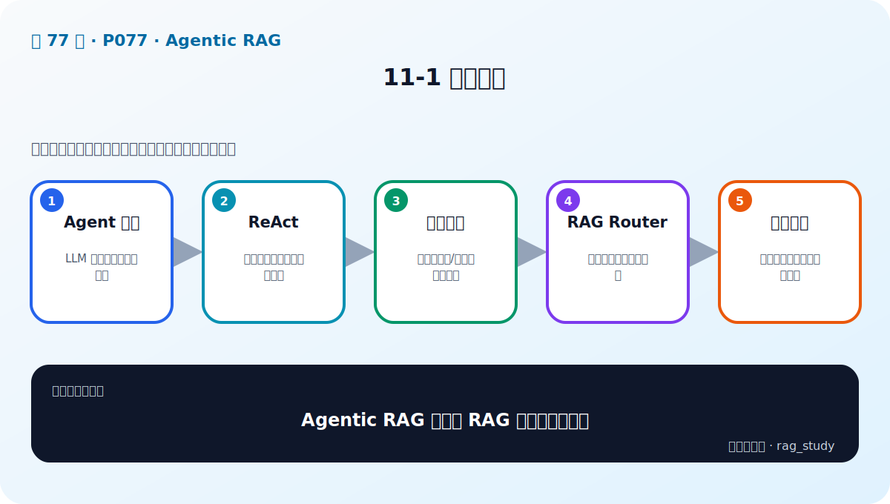
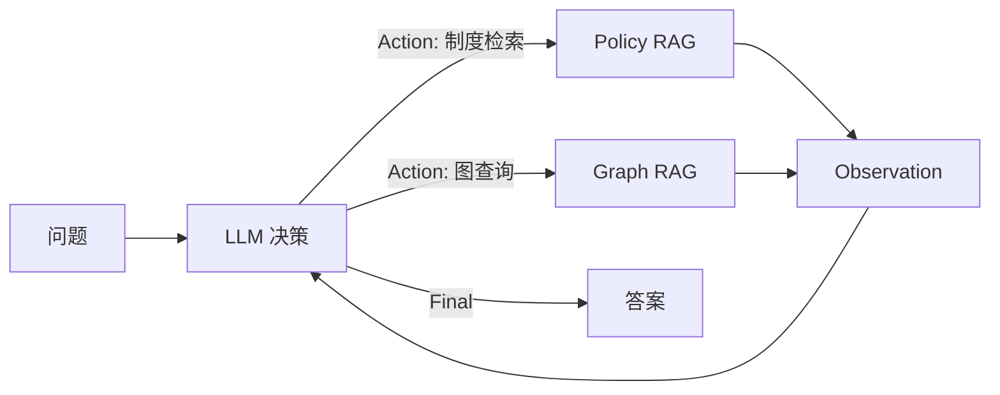

# 第 11 章：Agent、ReAct 与多知识库 Router

> 对应视频 P77–P82：[打开本章第一节](https://www.bilibili.com/video/BV1fLoKBREGv?p=77)

## Agent 给模型加了什么

模型本身只生成 token。Agent 运行时为它提供工具定义、状态和控制循环，使模型能
选择搜索知识库、查询图、调用 API 或结束回答。

Agent 不是一个更神秘的模型，而是 `LLM + tools + state + orchestration`。

## ReAct

ReAct 把 Reasoning 与 Acting 交替组织：模型根据当前任务产生下一步行动，环境
执行工具并返回 observation，模型再决定下一步。工程上应保存可审计的行动摘要、
工具参数和观察结果，不依赖展示模型的私密思维过程。

停止条件包括：得到足够证据、模型给出 final、达到最大步数、重复调用或工具失败。

## RAG Router

课程把制度向量 RAG 和金融 Graph RAG 封装成两个工具。Router 根据问题选择：

- “出差报销需要什么凭证？” → 制度知识库；
- “公司 A 投资的公司研发了什么产品？” → 金融图谱；
- 跨域问题 → 可能调用多工具后汇总；
- 与工具无关或资料不足 → 澄清或拒答。

工具描述本身是路由提示词，必须写清适用范围、输入 schema、输出、限制和示例。
仅靠模糊名称如 `search1`、`search2` 会让路由不稳定。

## 工程风险

- **循环与成本**：设置 max_steps、总 token/时间预算和重复检测。
- **工具幻觉**：只允许调用注册表中的工具，并校验 JSON 参数。
- **Prompt Injection**：文档或工具返回值是不可信数据，不能改写系统策略。
- **越权**：工具层执行权限检查，不能让模型自己判断用户能否访问。
- **不可复现**：记录模型、提示词、每步 action/observation、错误和最终路径。
- **路由错误**：单独建立 router 评测集，衡量工具选择准确率和不必要调用率。

## 什么时候不需要 Agent

若请求始终走固定检索—生成链，普通 pipeline 更快、更便宜、更可测。只有当问题
需要动态选择工具、迭代检索或多步计划时，Agent 的复杂度才有收益。

## 自测

为什么 Agent 的工具权限必须在工具层校验？

模型输出不可信，也可能受提示注入影响。若只在提示词中写“不要访问无权限数据”，
模型仍可能违规调用；工具层的确定性鉴权才是安全边界。

