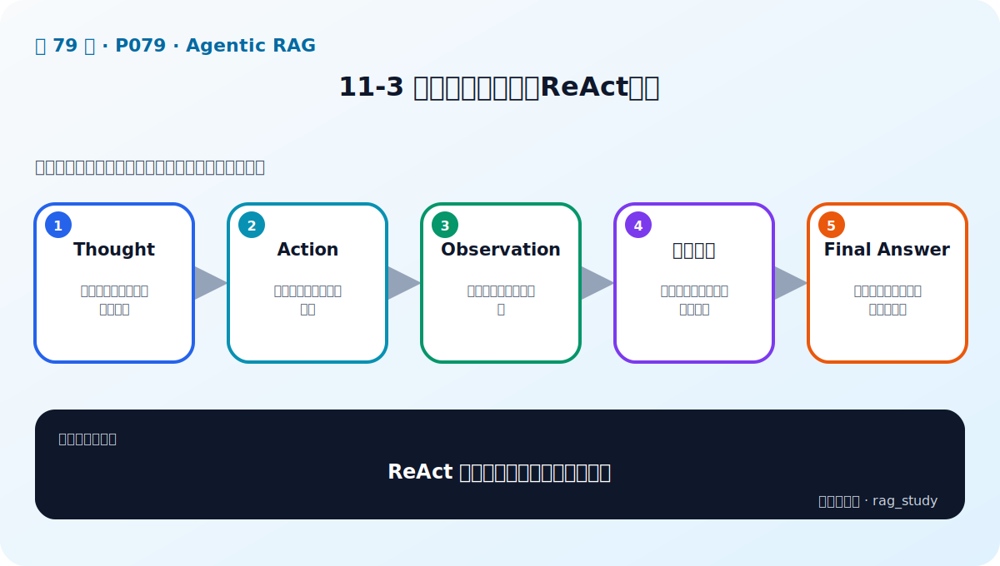
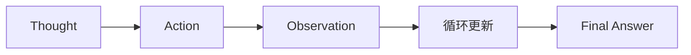

# P79：11-3 推理和行动并行：ReAct框架

> 笔记编号 79/89 · 对应原视频 P79 · 时长 04:46 · [打开这一节](https://www.bilibili.com/video/BV1fLoKBREGv?p=79)

[← P78: 11-2 大模型的手脚：AI智能体Agent](../11-agentic-rag/p078-大模型的手脚-AI智能体Agent.md) · [返回第 11 章专题](./README.md) · [P80: 11-4 基于Agent的多文档RAG Router →](../11-agentic-rag/p080-基于Agent的多文档RAG-Router.md)

## 这节到底讲什么

**核心问题：ReAct 如何让推理和行动并行推进？**

这节直接回答“ReAct 如何让推理和行动并行推进？”。老师的结论可以整理成五点：第一，Thought：基于目标判断下一步需要什么；第二，Action：选择工具并生成合法参数；第三，Observation：接收外部工具返回结果；第四，循环更新：用新证据继续推理或改选工具；第五，Final Answer：信息充分或达到终止条件后回答。下面逐项解释每一点的含义和作用。

## 辅助流程图

## 正文讲解（按视频顺序）

> 下面是依据音轨和画面整理的通顺版本，不是逐字稿。技术术语已经校正，
> 老师的原始讲法保留在后面的 ASR 页面。

### 1. Thought

基于目标判断下一步需要什么。

### 2. Action

选择工具并生成合法参数。

### 3. Observation

接收外部工具返回结果。

### 4. 循环更新

用新证据继续推理或改选工具。

### 5. Final Answer

信息充分或达到终止条件后回答。

## 用一个例子串起来

用户问制度问题时调用制度知识库，问公司投资关系时调用金融图谱。Agent Router 先判断意图、选择工具、读取结果，再决定是否继续调用或给出答案。

## 完整原声逐段记录

已用本地语音识别核查；技术词与口误以专题笔记的校正版为准。

[查看本节按时间戳保留的本地 ASR 转写](./transcripts/p079-推理和行动并行-ReAct框架-ASR.md)。原始转写会保留
同音字和断句误差，正文用校正后的术语，方便同时核对“老师说了什么”和“概念是什么”。

## 读完记住这五句话

- **Thought：** 基于目标判断下一步需要什么
- **Action：** 选择工具并生成合法参数
- **Observation：** 接收外部工具返回结果
- **循环更新：** 用新证据继续推理或改选工具
- **Final Answer：** 信息充分或达到终止条件后回答

## 最小可运行代码

[打开本节最相关的纯 Python 练习](../../rag_from_scratch/pipeline.py)。练习包不依赖 LangChain，
目的是先看清输入、输出和算法边界，再替换成课程中的框架/API。

## 最容易踩的坑

Agent 循环必须有工具权限、参数校验、最大步数、超时和失败处理；否则一次问题可能不断调用错误工具。

## 自测

1. 不看图回答：ReAct 如何让推理和行动并行推进？
2. 用上面的例子，指出本节五个知识点分别出现在哪里。
3. 如果没有“循环更新”，会出现什么具体问题？

## 学完检查

- [ ] 我能不看视频解释本节核心概念
- [ ] 我能指出它在 RAG 数据流中的位置
- [ ] 我知道它最适合与最不适合的场景
- [ ] 我读过完整 ASR 并核对了技术术语
- [ ] 我完成了专题 README 中对应的自测或实验
