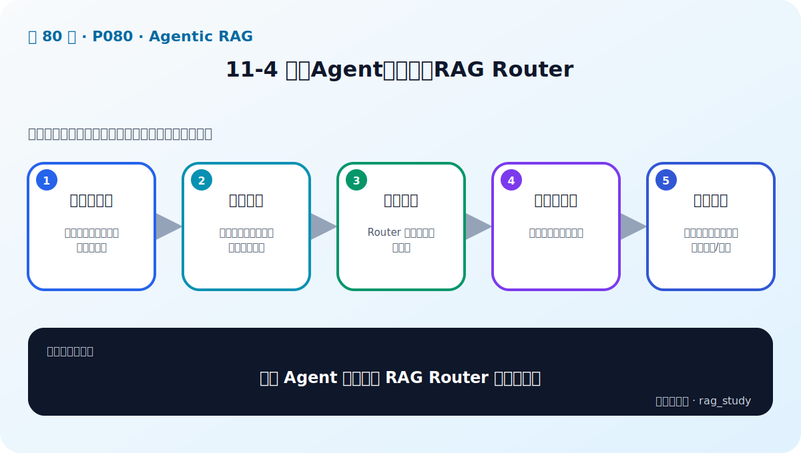

# P80：11-4 基于Agent的多文档RAG Router

> 笔记编号 80/89 · 对应原视频 P80 · 时长 02:37 · [打开这一节](https://www.bilibili.com/video/BV1fLoKBREGv?p=80)

[← P79: 11-3 推理和行动并行：ReAct框架](../11-agentic-rag/p079-推理和行动并行-ReAct框架.md) · [返回第 11 章专题](./README.md) · [P81: 11-5 实战：利用 ReAct Agent 实现 RAG Router →](../11-agentic-rag/p081-实战-利用-ReAct-Agent-实现-RAG-Router.md)

## 这节到底讲什么

**核心问题：基于 Agent 的多文档 RAG Router 怎样工作？**

这节直接回答“基于 Agent 的多文档 RAG Router 怎样工作？”。老师的结论可以整理成五点：第一，多个知识域：制度、金融等分别封装检索工具；第二，识别意图：判断问题属于哪个领域或是否跨域；第三，选择工具：Router 输出工具名与参数；第四，执行与观察：取得对应知识库证据；第五，生成答案：整合证据；无合适工具时拒答/澄清。下面逐项解释每一点的含义和作用。

## 辅助流程图

## 正文讲解（按视频顺序）

> 下面是依据音轨和画面整理的通顺版本，不是逐字稿。技术术语已经校正，
> 老师的原始讲法保留在后面的 ASR 页面。

### 1. 多个知识域

制度、金融等分别封装检索工具。

### 2. 识别意图

判断问题属于哪个领域或是否跨域。

### 3. 选择工具

Router 输出工具名与参数。

### 4. 执行与观察

取得对应知识库证据。

### 5. 生成答案

整合证据；无合适工具时拒答/澄清。

## 用一个例子串起来

用户问制度问题时调用制度知识库，问公司投资关系时调用金融图谱。Agent Router 先判断意图、选择工具、读取结果，再决定是否继续调用或给出答案。

## 完整原声逐段记录

已用本地语音识别核查；技术词与口误以专题笔记的校正版为准。

[查看本节按时间戳保留的本地 ASR 转写](./transcripts/p080-基于Agent的多文档RAG-Router-ASR.md)。原始转写会保留
同音字和断句误差，正文用校正后的术语，方便同时核对“老师说了什么”和“概念是什么”。

## 读完记住这五句话

- **多个知识域：** 制度、金融等分别封装检索工具
- **识别意图：** 判断问题属于哪个领域或是否跨域
- **选择工具：** Router 输出工具名与参数
- **执行与观察：** 取得对应知识库证据
- **生成答案：** 整合证据；无合适工具时拒答/澄清

## 最小可运行代码

[打开本节最相关的纯 Python 练习](../../rag_from_scratch/pipeline.py)。练习包不依赖 LangChain，
目的是先看清输入、输出和算法边界，再替换成课程中的框架/API。

## 最容易踩的坑

Agent 循环必须有工具权限、参数校验、最大步数、超时和失败处理；否则一次问题可能不断调用错误工具。

## 自测

1. 不看图回答：基于 Agent 的多文档 RAG Router 怎样工作？
2. 用上面的例子，指出本节五个知识点分别出现在哪里。
3. 如果没有“执行与观察”，会出现什么具体问题？

## 学完检查

- [ ] 我能不看视频解释本节核心概念
- [ ] 我能指出它在 RAG 数据流中的位置
- [ ] 我知道它最适合与最不适合的场景
- [ ] 我读过完整 ASR 并核对了技术术语
- [ ] 我完成了专题 README 中对应的自测或实验
