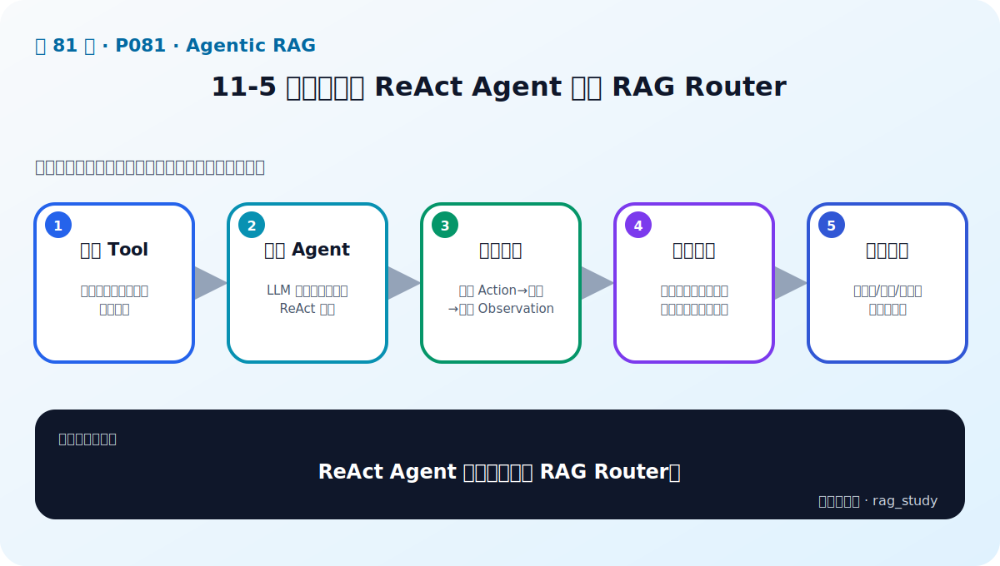

# P81：11-5 实战：利用 ReAct Agent 实现 RAG Router

> 笔记编号 81/89 · 对应原视频 P81 · 时长 13:31 · [打开这一节](https://www.bilibili.com/video/BV1fLoKBREGv?p=81)

[← P80: 11-4 基于Agent的多文档RAG Router](../11-agentic-rag/p080-基于Agent的多文档RAG-Router.md) · [返回第 11 章专题](./README.md) · [P82: 11-6 本章总结 →](../11-agentic-rag/p082-Agentic-RAG-本章总结.md)

## 这节到底讲什么

**核心问题：ReAct Agent 实战怎样实现 RAG Router？**

这节直接回答“ReAct Agent 实战怎样实现 RAG Router？”。老师的结论可以整理成五点：第一，定义 Tool：名称、描述、参数与检索函数；第二，构造 Agent：LLM 获得工具清单和 ReAct 约束；第三，运行循环：解析 Action→调用→写回 Observation；第四，处理边界：非法工具、解析错误、空结果、最大步数；第五，验证路由：用单域/跨域/无关问题检查轨迹。下面逐项解释每一点的含义和作用。

## 辅助流程图

## 正文讲解（按视频顺序）

> 下面是依据音轨和画面整理的通顺版本，不是逐字稿。技术术语已经校正，
> 老师的原始讲法保留在后面的 ASR 页面。

### 1. 定义 Tool

名称、描述、参数与检索函数。

### 2. 构造 Agent

LLM 获得工具清单和 ReAct 约束。

### 3. 运行循环

解析 Action→调用→写回 Observation。

### 4. 处理边界

非法工具、解析错误、空结果、最大步数。

### 5. 验证路由

用单域/跨域/无关问题检查轨迹。

## 课后迁移示例（非视频原例）

> 来源说明：这是为了帮助理解而补充的迁移示例，不是老师在本节视频中逐字讲述的原例。

用户问制度问题时调用制度知识库，问公司投资关系时调用金融图谱。Agent Router 先判断意图、选择工具、读取结果，再决定是否继续调用或给出答案。

## 完整原声逐段记录

已用本地语音识别核查；技术词与口误以专题笔记的校正版为准。

[查看本节按时间戳保留的本地 ASR 转写](./transcripts/p081-实战-利用-ReAct-Agent-实现-RAG-Router-ASR.md)。原始转写会保留
同音字和断句误差，正文用校正后的术语，方便同时核对“老师说了什么”和“概念是什么”。

## 读完记住这五句话

- **定义 Tool：** 名称、描述、参数与检索函数
- **构造 Agent：** LLM 获得工具清单和 ReAct 约束
- **运行循环：** 解析 Action→调用→写回 Observation
- **处理边界：** 非法工具、解析错误、空结果、最大步数
- **验证路由：** 用单域/跨域/无关问题检查轨迹

## 最小可运行代码

[打开本节最相关的纯 Python 练习](../../rag_from_scratch/pipeline.py)。练习包不依赖 LangChain，
目的是先看清输入、输出和算法边界，再替换成课程中的框架/API。

## 最容易踩的坑

Agent 循环必须有工具权限、参数校验、最大步数、超时和失败处理；否则一次问题可能不断调用错误工具。

## 自测

1. 不看图回答：ReAct Agent 实战怎样实现 RAG Router？
2. 用上面的例子，指出本节五个知识点分别出现在哪里。
3. 如果没有“处理边界”，会出现什么具体问题？

## 学完检查

- [ ] 我能不看视频解释本节核心概念
- [ ] 我能指出它在 RAG 数据流中的位置
- [ ] 我知道它最适合与最不适合的场景
- [ ] 我读过完整 ASR 并核对了技术术语
- [ ] 我完成了专题 README 中对应的自测或实验
