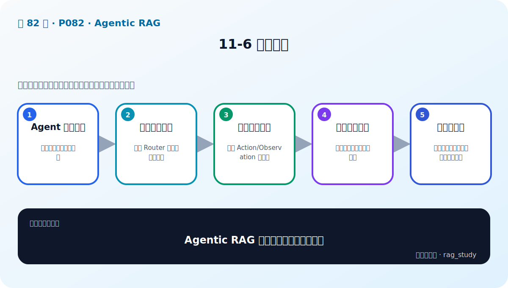
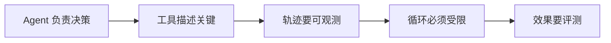

# P82：11-6 本章总结

> 笔记编号 82/89 · 对应原视频 P82 · 时长 01:25 · [打开这一节](https://www.bilibili.com/video/BV1fLoKBREGv?p=82)

[← P81: 11-5 实战：利用 ReAct Agent 实现 RAG Router](../11-agentic-rag/p081-实战-利用-ReAct-Agent-实现-RAG-Router.md) · [返回第 11 章专题](./README.md) · [P83: 12-1 本章介绍 →](../12-gradio-app/p083-Gradio-整合-本章导学.md)

## 这节到底讲什么

**核心问题：Agentic RAG 章最需要记住哪些边界？**

这节直接回答“Agentic RAG 章最需要记住哪些边界？”。老师的结论可以整理成五点：第一，Agent 负责决策：不等于知识本身更准确；第二，工具描述关键：决定 Router 能否选对知识库；第三，轨迹要可观测：每步 Action/Observation 可追踪；第四，循环必须受限：步数、成本、权限和超时；第五，效果要评测：路由准确率与最终答案质量分开看。下面逐项解释每一点的含义和作用。

## 辅助流程图

## 正文讲解（按视频顺序）

> 下面是依据音轨和画面整理的通顺版本，不是逐字稿。技术术语已经校正，
> 老师的原始讲法保留在后面的 ASR 页面。

### 1. Agent 负责决策

不等于知识本身更准确。

### 2. 工具描述关键

决定 Router 能否选对知识库。

### 3. 轨迹要可观测

每步 Action/Observation 可追踪。

### 4. 循环必须受限

步数、成本、权限和超时。

### 5. 效果要评测

路由准确率与最终答案质量分开看。

## 用一个例子串起来

用户问制度问题时调用制度知识库，问公司投资关系时调用金融图谱。Agent Router 先判断意图、选择工具、读取结果，再决定是否继续调用或给出答案。

## 完整原声逐段记录

已用本地语音识别核查；技术词与口误以专题笔记的校正版为准。

[查看本节按时间戳保留的本地 ASR 转写](./transcripts/p082-Agentic-RAG-本章总结-ASR.md)。原始转写会保留
同音字和断句误差，正文用校正后的术语，方便同时核对“老师说了什么”和“概念是什么”。

## 读完记住这五句话

- **Agent 负责决策：** 不等于知识本身更准确
- **工具描述关键：** 决定 Router 能否选对知识库
- **轨迹要可观测：** 每步 Action/Observation 可追踪
- **循环必须受限：** 步数、成本、权限和超时
- **效果要评测：** 路由准确率与最终答案质量分开看

## 最小可运行代码

[打开本节最相关的纯 Python 练习](../../rag_from_scratch/pipeline.py)。练习包不依赖 LangChain，
目的是先看清输入、输出和算法边界，再替换成课程中的框架/API。

## 最容易踩的坑

Agent 循环必须有工具权限、参数校验、最大步数、超时和失败处理；否则一次问题可能不断调用错误工具。

## 自测

1. 不看图回答：Agentic RAG 章最需要记住哪些边界？
2. 用上面的例子，指出本节五个知识点分别出现在哪里。
3. 如果没有“循环必须受限”，会出现什么具体问题？

## 学完检查

- [ ] 我能不看视频解释本节核心概念
- [ ] 我能指出它在 RAG 数据流中的位置
- [ ] 我知道它最适合与最不适合的场景
- [ ] 我读过完整 ASR 并核对了技术术语
- [ ] 我完成了专题 README 中对应的自测或实验
