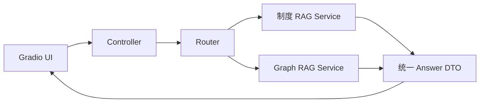

# 第 12 章：用 Gradio 整合两个 RAG 项目

> 对应视频 P83–P86：[打开本章第一节](https://www.bilibili.com/video/BV1fLoKBREGv?p=83)

## Gradio 负责哪一层

Gradio 用 Python 组件快速构建演示界面：Textbox、Chatbot、Dropdown、File、
Button 等组件通过事件绑定到函数。它适合原型、内部演示和人工评测入口，不替代
生产系统的鉴权、审计、限流和服务治理。

## 推荐分层



界面函数不要直接塞进 Loader、索引和 Prompt 细节。两个 RAG 模块应暴露统一返回
结构，如：

```python
{
    "answer": "...",
    "sources": [{"title": "...", "page": 3}],
    "route": "policy_rag",
    "latency_ms": 820,
}
```

这样可独立测试、替换前端，也方便在 UI 展示路由与来源。

## 整合要点

- 模型、Embedding 和数据库连接在应用启动时初始化，不要每次点击重新加载。
- 长任务用队列和流式输出，界面显示处理中、错误和重试提示。
- 对会话历史设置长度上限；传给检索器前先把追问改写成独立问题。
- 来源显示标题、页码与片段，点击可回原文；不要只显示相似度。
- 上传文件需限制类型、大小和解析时间，临时文件要清理。
- 在答案旁提供“有帮助/没帮助”和错误类型，回流为评测样本。

## 从 Demo 到上线还缺什么

身份认证、租户隔离、权限过滤、HTTPS、密钥管理、日志脱敏、速率限制、超时熔断、
健康检查、监控告警、备份恢复和灰度发布。若这些没有完成，应把 Gradio 明确标为
演示环境。

## 自测

<details>
<summary>为什么把所有 RAG 代码直接写在 Gradio 点击回调中会变难维护？</summary>

界面、业务编排和基础设施耦合后无法单元测试，也无法复用到 API；模型会被重复
加载，错误和状态边界混乱。应让 UI 只负责输入输出，RAG 作为独立服务层。
</details>

