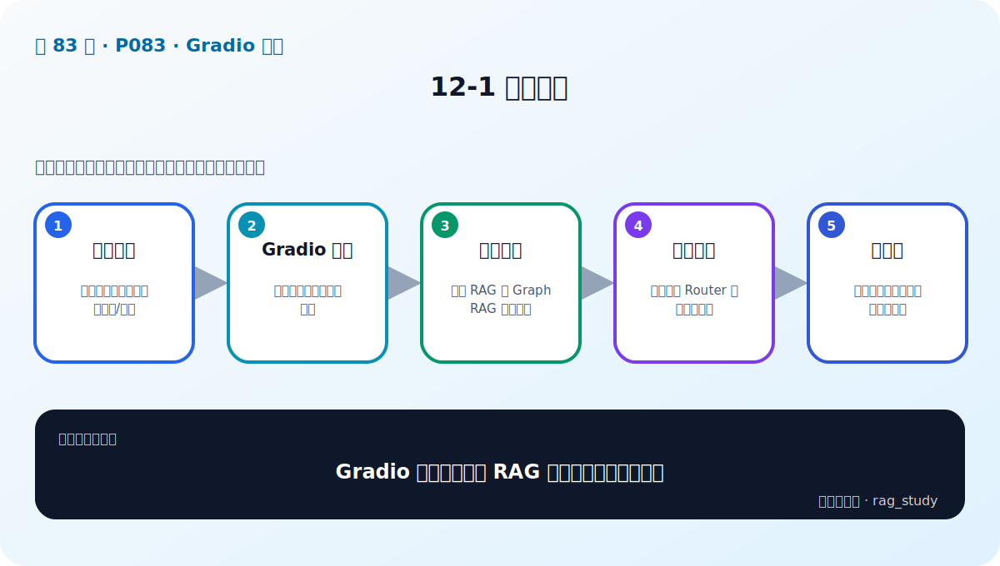

# P83：12-1 本章介绍

> 笔记编号 83/89 · 对应原视频 P83 · 时长 01:14 · [打开这一节](https://www.bilibili.com/video/BV1fLoKBREGv?p=83)

[← P82: 11-6 本章总结](../11-agentic-rag/p082-Agentic-RAG-本章总结.md) · [返回第 12 章专题](./README.md) · [P84: 12-2 演示界面神器：gradio介绍 →](../12-gradio-app/p084-演示界面神器-gradio介绍.md)

## 这节到底讲什么

**核心问题：Gradio 章如何把两个 RAG 项目变成可交互应用？**

这节直接回答“Gradio 章如何把两个 RAG 项目变成可交互应用？”。老师的结论可以整理成五点：第一，界面目标：让用户输入问题并看到答案/来源；第二，Gradio 组件：输入、输出、事件与布局；第三，服务封装：普通 RAG 与 Graph RAG 统一接口；第四，项目整合：按选择或 Router 调用对应后端；第五，可用性：错误提示、状态展示与基本部署。下面逐项解释每一点的含义和作用。

## 辅助流程图

## 正文讲解（按视频顺序）

> 下面是依据音轨和画面整理的通顺版本，不是逐字稿。技术术语已经校正，
> 老师的原始讲法保留在后面的 ASR 页面。

### 1. 界面目标

让用户输入问题并看到答案/来源。

### 2. Gradio 组件

输入、输出、事件与布局。

### 3. 服务封装

普通 RAG 与 Graph RAG 统一接口。

### 4. 项目整合

按选择或 Router 调用对应后端。

### 5. 可用性

错误提示、状态展示与基本部署。

## 用一个例子串起来

页面接收问题后，只把它交给统一的 RAG 服务接口；后端返回答案、来源、路由和耗时。界面负责展示，不应该在点击回调里重新加载模型或重建索引。

## 完整原声逐段记录

已用本地语音识别核查；技术词与口误以专题笔记的校正版为准。

[查看本节按时间戳保留的本地 ASR 转写](./transcripts/p083-Gradio-整合-本章导学-ASR.md)。原始转写会保留
同音字和断句误差，正文用校正后的术语，方便同时核对“老师说了什么”和“概念是什么”。

## 读完记住这五句话

- **界面目标：** 让用户输入问题并看到答案/来源
- **Gradio 组件：** 输入、输出、事件与布局
- **服务封装：** 普通 RAG 与 Graph RAG 统一接口
- **项目整合：** 按选择或 Router 调用对应后端
- **可用性：** 错误提示、状态展示与基本部署

## 最小可运行代码

[打开本节最相关的纯 Python 练习](../../rag_from_scratch/README.md)。练习包不依赖 LangChain，
目的是先看清输入、输出和算法边界，再替换成课程中的框架/API。

## 最容易踩的坑

Gradio 适合原型，不自动提供生产系统需要的鉴权、隔离、限流、审计和监控。

## 自测

1. 不看图回答：Gradio 章如何把两个 RAG 项目变成可交互应用？
2. 用上面的例子，指出本节五个知识点分别出现在哪里。
3. 如果没有“项目整合”，会出现什么具体问题？

## 学完检查

- [ ] 我能不看视频解释本节核心概念
- [ ] 我能指出它在 RAG 数据流中的位置
- [ ] 我知道它最适合与最不适合的场景
- [ ] 我读过完整 ASR 并核对了技术术语
- [ ] 我完成了专题 README 中对应的自测或实验
