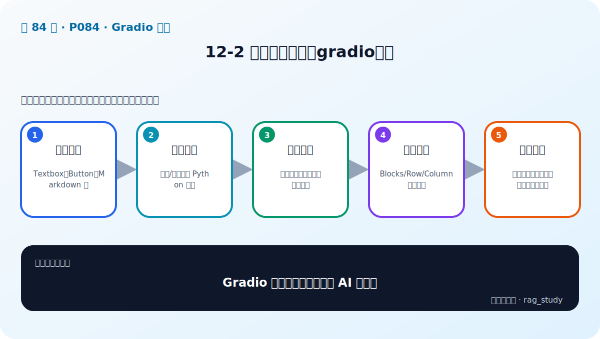

# P84：12-2 演示界面神器：gradio介绍

> 笔记编号 84/89 · 对应原视频 P84 · 时长 12:20 · [打开这一节](https://www.bilibili.com/video/BV1fLoKBREGv?p=84)

[← P83: 12-1 本章介绍](../12-gradio-app/p083-Gradio-整合-本章导学.md) · [返回第 12 章专题](./README.md) · [P85: 12-3 实战：gradio整合两大RAG项目（1） →](../12-gradio-app/p085-实战-gradio整合两大RAG项目-1.md)

## 这节到底讲什么

**核心问题：Gradio 为什么适合快速演示 AI 应用？**

这节直接回答“Gradio 为什么适合快速演示 AI 应用？”。老师的结论可以整理成五点：第一，声明组件：Textbox、Button、Markdown 等；第二，绑定事件：点击/提交触发 Python 函数；第三，自动传值：组件输入映射函数参数与返回；第四，快速布局：Blocks/Row/Column 组织页面；第五，使用边界：适合原型和演示，生产仍需安全运维。下面逐项解释每一点的含义和作用。

## 辅助流程图

## 正文讲解（按视频顺序）

> 下面是依据音轨和画面整理的通顺版本，不是逐字稿。技术术语已经校正，
> 老师的原始讲法保留在后面的 ASR 页面。

### 1. 声明组件

Textbox、Button、Markdown 等。

### 2. 绑定事件

点击/提交触发 Python 函数。

### 3. 自动传值

组件输入映射函数参数与返回。

### 4. 快速布局

Blocks/Row/Column 组织页面。

### 5. 使用边界

适合原型和演示，生产仍需安全运维。

## 课后迁移示例（非视频原例）

> 来源说明：这是为了帮助理解而补充的迁移示例，不是老师在本节视频中逐字讲述的原例。

页面接收问题后，只把它交给统一的 RAG 服务接口；后端返回答案、来源、路由和耗时。界面负责展示，不应该在点击回调里重新加载模型或重建索引。

## 完整原声逐段记录

已用本地语音识别核查；技术词与口误以专题笔记的校正版为准。

[查看本节按时间戳保留的本地 ASR 转写](./transcripts/p084-演示界面神器-gradio介绍-ASR.md)。原始转写会保留
同音字和断句误差，正文用校正后的术语，方便同时核对“老师说了什么”和“概念是什么”。

## 读完记住这五句话

- **声明组件：** Textbox、Button、Markdown 等
- **绑定事件：** 点击/提交触发 Python 函数
- **自动传值：** 组件输入映射函数参数与返回
- **快速布局：** Blocks/Row/Column 组织页面
- **使用边界：** 适合原型和演示，生产仍需安全运维

## 最小可运行代码

[打开本节最相关的纯 Python 练习](../../rag_from_scratch/README.md)。练习包不依赖 LangChain，
目的是先看清输入、输出和算法边界，再替换成课程中的框架/API。

## 最容易踩的坑

Gradio 适合原型，不自动提供生产系统需要的鉴权、隔离、限流、审计和监控。

## 自测

1. 不看图回答：Gradio 为什么适合快速演示 AI 应用？
2. 用上面的例子，指出本节五个知识点分别出现在哪里。
3. 如果没有“快速布局”，会出现什么具体问题？

## 学完检查

- [ ] 我能不看视频解释本节核心概念
- [ ] 我能指出它在 RAG 数据流中的位置
- [ ] 我知道它最适合与最不适合的场景
- [ ] 我读过完整 ASR 并核对了技术术语
- [ ] 我完成了专题 README 中对应的自测或实验
