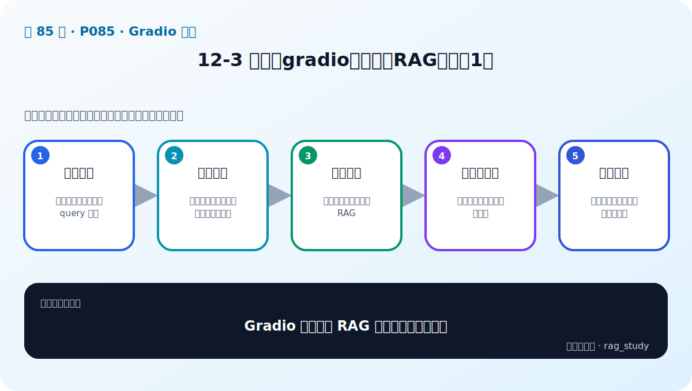

# P85：12-3 实战：gradio整合两大RAG项目（1）

> 笔记编号 85/89 · 对应原视频 P85 · 时长 13:24 · [打开这一节](https://www.bilibili.com/video/BV1fLoKBREGv?p=85)

[← P84: 12-2 演示界面神器：gradio介绍](../12-gradio-app/p084-演示界面神器-gradio介绍.md) · [返回第 12 章专题](./README.md) · [P86: 12-4 实战：gradio整合两大RAG项目（2） →](../12-gradio-app/p086-实战-gradio整合两大RAG项目-2.md)

## 这节到底讲什么

**核心问题：Gradio 整合两个 RAG 项目第一步是什么？**

这节直接回答“Gradio 整合两个 RAG 项目第一步是什么？”。老师的结论可以整理成五点：第一，整理后端：两个项目暴露一致的 query 接口；第二，创建页面：问题输入、项目选择、答案与来源区；第三，编写回调：读取选择并调用对应 RAG；第四，格式化结果：答案、引用、错误统一展示；第五，本地联调：分别测试制度问答和金融知识库。下面逐项解释每一点的含义和作用。

## 辅助流程图

## 正文讲解（按视频顺序）

> 下面是依据音轨和画面整理的通顺版本，不是逐字稿。技术术语已经校正，
> 老师的原始讲法保留在后面的 ASR 页面。

### 1. 整理后端

两个项目暴露一致的 query 接口。

### 2. 创建页面

问题输入、项目选择、答案与来源区。

### 3. 编写回调

读取选择并调用对应 RAG。

### 4. 格式化结果

答案、引用、错误统一展示。

### 5. 本地联调

分别测试制度问答和金融知识库。

## 用一个例子串起来

页面接收问题后，只把它交给统一的 RAG 服务接口；后端返回答案、来源、路由和耗时。界面负责展示，不应该在点击回调里重新加载模型或重建索引。

## 完整原声逐段记录

已用本地语音识别核查；技术词与口误以专题笔记的校正版为准。

[查看本节按时间戳保留的本地 ASR 转写](./transcripts/p085-实战-gradio整合两大RAG项目-1-ASR.md)。原始转写会保留
同音字和断句误差，正文用校正后的术语，方便同时核对“老师说了什么”和“概念是什么”。

## 读完记住这五句话

- **整理后端：** 两个项目暴露一致的 query 接口
- **创建页面：** 问题输入、项目选择、答案与来源区
- **编写回调：** 读取选择并调用对应 RAG
- **格式化结果：** 答案、引用、错误统一展示
- **本地联调：** 分别测试制度问答和金融知识库

## 最小可运行代码

[打开本节最相关的纯 Python 练习](../../rag_from_scratch/README.md)。练习包不依赖 LangChain，
目的是先看清输入、输出和算法边界，再替换成课程中的框架/API。

## 最容易踩的坑

Gradio 适合原型，不自动提供生产系统需要的鉴权、隔离、限流、审计和监控。

## 自测

1. 不看图回答：Gradio 整合两个 RAG 项目第一步是什么？
2. 用上面的例子，指出本节五个知识点分别出现在哪里。
3. 如果没有“格式化结果”，会出现什么具体问题？

## 学完检查

- [ ] 我能不看视频解释本节核心概念
- [ ] 我能指出它在 RAG 数据流中的位置
- [ ] 我知道它最适合与最不适合的场景
- [ ] 我读过完整 ASR 并核对了技术术语
- [ ] 我完成了专题 README 中对应的自测或实验
