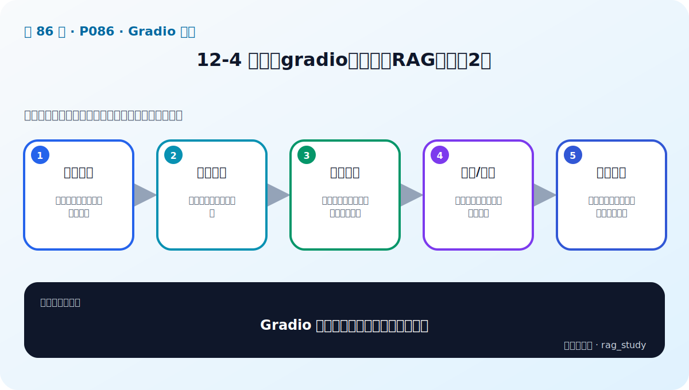

# P86：12-4 实战：gradio整合两大RAG项目（2）

> 笔记编号 86/89 · 对应原视频 P86 · 时长 19:07 · [打开这一节](https://www.bilibili.com/video/BV1fLoKBREGv?p=86)

[← P85: 12-3 实战：gradio整合两大RAG项目（1）](../12-gradio-app/p085-实战-gradio整合两大RAG项目-1.md) · [返回第 12 章专题](./README.md) · [P87: 13-1 本章介绍 →](../13-model-finetuning/p087-模型微调导言-本章导学.md)

## 这节到底讲什么

**核心问题：Gradio 整合第二步怎样处理完整交互？**

这节直接回答“Gradio 整合第二步怎样处理完整交互？”。老师的结论可以整理成五点：第一，事件绑定：提交、清空、示例问题与状态；第二，执行反馈：加载中提示与耗时信息；第三，异常处理：空输入、后端错误、无结果可理解；第四，多轮/状态：需要时保存会话而非污染全局；第五，验收发布：功能、并发、安全与访问边界检查。下面逐项解释每一点的含义和作用。

## 辅助流程图

## 正文讲解（按视频顺序）

> 下面是依据音轨和画面整理的通顺版本，不是逐字稿。技术术语已经校正，
> 老师的原始讲法保留在后面的 ASR 页面。

### 1. 事件绑定

提交、清空、示例问题与状态。

### 2. 执行反馈

加载中提示与耗时信息。

### 3. 异常处理

空输入、后端错误、无结果可理解。

### 4. 多轮/状态

需要时保存会话而非污染全局。

### 5. 验收发布

功能、并发、安全与访问边界检查。

## 课后迁移示例（非视频原例）

> 来源说明：这是为了帮助理解而补充的迁移示例，不是老师在本节视频中逐字讲述的原例。

页面接收问题后，只把它交给统一的 RAG 服务接口；后端返回答案、来源、路由和耗时。界面负责展示，不应该在点击回调里重新加载模型或重建索引。

## 完整原声逐段记录

已用本地语音识别核查；技术词与口误以专题笔记的校正版为准。

[查看本节按时间戳保留的本地 ASR 转写](./transcripts/p086-实战-gradio整合两大RAG项目-2-ASR.md)。原始转写会保留
同音字和断句误差，正文用校正后的术语，方便同时核对“老师说了什么”和“概念是什么”。

## 读完记住这五句话

- **事件绑定：** 提交、清空、示例问题与状态
- **执行反馈：** 加载中提示与耗时信息
- **异常处理：** 空输入、后端错误、无结果可理解
- **多轮/状态：** 需要时保存会话而非污染全局
- **验收发布：** 功能、并发、安全与访问边界检查

## 最小可运行代码

[打开本节最相关的纯 Python 练习](../../rag_from_scratch/README.md)。练习包不依赖 LangChain，
目的是先看清输入、输出和算法边界，再替换成课程中的框架/API。

## 最容易踩的坑

Gradio 适合原型，不自动提供生产系统需要的鉴权、隔离、限流、审计和监控。

## 自测

1. 不看图回答：Gradio 整合第二步怎样处理完整交互？
2. 用上面的例子，指出本节五个知识点分别出现在哪里。
3. 如果没有“多轮/状态”，会出现什么具体问题？

## 学完检查

- [ ] 我能不看视频解释本节核心概念
- [ ] 我能指出它在 RAG 数据流中的位置
- [ ] 我知道它最适合与最不适合的场景
- [ ] 我读过完整 ASR 并核对了技术术语
- [ ] 我完成了专题 README 中对应的自测或实验
