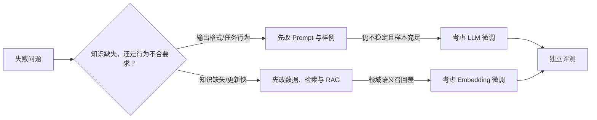

# 第 13 章：模型微调导言

> 对应视频 P87：[打开本章导言](https://www.bilibili.com/video/BV1fLoKBREGv?p=87)

> 课程选集在本章只提供了 `13-1 本章介绍`。音轨预告了大模型微调、LoRA、
> SWIFT 与 Embedding 微调，但没有后续讲解或实战选集。本页只整理导言明确给出的
> 路线，并补充学习边界，不把补充知识伪装成原课内容。


## 先判断是否真的需要微调

微调不是所有 RAG 问题的第一选择。可以按下面顺序排查：



- **知识需要频繁更新**：优先用 RAG，避免把事实烙进权重后难以维护。
- **模型不会遵循领域格式、语气或任务步骤**：可考虑监督微调。
- **领域词语义召回差**：先构造真实 query-document 正负样本，再考虑
  Embedding 微调。
- **只是个别坏例**：优先修数据、Prompt、分块、过滤与评测集。

## LLM 微调与 LoRA

全量微调更新模型的大量参数，数据、显存、训练稳定性和灾难性遗忘风险都更高。
LoRA 冻结原权重，用低秩矩阵学习权重增量：

```text
W' = W + ΔW
ΔW = B A，且 rank(A, B) 远小于 W 的维度
```

训练和保存的参数量因此显著减少。LoRA 解决的是训练资源问题，不自动解决脏数据、
错误标签、任务定义不清和评测缺失。

## SWIFT 学习路线

导言提到用 SWIFT 组织微调实战。无论具体框架如何变化，稳定的数据流是：

1. 定义任务和验收集，训练集与测试集严格隔离；
2. 把样本整理成框架要求的指令/对话格式；
3. 选择基础模型、LoRA 目标层、rank、学习率和批量策略；
4. 监控训练/验证损失、显存、吞吐和过拟合；
5. 保存适配器并用固定测试集与原模型做 A/B；
6. 记录模型、数据、代码和参数版本，再决定是否合并或部署。

## Embedding 微调不是 LLM 微调

Embedding 微调的目标是改善“查询与相关文档靠近、无关文档远离”的表示空间。
数据通常包含 `(query, positive, negatives)`；难负例尤其重要，因为它们字面或
语义相近却不是正确证据。

验收应看 `Recall@k`、`MRR`、延迟和向量存储成本，而不是生成答案看起来是否流畅。
LLM 与 Embedding 的数据、损失函数和指标不同，必须分别评估。

## 自测

<details>
<summary>公司制度每周更新，但模型常回答旧条款，应该先微调 LLM 吗？</summary>

不应该。问题首先是外部知识的时效与检索链路，应更新知识库、索引与引用策略。
把频繁变化的事实微调进参数会增加更新成本，也更难追踪来源。
</details>
