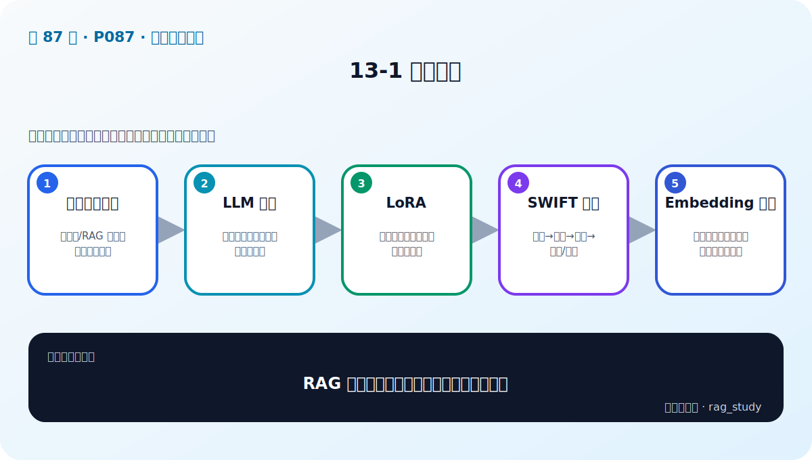

# P87：13-1 本章介绍

> 笔记编号 87/89 · 对应原视频 P87 · 时长 01:32 · [打开这一节](https://www.bilibili.com/video/BV1fLoKBREGv?p=87)

[← P86: 12-4 实战：gradio整合两大RAG项目（2）](../12-gradio-app/p086-实战-gradio整合两大RAG项目-2.md) · [返回第 13 章专题](./README.md) · [P88: 14-1 项目总结和展望：课程回顾与总结 →](../14-course-review/p088-项目总结和展望-课程回顾与总结.md)

## 这节到底讲什么

**核心问题：RAG 项目何时需要模型微调，路线是什么？**

这一节只是模型微调章的导言。老师预告了 LLM 微调、LoRA、SWIFT 训练流程和 Embedding 微调，但当前视频选集没有后续实战。读这一页时最重要的是先分清：知识更新问题通常先改 RAG，模型行为问题才考虑 LLM 微调，领域召回问题才考虑 Embedding 微调。

## 辅助流程图

## 正文讲解（按视频顺序）

> 下面是依据音轨和画面整理的通顺版本，不是逐字稿。技术术语已经校正，
> 老师的原始讲法保留在后面的 ASR 页面。

### 1. 先判断必要性

提示词/RAG 能解决就不急着微调。

### 2. LLM 微调

用领域数据改变任务行为与表达。

### 3. LoRA

以低秩适配降低训练参数和资源。

### 4. SWIFT 流程

数据→训练→监控→保存/推理。

### 5. Embedding 微调

用领域正负样本提升召回并单独评估。

## 用一个例子串起来

公司制度每周变化时，应更新 RAG 知识库；模型总是不按固定 JSON 输出时，才可能考虑 LLM 微调；领域缩写始终召回不到相关文档时，才考虑 Embedding 微调。

## 完整原声逐段记录

已用本地语音识别核查；技术词与口误以专题笔记的校正版为准。

[查看本节按时间戳保留的本地 ASR 转写](./transcripts/p087-模型微调导言-本章导学-ASR.md)。原始转写会保留
同音字和断句误差，正文用校正后的术语，方便同时核对“老师说了什么”和“概念是什么”。

## 读完记住这五句话

- **先判断必要性：** 提示词/RAG 能解决就不急着微调
- **LLM 微调：** 用领域数据改变任务行为与表达
- **LoRA：** 以低秩适配降低训练参数和资源
- **SWIFT 流程：** 数据→训练→监控→保存/推理
- **Embedding 微调：** 用领域正负样本提升召回并单独评估

## 最小可运行代码

[打开本节最相关的纯 Python 练习](../../rag_from_scratch/README.md)。练习包不依赖 LangChain，
目的是先看清输入、输出和算法边界，再替换成课程中的框架/API。

## 最容易踩的坑

不要用微调掩盖数据和检索问题。没有独立测试集、干净样本和明确指标时，训练损失下降也不能说明业务变好。

## 自测

1. 不看图回答：RAG 项目何时需要模型微调，路线是什么？
2. 用上面的例子，指出本节五个知识点分别出现在哪里。
3. 如果没有“SWIFT 流程”，会出现什么具体问题？

## 学完检查

- [ ] 我能不看视频解释本节核心概念
- [ ] 我能指出它在 RAG 数据流中的位置
- [ ] 我知道它最适合与最不适合的场景
- [ ] 我读过完整 ASR 并核对了技术术语
- [ ] 我完成了专题 README 中对应的自测或实验
