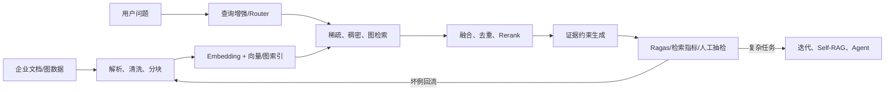

# 第 14 章：课程总结、项目表达与面试

> 对应视频 P88–P89：[打开课程回顾](https://www.bilibili.com/video/BV1fLoKBREGv?p=88)


## 一条线复盘整门课程



这条线可拆成五层能力：

1. **基础组件**：理解 LLM、Embedding、向量数据库和文档对象各自的输入输出；
2. **Baseline**：跑通离线建库与在线检索生成，答案能回到来源；
3. **评估与增强**：先用数据定位瓶颈，再加入查询增强、混合检索、融合和重排；
4. **结构与决策**：Graph RAG 处理关系/多跳，Agent Router 负责选择知识与工具；
5. **工程迭代**：可观测、可复现、可治理，确有需要时再做模型微调。

## 项目不能只说“我用了什么”

面试讲项目时，用可验证的因果链：

```text
业务背景 → 目标/约束 → 我的任务 → 技术行动 → 量化结果 → 失败与复盘
```

一个更可信的表达示例：

> 制度问答中，初版 Dense Retrieval 对条款编号问题漏召回。我们在固定的 N 条
> 评测样本上确认 Recall@5 是瓶颈，于是加入 BM25 与 RRF，再对候选做 Rerank。
> 我负责评测脚本、融合模块和坏例分析。上线前在同一数据集比较质量、P95 延迟与
> 成本，并保留了无证据拒答和来源引用。

数字必须来自真实记录；没有数据就说明评测方式和观察，不编造提升百分比。

## 面试准备顺序

- 先读岗位描述，区分应用开发、算法、平台和研究岗位需要的深度；
- 用“数据流 + 模块边界 + 指标”整理知识，不背零散名词；
- 准备 1 分钟自我介绍，只保留与岗位相关的经历和证据；
- 每个项目都能画架构、解释选型、复盘失败，并说明自己实际负责的部分；
- 补齐算法/数据结构、Python、数据库、服务治理等基础能力；
- 展示学习能力时给出可检查的产物：实验、笔记、代码、指标或复现记录。

## 最终验收

- [ ] 我能在白纸上画出完整 RAG 离线与在线链路
- [ ] 我能分别解释检索失败和生成失败怎样评估
- [ ] 我能说明普通 RAG、Graph RAG 与 Agentic RAG 的边界
- [ ] 我能用一组量化指标比较 Baseline 与改进方案
- [ ] 我能用“背景—任务—行动—结果—复盘”讲清自己的项目
- [ ] 我不会把课程未提供的微调后续章节说成已经学过
