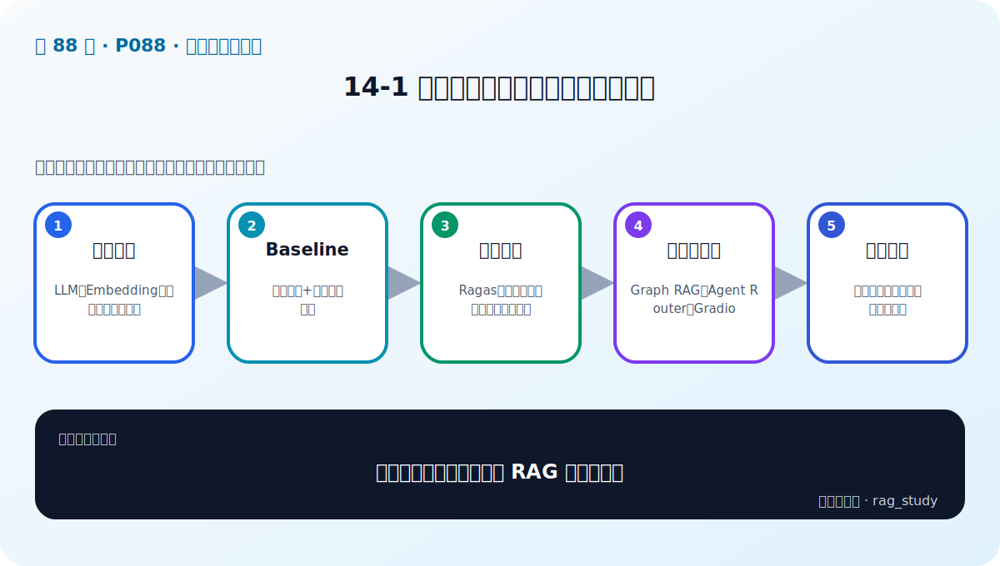

# P88：14-1 项目总结和展望：课程回顾与总结

> 笔记编号 88/89 · 对应原视频 P88 · 时长 15:06 · [打开这一节](https://www.bilibili.com/video/BV1fLoKBREGv?p=88)

[← P87: 13-1 本章介绍](../13-model-finetuning/p087-模型微调导言-本章导学.md) · [返回第 14 章专题](./README.md) · [P89: 14-2 项目总结和展望：课程总结与 AI 岗位面试技巧 →](../14-course-review/p089-项目总结和展望-课程总结与-AI-岗位面试技巧.md)

## 这节到底讲什么

**核心问题：整门课程如何压缩成一张 RAG 能力地图？**

这一节把整门课重新压缩成一张能力地图：先掌握 LLM、Embedding、向量库与文档处理，再完成 Baseline；有了评测基线后，才加入查询增强、融合、重排、Graph RAG 和 Agent。复盘的重点不是背工具名，而是说清每个模块解决了什么失败问题。

## 辅助流程图

## 正文讲解（按视频顺序）

> 下面是依据音轨和画面整理的通顺版本，不是逐字稿。技术术语已经校正，
> 老师的原始讲法保留在后面的 ASR 页面。

### 1. 基础组件

LLM、Embedding、向量库、文档处理。

### 2. Baseline

离线索引+在线检索生成。

### 3. 评估增强

Ragas、查询增强、融合重排、自反思。

### 4. 结构与智能

Graph RAG、Agent Router、Gradio。

### 5. 继续进阶

微调、工程治理与真实项目迭代。

## 用一个例子串起来

讲项目时不要只说“用了 Milvus 和 LangChain”。应说明原 Baseline 在什么问题上失败、你如何用固定评测集定位原因、做了什么改动，以及质量、延迟和成本发生了什么变化。

## 完整原声逐段记录

已用本地语音识别核查；技术词与口误以专题笔记的校正版为准。

[查看本节按时间戳保留的本地 ASR 转写](./transcripts/p088-项目总结和展望-课程回顾与总结-ASR.md)。原始转写会保留
同音字和断句误差，正文用校正后的术语，方便同时核对“老师说了什么”和“概念是什么”。

## 读完记住这五句话

- **基础组件：** LLM、Embedding、向量库、文档处理
- **Baseline：** 离线索引+在线检索生成
- **评估增强：** Ragas、查询增强、融合重排、自反思
- **结构与智能：** Graph RAG、Agent Router、Gradio
- **继续进阶：** 微调、工程治理与真实项目迭代

## 最小可运行代码

[打开本节最相关的纯 Python 练习](../../rag_from_scratch/README.md)。练习包不依赖 LangChain，
目的是先看清输入、输出和算法边界，再替换成课程中的框架/API。

## 最容易踩的坑

面试中不要编造提升数字，也不要把团队工作都说成自己完成。说清个人任务、验证方法和真实结果更可信。

## 自测

1. 不看图回答：整门课程如何压缩成一张 RAG 能力地图？
2. 用上面的例子，指出本节五个知识点分别出现在哪里。
3. 如果没有“结构与智能”，会出现什么具体问题？

## 学完检查

- [ ] 我能不看视频解释本节核心概念
- [ ] 我能指出它在 RAG 数据流中的位置
- [ ] 我知道它最适合与最不适合的场景
- [ ] 我读过完整 ASR 并核对了技术术语
- [ ] 我完成了专题 README 中对应的自测或实验
