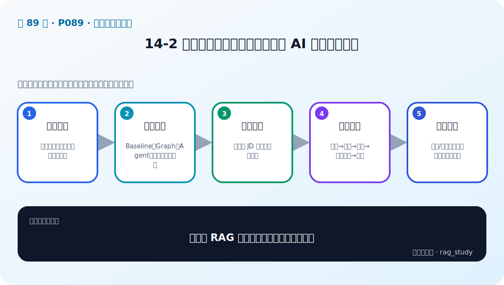
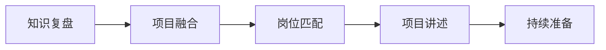

# P89：14-2 项目总结和展望：课程总结与 AI 岗位面试技巧

> 笔记编号 89/89 · 对应原视频 P89 · 时长 15:57 · [打开这一节](https://www.bilibili.com/video/BV1fLoKBREGv?p=89)

[← P88: 14-1 项目总结和展望：课程回顾与总结](../14-course-review/p088-项目总结和展望-课程回顾与总结.md) · [返回第 14 章专题](./README.md) · 已是最后一节 →

## 这节到底讲什么

**核心问题：怎样把 RAG 能力转化为项目与面试表达？**

这一节讨论如何把所学内容变成项目能力和面试表达。重点是按岗位要求选择相关知识，用背景、任务、行动、结果和复盘讲项目，并用真实指标说明改进。算法题、业务基础、沟通表达和持续学习能力也需要一起准备。

## 辅助流程图

## 正文讲解（按视频顺序）

> 下面是依据音轨和画面整理的通顺版本，不是逐字稿。技术术语已经校正，
> 老师的原始讲法保留在后面的 ASR 页面。

### 1. 知识复盘

按组件、数据流和指标形成结构。

### 2. 项目融合

Baseline、Graph、Agent、微调按需求组合。

### 3. 岗位匹配

先理解 JD 再突出相关技能。

### 4. 项目讲述

背景→任务→行动→量化结果→复盘。

### 5. 持续准备

算法/业务题、沟通能力与学习证据。

## 用一个例子串起来

讲项目时不要只说“用了 Milvus 和 LangChain”。应说明原 Baseline 在什么问题上失败、你如何用固定评测集定位原因、做了什么改动，以及质量、延迟和成本发生了什么变化。

## 完整原声逐段记录

已用本地语音识别核查；技术词与口误以专题笔记的校正版为准。

[查看本节按时间戳保留的本地 ASR 转写](./transcripts/p089-项目总结和展望-课程总结与-AI-岗位面试技巧-ASR.md)。原始转写会保留
同音字和断句误差，正文用校正后的术语，方便同时核对“老师说了什么”和“概念是什么”。

## 读完记住这五句话

- **知识复盘：** 按组件、数据流和指标形成结构
- **项目融合：** Baseline、Graph、Agent、微调按需求组合
- **岗位匹配：** 先理解 JD 再突出相关技能
- **项目讲述：** 背景→任务→行动→量化结果→复盘
- **持续准备：** 算法/业务题、沟通能力与学习证据

## 最小可运行代码

[打开本节最相关的纯 Python 练习](../../rag_from_scratch/README.md)。练习包不依赖 LangChain，
目的是先看清输入、输出和算法边界，再替换成课程中的框架/API。

## 最容易踩的坑

面试中不要编造提升数字，也不要把团队工作都说成自己完成。说清个人任务、验证方法和真实结果更可信。

## 自测

1. 不看图回答：怎样把 RAG 能力转化为项目与面试表达？
2. 用上面的例子，指出本节五个知识点分别出现在哪里。
3. 如果没有“项目讲述”，会出现什么具体问题？

## 学完检查

- [ ] 我能不看视频解释本节核心概念
- [ ] 我能指出它在 RAG 数据流中的位置
- [ ] 我知道它最适合与最不适合的场景
- [ ] 我读过完整 ASR 并核对了技术术语
- [ ] 我完成了专题 README 中对应的自测或实验
