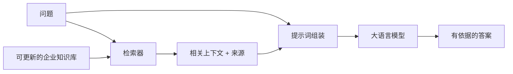

# 第 2 章：RAG 基础——为什么需要、怎样运转、难点在哪

> 对应视频 P2–P7：[打开本章第一节](https://www.bilibili.com/video/BV1fLoKBREGv?p=2)

## 这章解决什么问题

大模型已经支持很长的上下文，企业为什么仍需要 RAG？一个合格的 RAG 系统又由
哪些环节组成？

## RAG 的三大核心



- **知识库**：保存模型训练数据之外的私有、领域和最新知识；能够独立更新。
- **检索**：针对当前问题取回少量相关证据，而不是把整个资料库交给模型。
- **生成**：综合问题与证据组织自然语言答案，并按要求引用或拒答。

RAG 的价值不是让模型“永久记住”资料，而是在每次回答前提供可核查的临时工作
记忆。

## P3：它填补了大模型哪些短板

1. **缺少私有知识**：企业制度、合同、客户记录通常不在预训练语料中。
2. **知识有截止时间**：重新训练模型代价高，外部知识库可以单独更新。
3. **幻觉与不可追溯**：检索证据能约束生成，并为答案提供来源。
4. **企业要求更严格**：创意写作允许多种答案，制度、金融、客服回答通常要求
   准确、最新、可解释。

RAG 能降低幻觉概率，但不会自动消灭幻觉。若召回的是错误资料，模型仍可能非常
流畅地生成错误答案。

## P5：Long Context 为什么没有取代 RAG

把全部文档塞进超长上下文在小规模、低频场景中可行，但它与检索并不是二选一。

| 维度 | 全量 Long Context | RAG |
|---|---|---|
| 推理成本 | 每次重复输入大量 token | 只输入少量候选证据 |
| 延迟 | 随上下文增长 | 由检索与 top-k 控制 |
| 数据暴露 | 可能把完整私有文档发给外部模型 | 可只发送必要片段，仍需安全审计 |
| 信息定位 | 存在“needle in a haystack”与中部信息遗失 | 先用专门检索器筛选 |
| 更新 | 每次重新附带全量资料 | 更新索引中的局部文档 |
| 引用 | 需额外定位来源 | chunk 天然携带来源元数据 |

最佳实践往往是组合：RAG 先缩小范围，较长上下文再容纳更多候选、相邻段落或完整
章节。

## P6：从“合格”到“优秀”的技术栈

课程把失败点拆成一条可诊断链：

```text
异构企业数据
→ 解析与质量治理
→ 分块、元数据与索引
→ 查询理解/改写
→ 稀疏或稠密召回
→ 融合与重排
→ 上下文压缩和提示词
→ 模型生成
→ 评估与迭代
```

- 输入侧要处理 PDF、表格、PPT、数据库、扫描件和复杂布局。
- 检索侧要应对过短、歧义、多意图、跨文档和多跳问题。
- 生成侧要控制上下文顺序、冲突、引用、拒答和模型选择。
- 工程侧还要考虑权限、数据隔离、增量更新、高可用、日志与成本。

不是每个项目都需要所有优化。先用评估确认瓶颈，再选择技术。

## P7：课程案例架构

制度问答使用 PDF/表格、Chroma 等向量库；金融智库使用 Neo4j 等图数据库。
入口先做意图识别或 Router，把制度问题交给向量 RAG，把关系型金融问题交给
Graph RAG。课程使用 LangChain/LlamaIndex 等应用框架、Notebook 演示，并在
最后接入 Gradio/FastAPI。

## 最容易踩的坑

- 把“检索到相似文本”误当成“检索到足以回答问题的证据”。
- 文档改了但索引、缓存或引用没有同步更新。
- 没有保留 source、page、section、version、permission 等元数据。
- 只看答案主观顺不顺，不看检索结果、拒答率和分问题类型指标。

## 动手验证

先读并运行 [从零实现练习包](../../rag_from_scratch/README.md)。修改
`BaselineRAG` 的 `k`，观察提示词中的证据如何变化；再故意问一个资料外问题，
检查提示词是否明确要求拒答。

## 自测

<details>
<summary>长上下文已经装得下全部资料时，RAG 还有哪些独立价值？</summary>

降低重复 token 成本和延迟、减少不必要的数据暴露、用专门检索器改善信息定位、
支持局部增量更新、携带可追溯来源，并让召回环节可以单独评估和优化。
</details>
