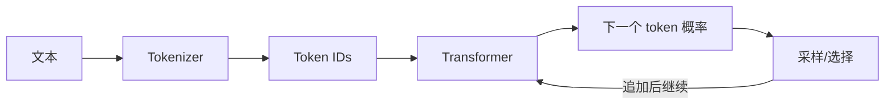

# 第 3 章：RAG 所需的大模型基础与选型

> 对应视频 P8–P16：[打开本章第一节](https://www.bilibili.com/video/BV1fLoKBREGv?p=8)

## 生成模型到底在做什么

大模型以 token 为单位做自回归“文字接龙”：根据已有 token 预测下一个 token，
把新 token 接回输入，再继续预测。因此生成 100 个 token 大致需要 100 个串行
解码步骤；流式输出只是把已经生成的部分尽早展示，并没有把自回归变成一次完成。



Transformer 的自注意力建立 token 之间的全局关系。模型训练通常经历大规模
预训练、指令微调和偏好对齐；RAG 并不修改这些参数，而是在推理时提供外部证据。

## 调用模型的三种方式

1. **Transformers 本地加载**：控制力强，可量化、微调和离线运行；需要足够的
   CPU/GPU/统一内存和推理工程能力。
2. **Ollama 等本地服务**：用统一 HTTP 接口管理模型，适合开发和私有化验证；
   仍受本机性能、上下文和并发限制。
3. **模型厂商 API**：开箱即用、模型能力通常更强；要评估数据合规、速率限制、
   可用性、价格和供应商依赖。

GPU 适合模型推理，是因为 Transformer 主要由可高度并行的矩阵乘加组成；但
自回归解码的 token 步之间仍有先后依赖。

## 不要用“参数越大”代替业务评测

课程用涌现能力说明规模会影响复杂推理和指令遵循，但模型榜单、通用分数和业务
效果不是同一件事。RAG 更关注：

- 能否从多个候选片段中抽取真正相关的事实；
- 能否按给定证据做阅读理解，不把参数记忆混进来；
- 长上下文中的定位能力、中文和领域术语能力；
- 结构化输出、引用、拒答和 Tool Calling 的可靠性；
- 延迟、吞吐、上下文价格、部署资源和数据合规。

## RAG 模型选型四步法

```text
先用能力最强的模型验证业务上限
→ 用自己的问题/证据/答案构建测试集
→ 按准确性、忠实度、延迟、成本等指标评测
→ 在满足门槛的候选中逐步换小模型、量化或微调
```

先拿大模型跑通，是为了区分“方案本身不可行”和“模型能力不够”。验证可行后再
降本，而不是一开始就在最小模型上反复修提示词。

## 角色需要掌握到什么程度

- 产品和业务：知道能力边界、成本、风险、评估口径。
- AI 应用开发：熟悉 API、本地服务、提示词、结构化输出、上下文与工具调用。
- 算法/平台：进一步掌握 tokenizer、Transformer、量化、推理优化、微调和部署。

## 实战检查清单

- [ ] 固定 temperature、模型版本和 system prompt，保证实验可比较。
- [ ] 记录 prompt/completion token、首 token 延迟和总延迟。
- [ ] 为 API 设置超时、重试、并发限制和熔断，但避免对非幂等操作盲目重试。
- [ ] 不把密钥写进代码；私有文档发送给第三方前完成合规评审。
- [ ] 对结构化输出做 schema 校验，不能只相信模型承诺。

## 自测

<details>
<summary>为什么选模型时要先用强模型测业务上限，再考虑小模型？</summary>

强模型能先验证数据、检索和交互方案是否成立。若一开始只用小模型，失败时很难
判断是方案错误还是模型能力不足；上限确定后，才有清晰的质量门槛做成本优化。
</details>
